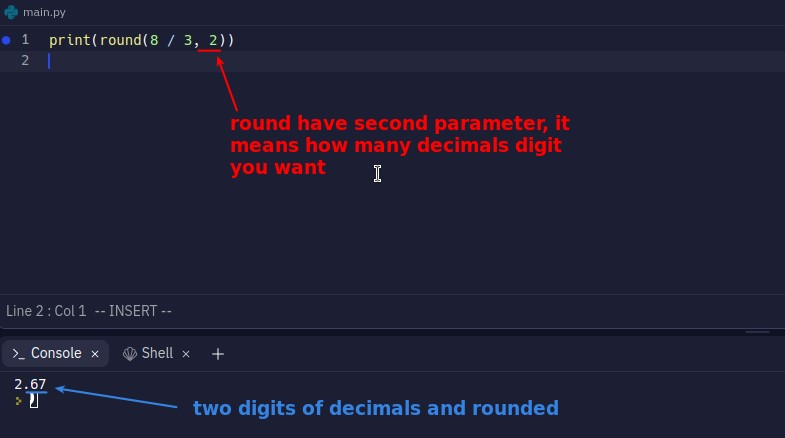

## **Different ways to remove decimals**

- int() will directly remove the fractional part and get the number of Integer type.

- Instead of int(), we usually round off the decimal part to get the integer.

## **Two types of division**

## **Math operator with =**

- There are many similar operators, such as \*=, -=, += ... The logic is the same.

## **F-String**

- We often need to concatenate values of different types into one string output as above.

- The above is using simpler way - F-string to achieve the same purpose.
