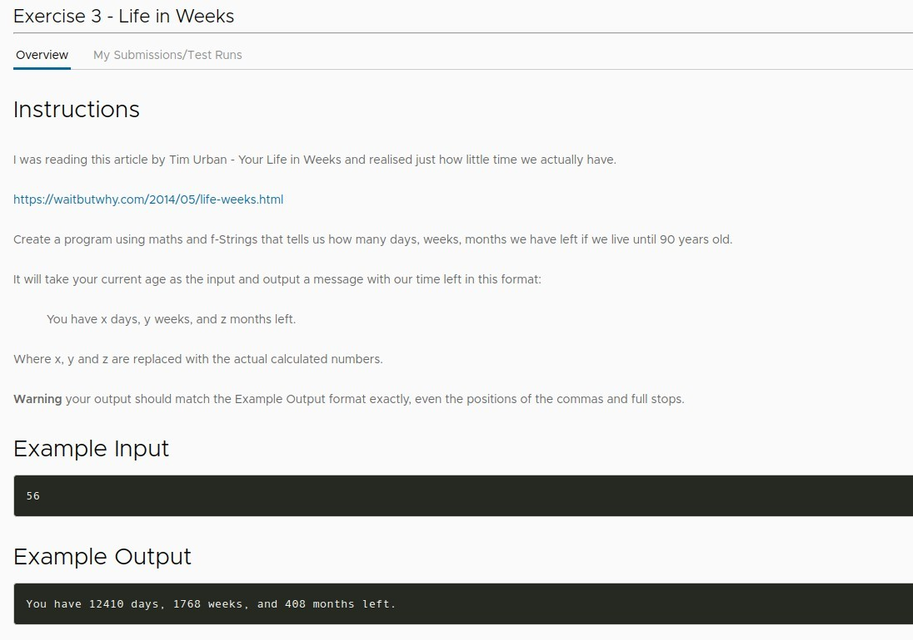
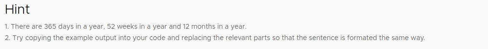
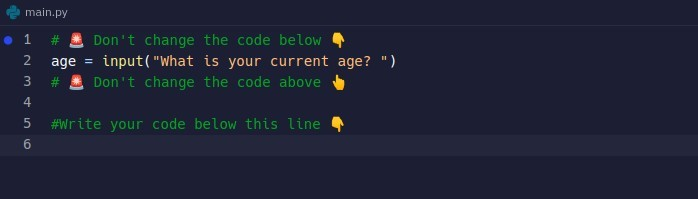
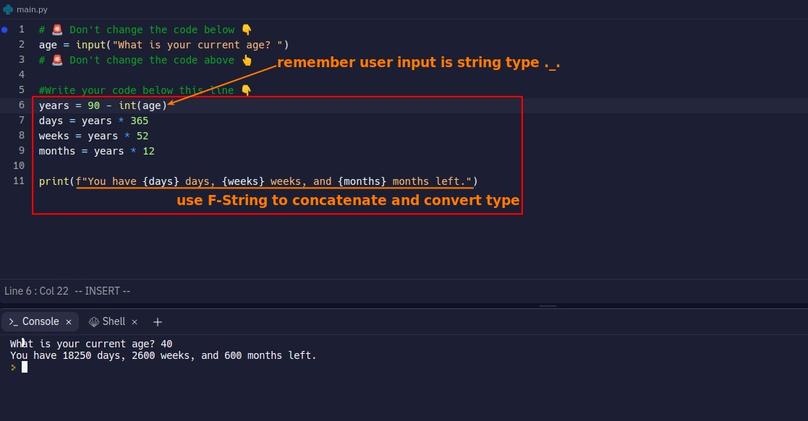

## **Question: How many days, weeks, months I left**

- To simplify the questions by focusing on the F-String exercise, we start from the first day of the following year and do not count the leap year.

## **Solution**

