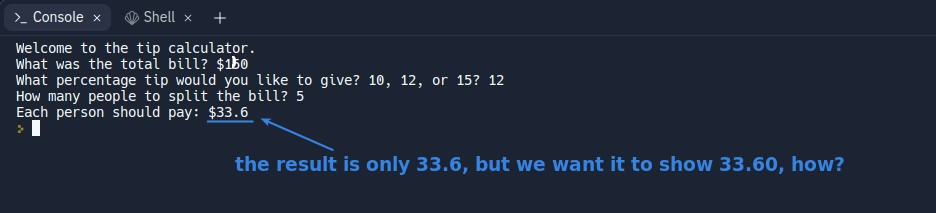
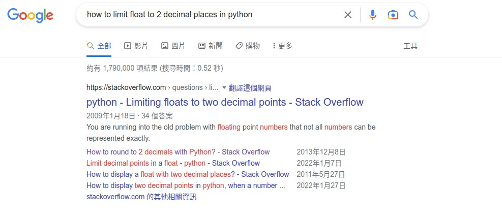
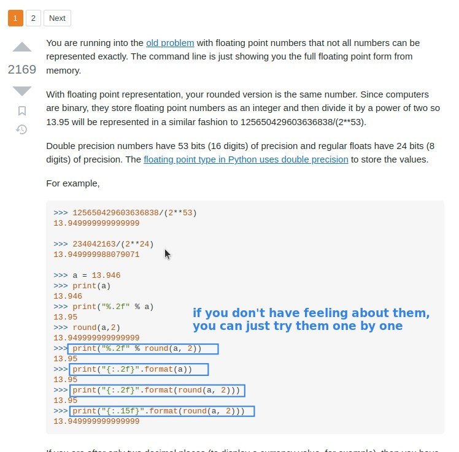
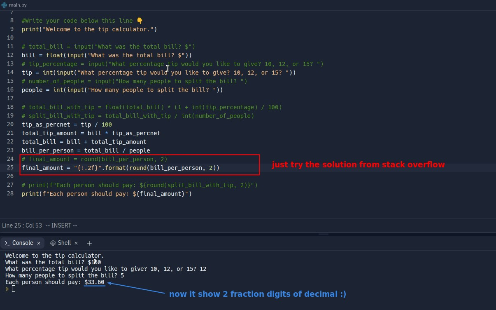
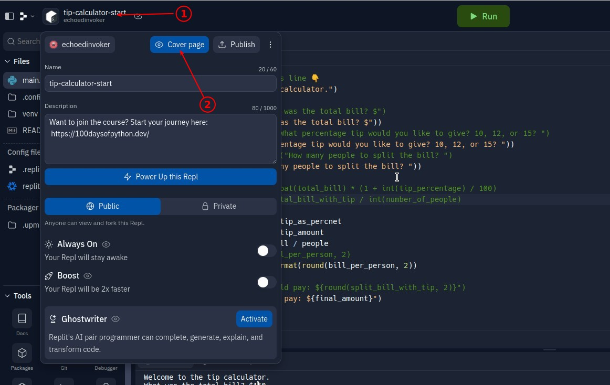
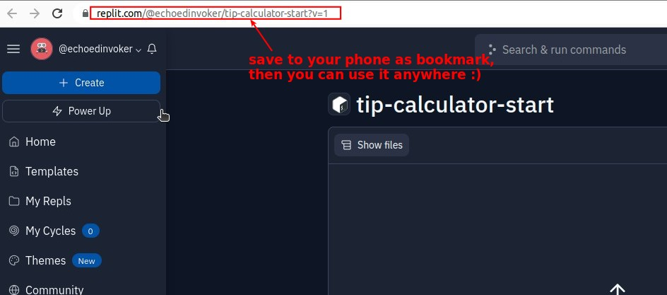

## **Question: Tip Calculator**

## **Solutions**

### _By myself_

### _Lecture solution_

## **If we want to limit float result format, how?**

### _Additional demand_

- In fact, this is not a problem of calculation but a problem of format.

### _Do survey on internet_

> When we are stuck with a problem or need, we go online to find out the solution.

- We don't even need to know the details or the concept, just copy and paste the answer from the stack overflow and try to solve the problem directly.

### _Solution_

## **Use your program anywhere :)**

