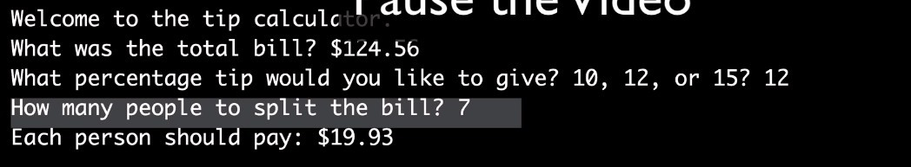
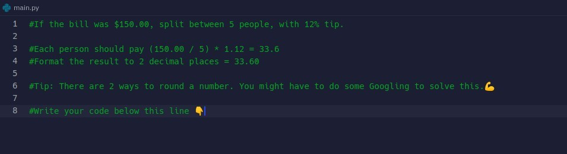

## **Question: Tip Calculator**

## **Solutions**

### _By myself_

### _Lecture solution_

## **If we want to limit float result format, how?**

### _Additional demand_

### _Do survey on internet_

### _Solution_

