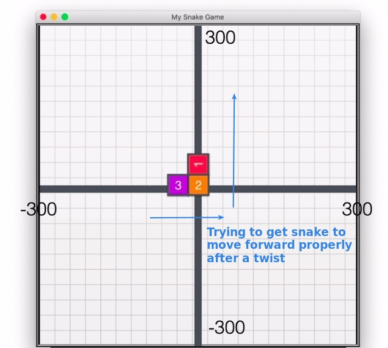

## **Challenge 1: Moving the snake**

### _Instruction_

### _Fist try: simply .forward() each segment_

### _Query documents about turtle animation_

### _Second try: including animation skill_

## **Challenge 2: Moving with turning**

### _Instruction_

### _First try: simply turn left 90 degree of 1st segment_

### _Change the logic of moving_

