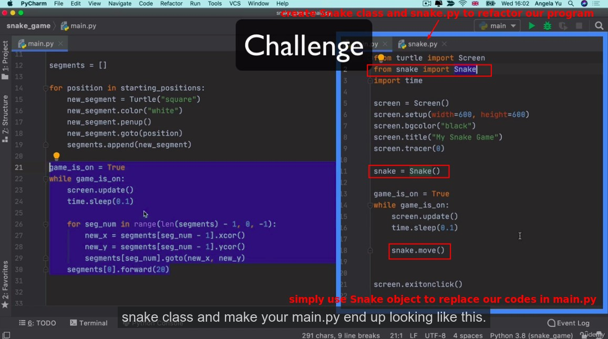
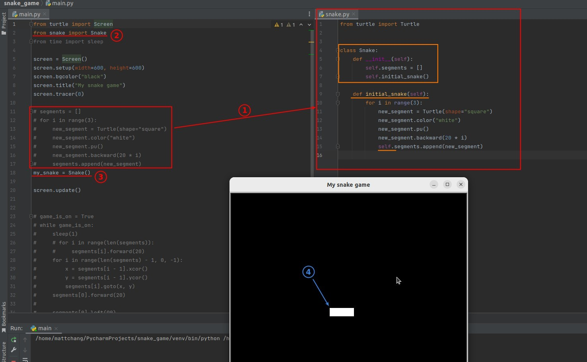
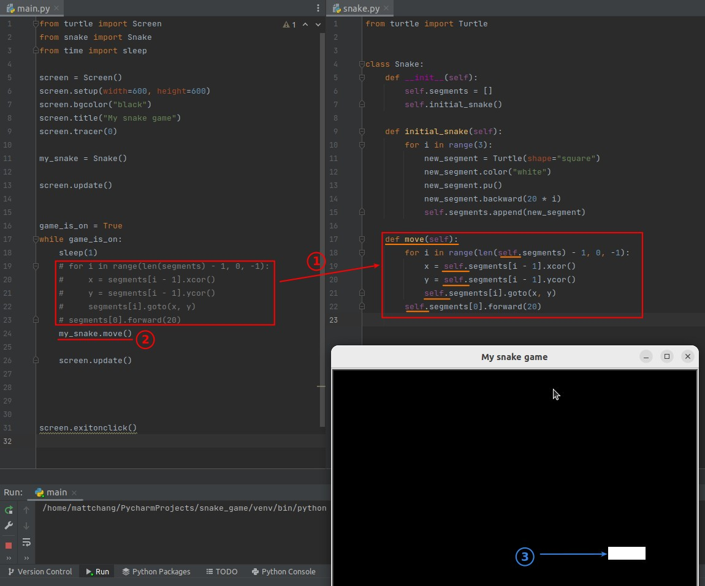
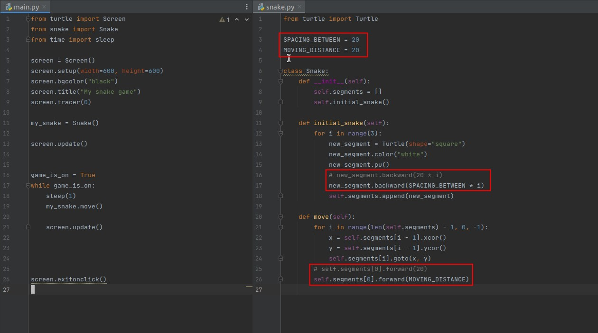

## **Challenge: refactoring with Snake class**

## **My solution**

### _Build Snake class & initialize_

- A method in a class can refer directly to an attribute or other method in the same class via self, which is a subtle difference from a normal function.

### _Snake movine codes_

## **Lector's plus**

- Extracting important constants into global variables makes it easy to modify or observe them in the future, without having to look at the details of the codes.
