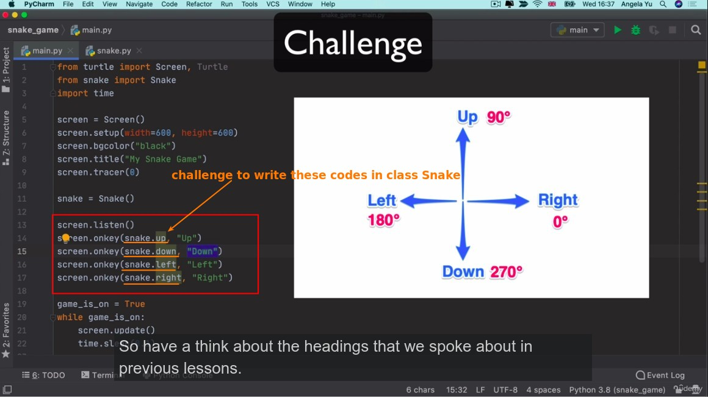
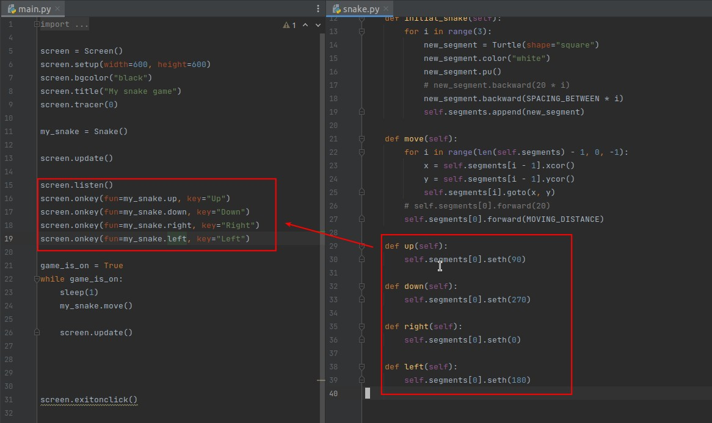
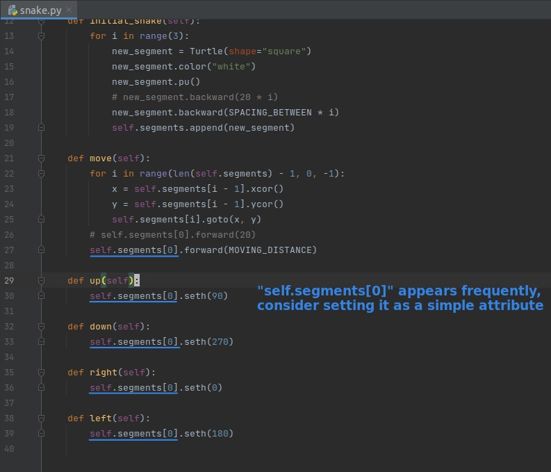
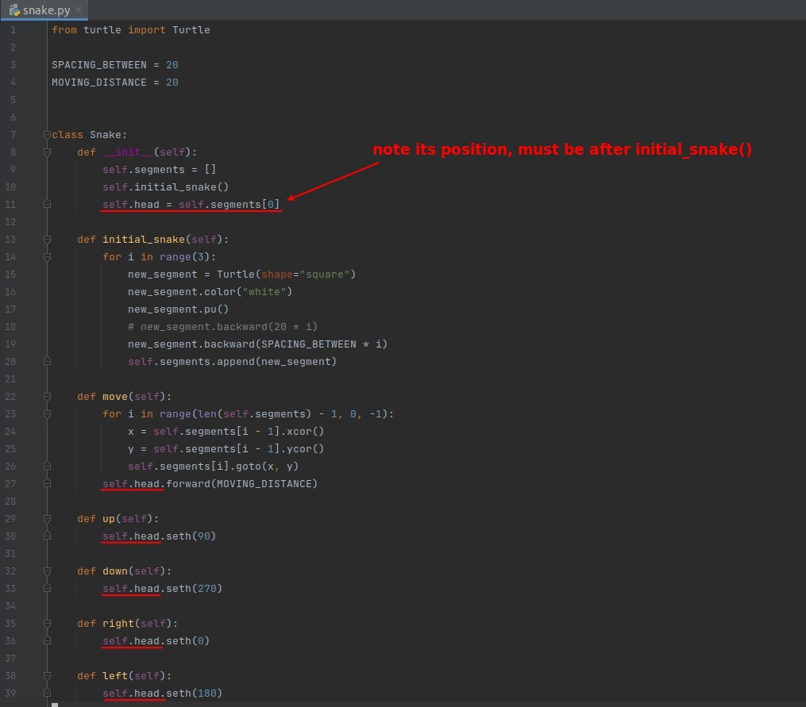
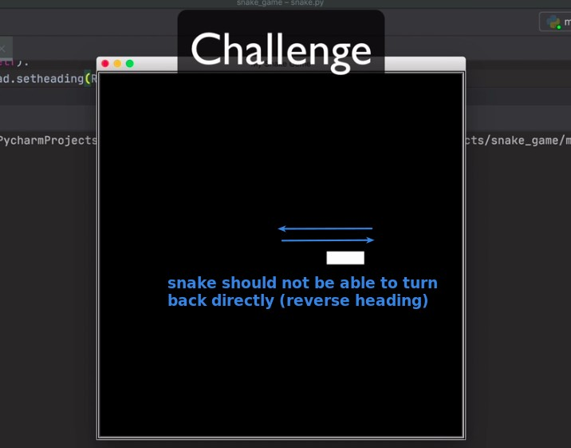
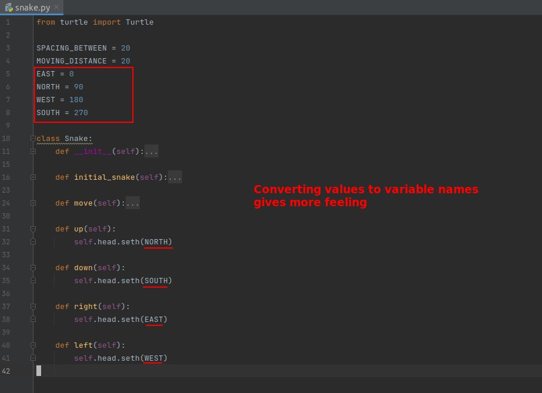
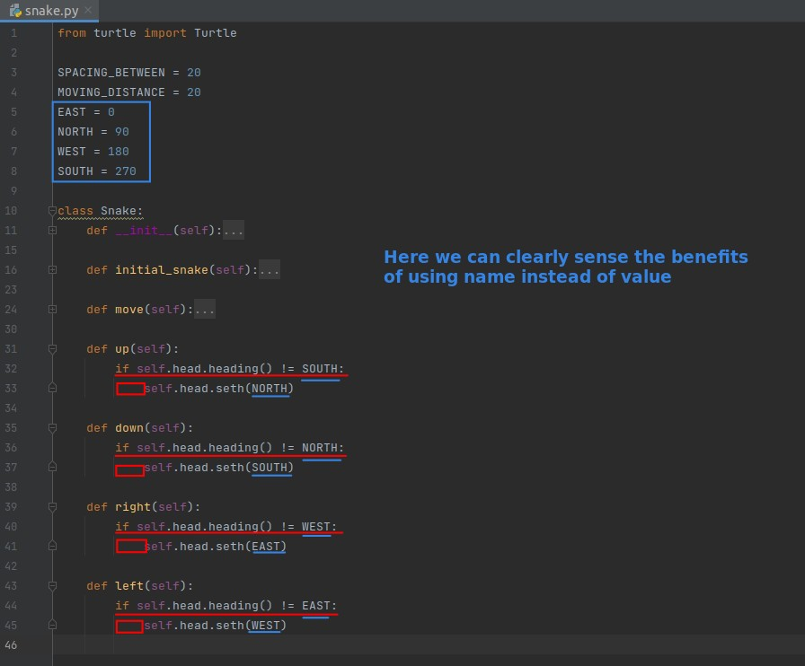
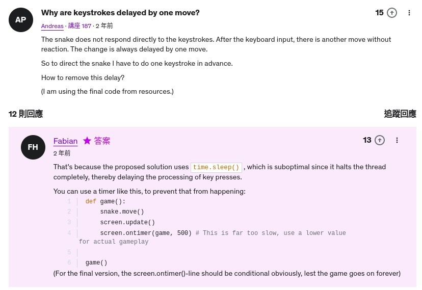
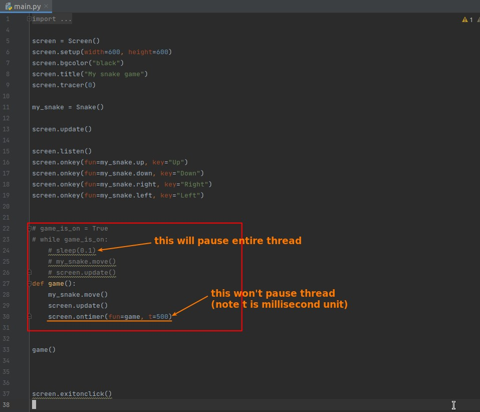

## **Challenge 1: control snake heading**

### _My solution_

### _Lector's plus: Use attr to simply codes_

## **Challenge 2: Prevent snake turn around directly**

### _Use global constant_

## **Why keystrokes delayed so hard...?**

### _QA_

### _implement it_

