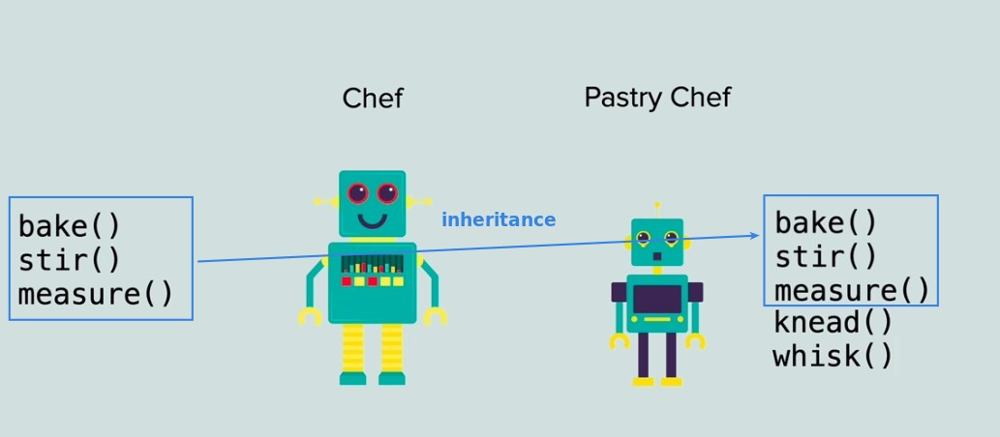
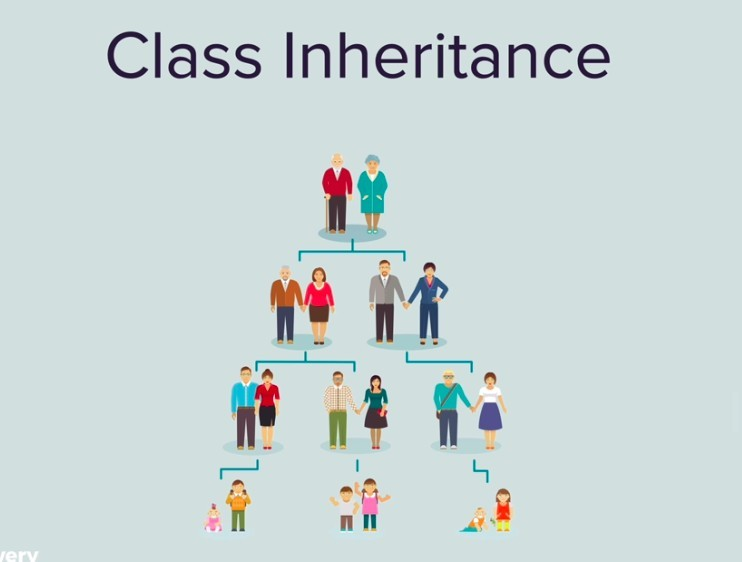
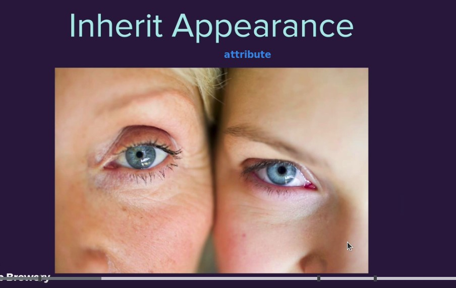
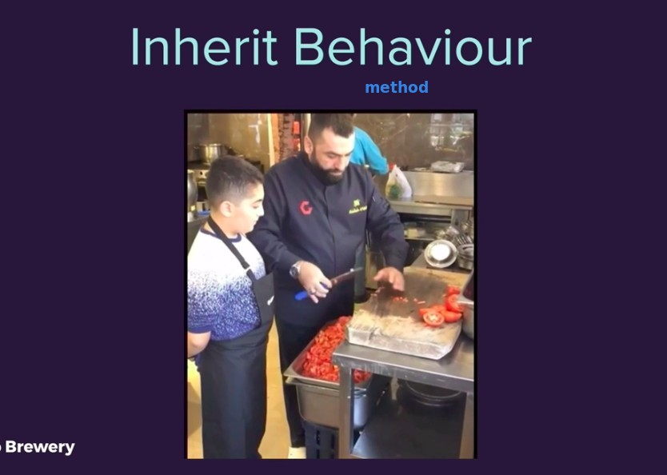
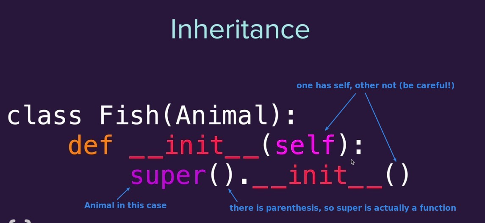
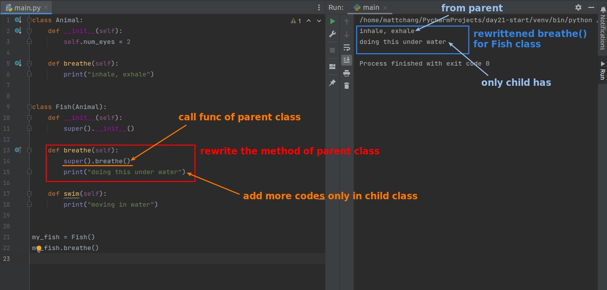

## **Concept of Inheritance**

## **Formula of Inheritance**

## **Practice in codes**

### _Inheritance_

- It may seem strange that we can use parent methods by calling the constructor of the parent class in the constructor of the child class, but that is exactly what happens!!

### _Modify method from parent class_

