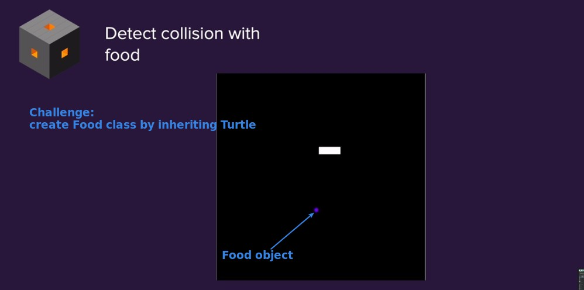
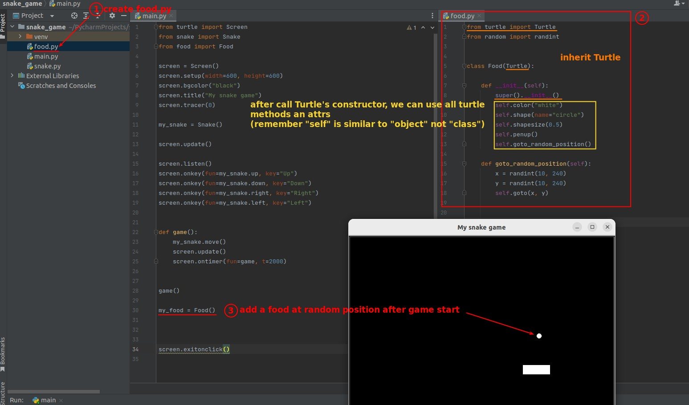
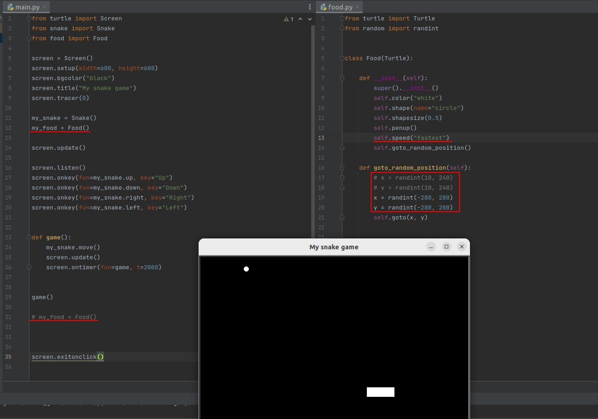
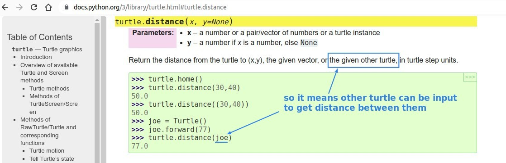
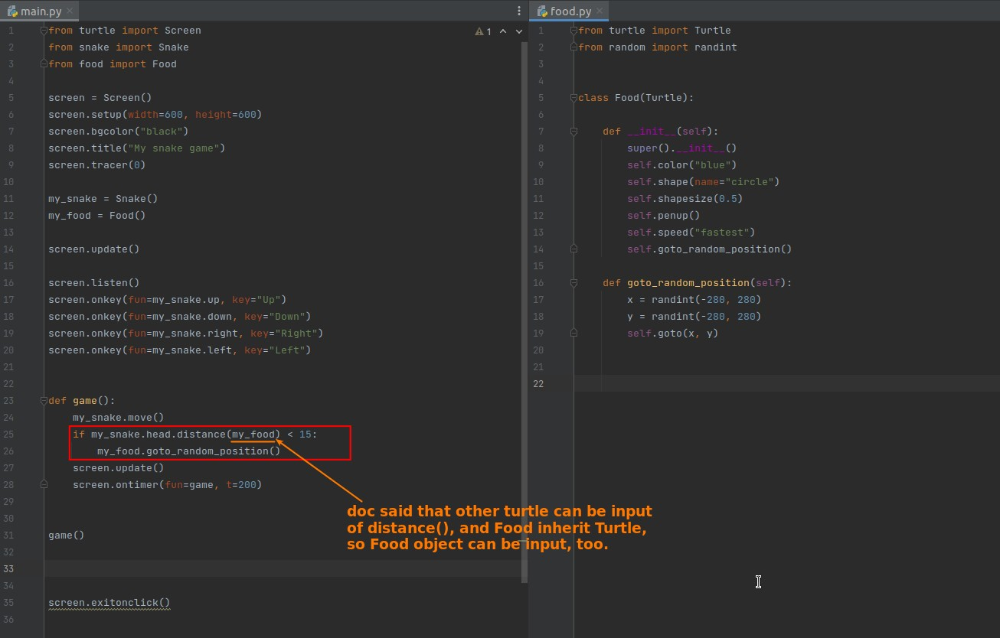
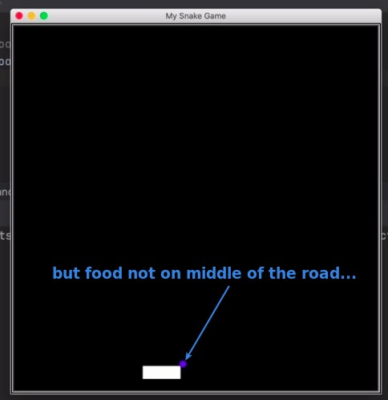
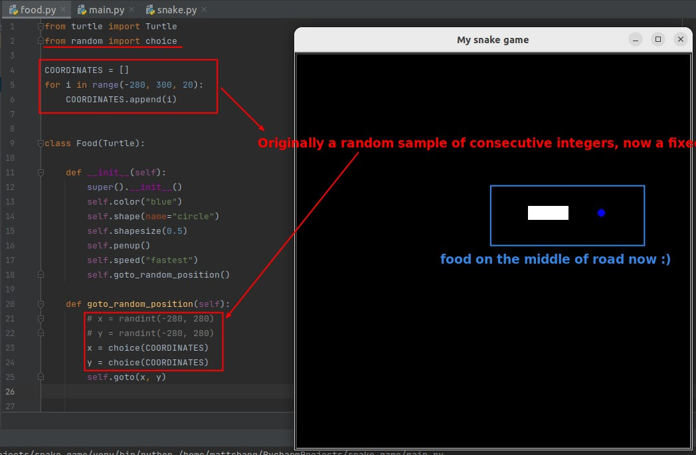

## **Challenge: Create Food obj by inherit Turtle class**

### _instruction_

### _My solution_

### _Compare to lector's_

- There is an obvious error in my coordinates section.
- lector puts the codes for creating the Food object and the Snake object together, which is more readable and doesn't change the result much, because our snake starts moving as soon as the game starts.

## **Challenge 2: Collistion with the food**

> Here collistion means that when the snake head in the screen touches the food, the food disappears and appears in another random position.

### _hint: documents - turtle.distance_

### _My solution_

### _Problem: food not on middle of road_

- Because snake movement relies on .forward(20), the coordinates of segments will be discrete rather than continuous, and this will result in food not appearing in the middle of the snake's path.

- The problem can be solved by listing the coordinates of each of the snake segments, and then taking a random sample from these as the possible locations of the food.
