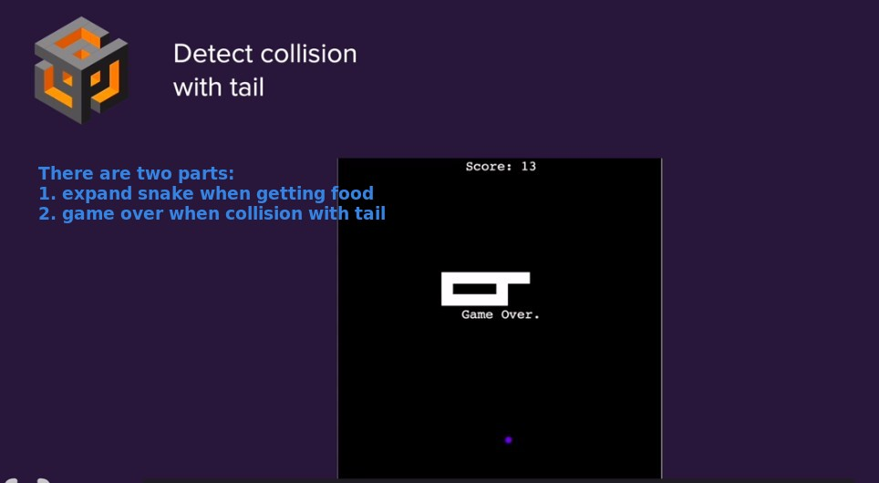
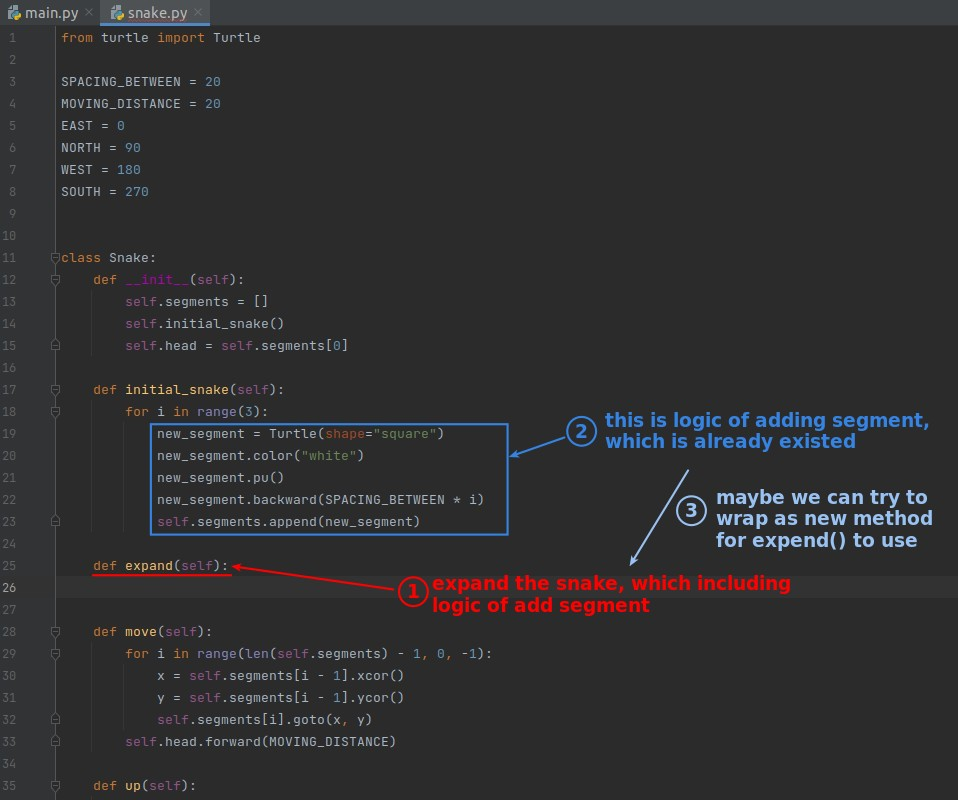
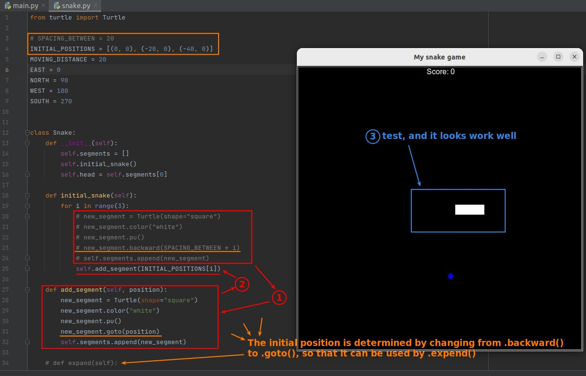
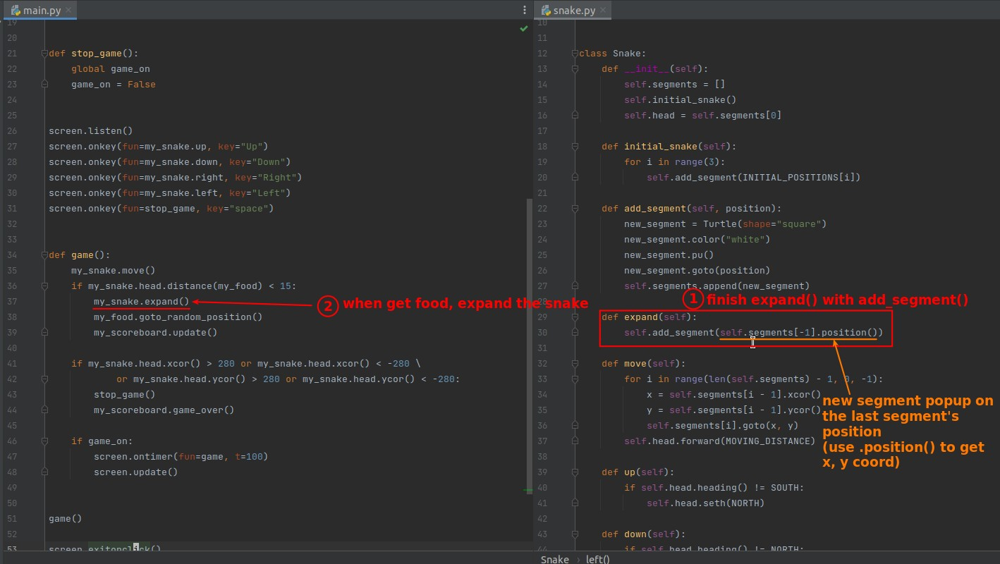
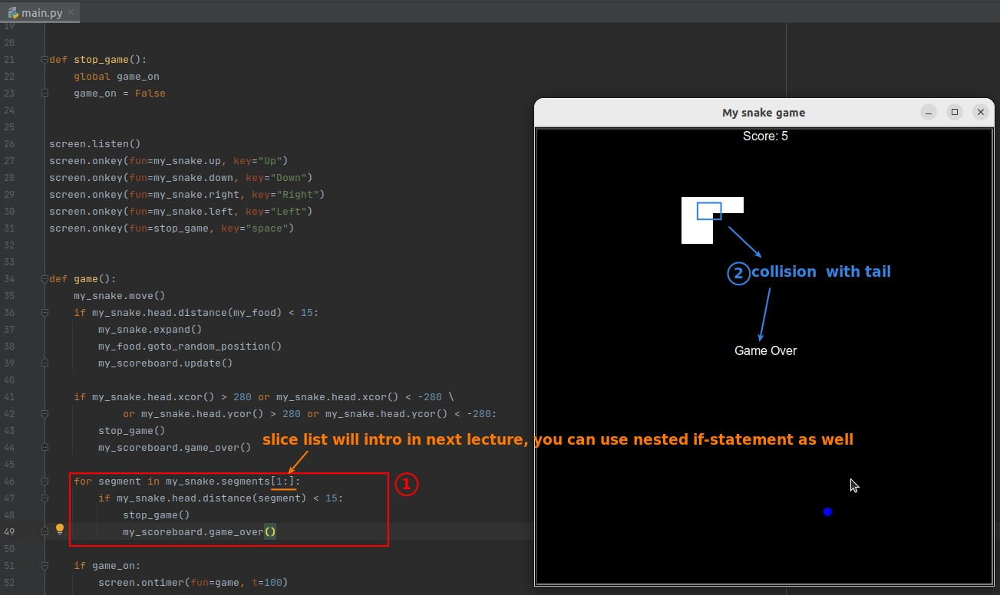

## **Challenge!**

## **Part 1: expand the snake**

### _create method expand() in Snake class, but..._

### _split instructions from initial_snake() to add_segment()_

### _Finish expand() and use it in main.py_

## **Part 2: collision with tail**

