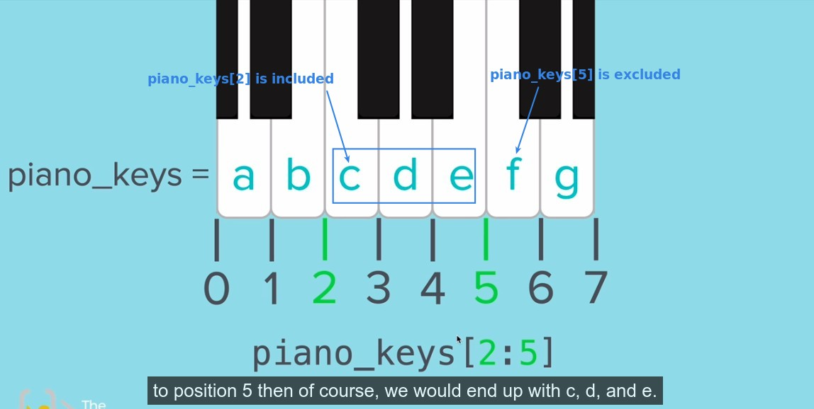
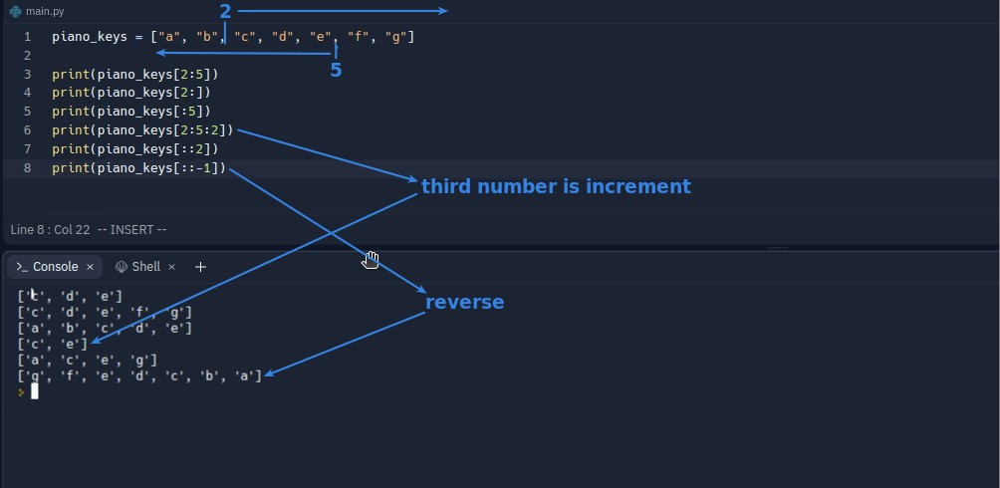
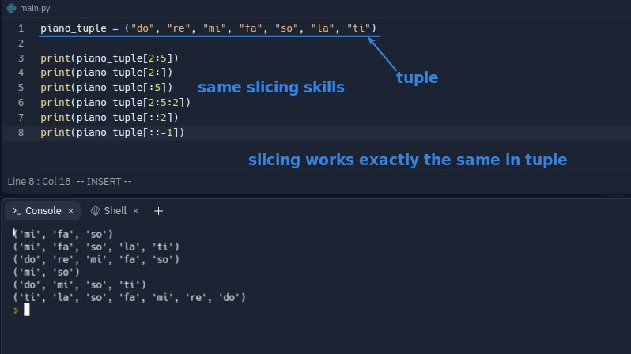

## **Intro of slicing**

- lector uses another concept to explain why the value of [2] is included, but [5] is not.

## **Practice in codes**

### _list_

- The [::-1] part is a bit odd, in theory it should feel like [0] [-1] [-2] ... So the first value should still be "a", but it starts with "g" in [-1].

### _tuple_

> In addition to lists, slicing can also be applied to tuple, and all are used in exactly the same way.

