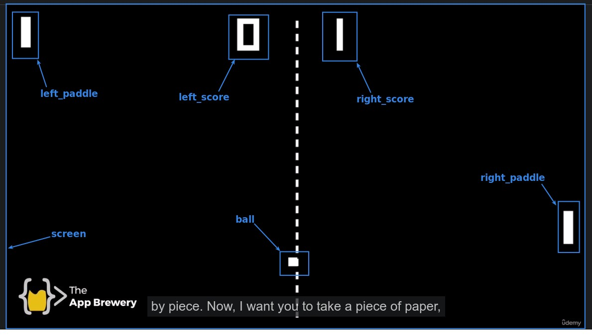
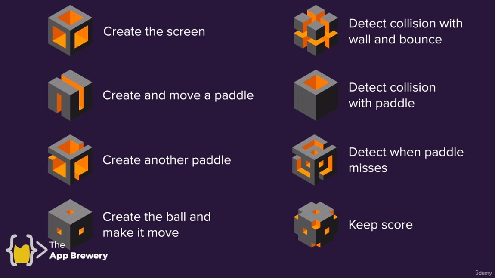

# **_Pong Game_**

> This day we had to complete the pong game, a classic game, but a little more complicated than the snake game.

## **Challenge: Breakign down the problem into small steps and classes**

> When faced with a complex project, the first step is to think about how to break it down into simpler elements such as the small tasks that need to be done, the steps that need to be taken, and which parts can be made into classes.

### _Classes_

- As you can see in the picture above, I can see that there are six parts that can be made into classes.

### _Small Steps_

1. Create screen.
2. Make a moveable paddle.
3. Make another paddle.
4. Make a moveable ball.
5. Make the ball collide with the wall and bounce.
6. Make the ball collide with the paddle and bounce.
7. Make a paddle and miss the ball.
8. Make a scoreboard with continuous scoring

### _Lector's steps_

lector has only figured out the steps first, but which classes are expected to be made is not yet expained.
