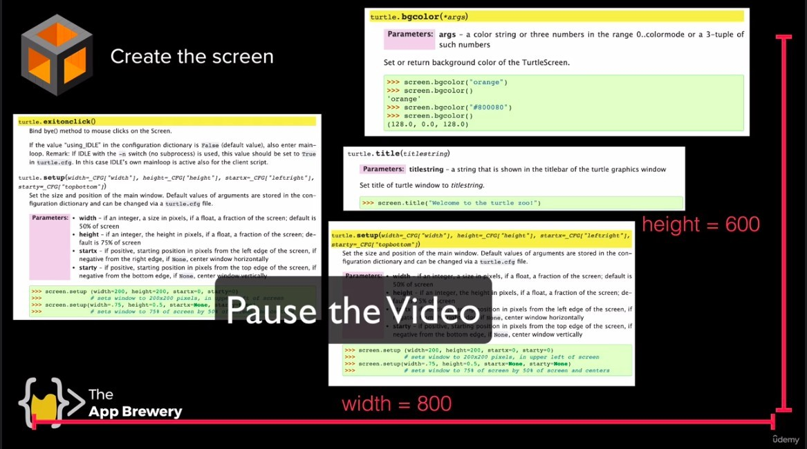
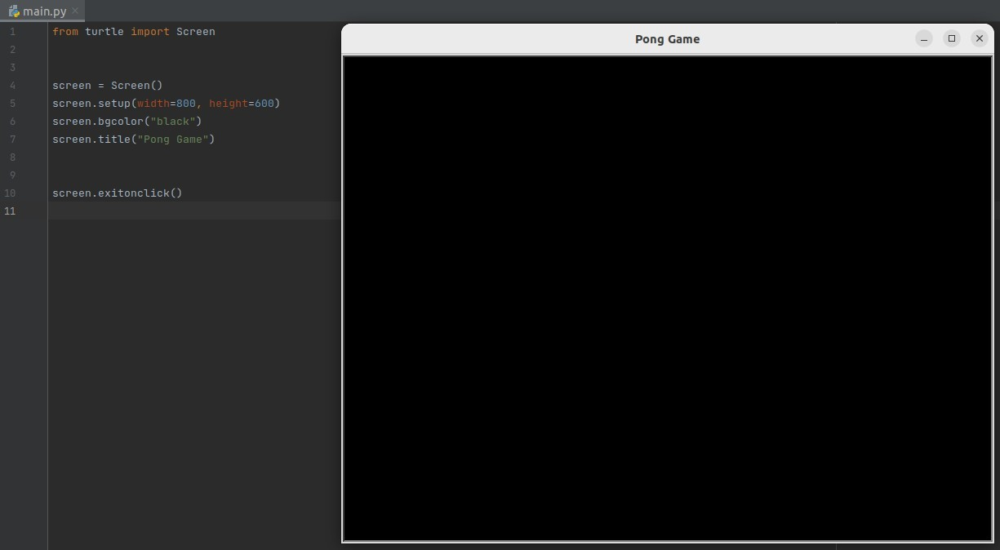
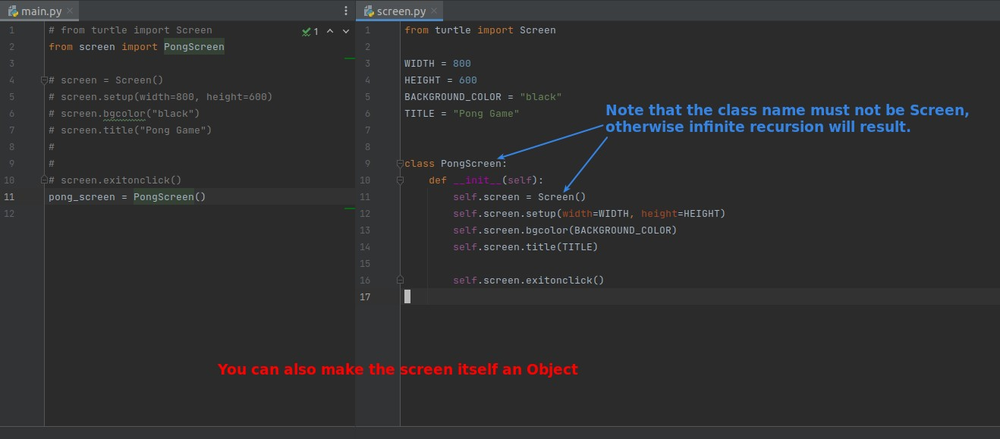

## **Challenge: Create screen of Pong game**

## **My & Lector's solution**

- Write the screen directly in main.py in the same way as before.

## **OOP way**

- Because the \_Screen object is made using Screen(), it is not recommended to create the class directly by inheritance, as the underline in front of it means that direct external use is prohibited.
