## **Challenge 1: Create a paddle**

### _instruction_

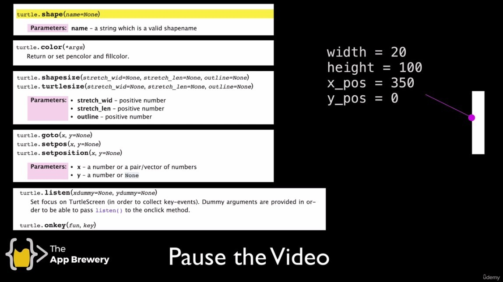

### _hint: shapesize()_

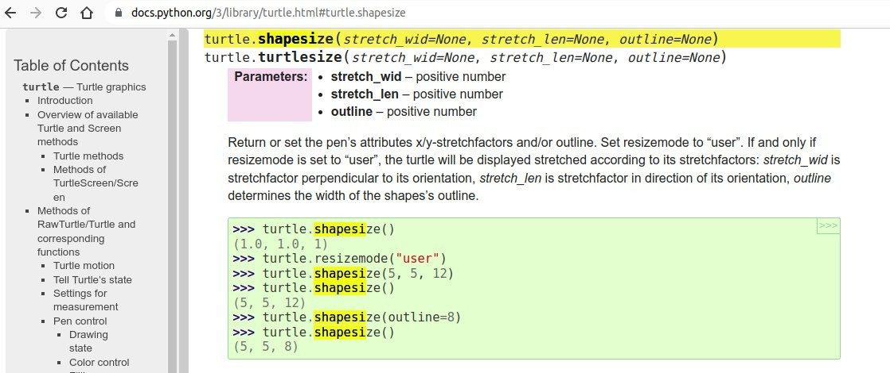

### _solution_

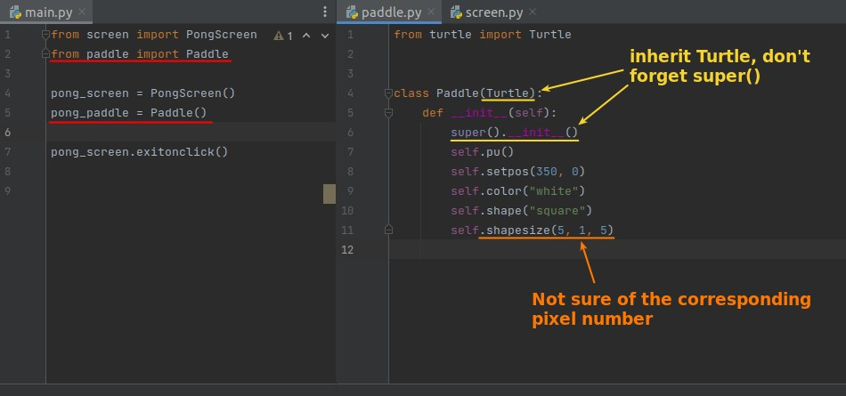

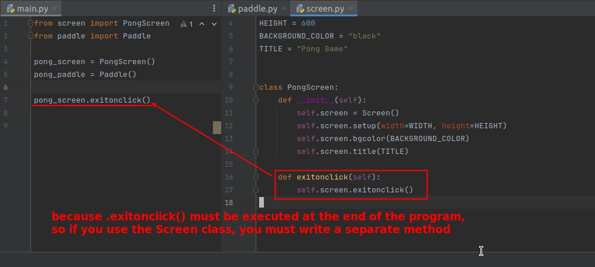

- This step was later found to be a bit redundant.

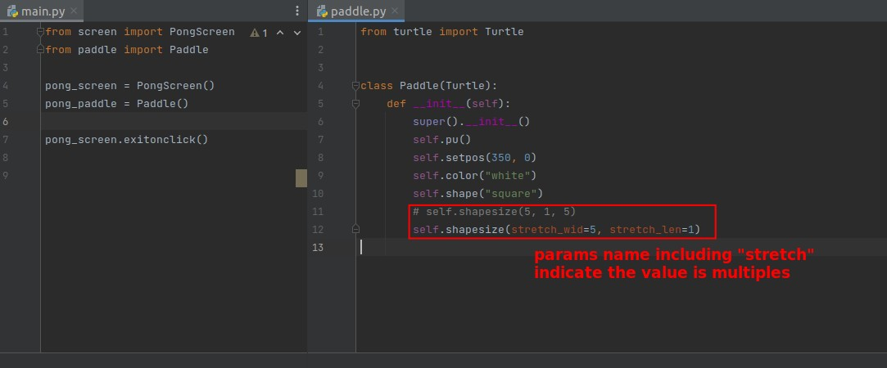

- lector uses keyword arguments to give arguments, so you can guess what these values mean in terms of multiples.

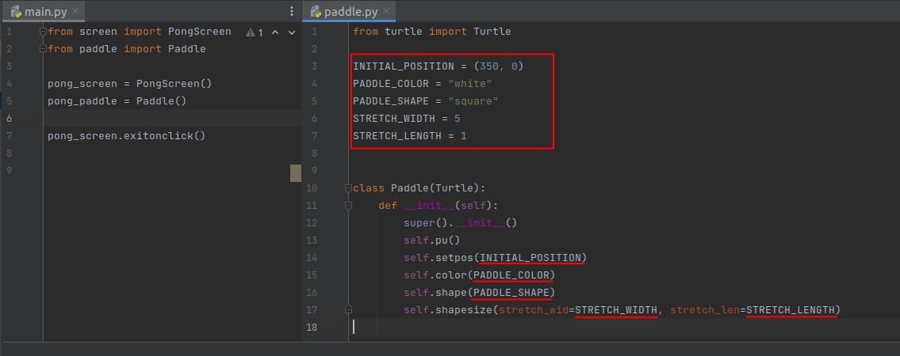

- Increase script readability with global constants.

## **Challenge 2: Control the paddle up & down**

### _listener and methods_

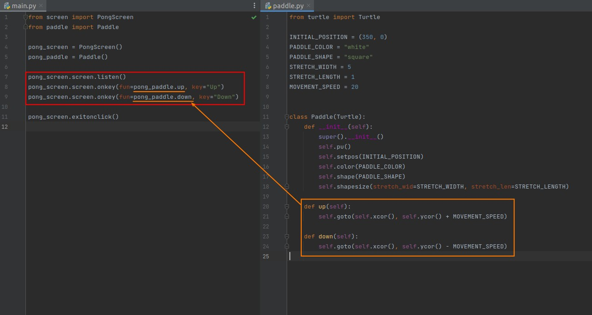

### _remove .exitonclick()_

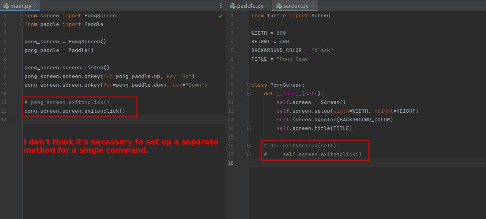

## **Challenge 3: Remove waitnig time for animation**

### _instruction_

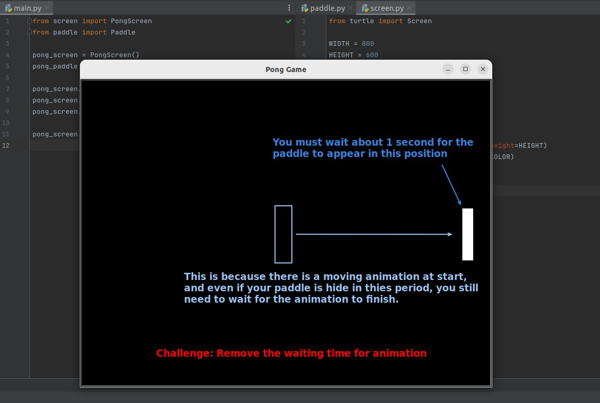

### _solution_

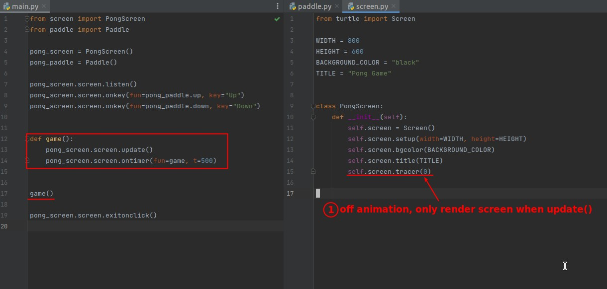

### _optimize: increase readibility with global constant_

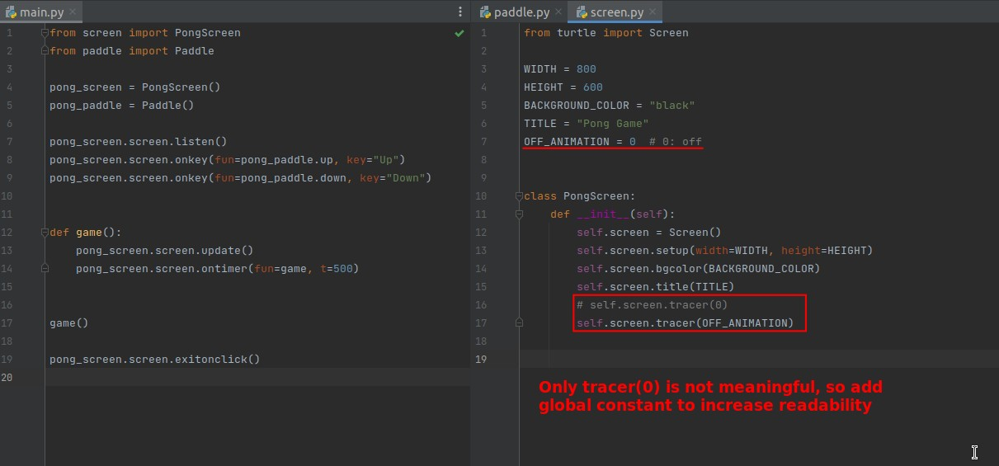
