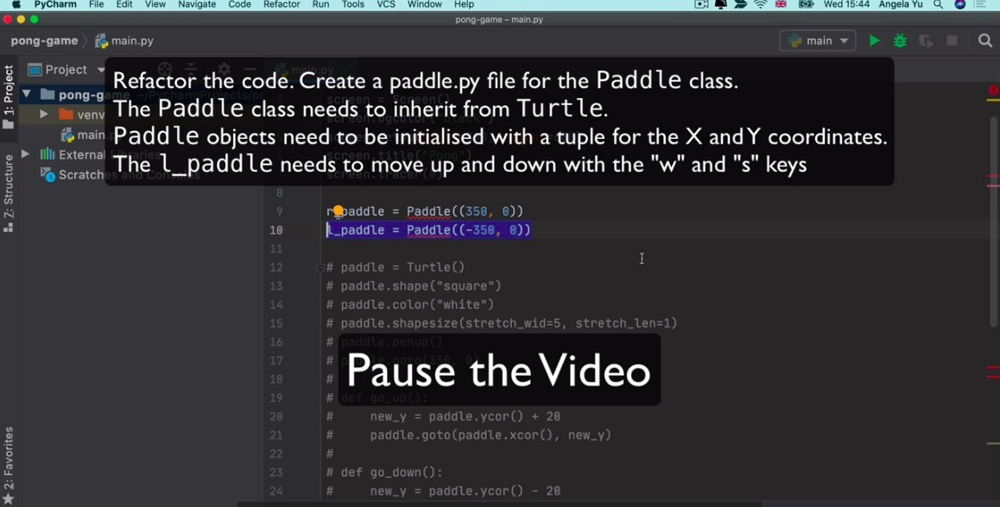
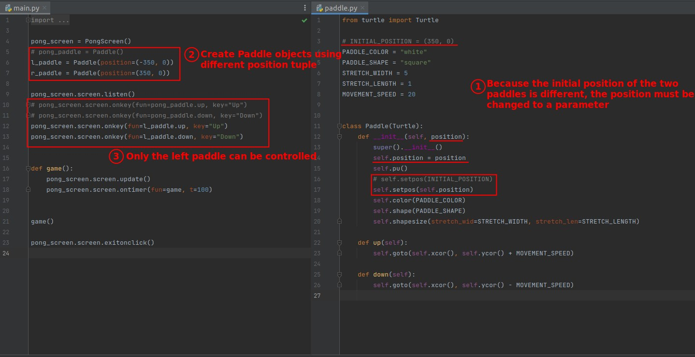
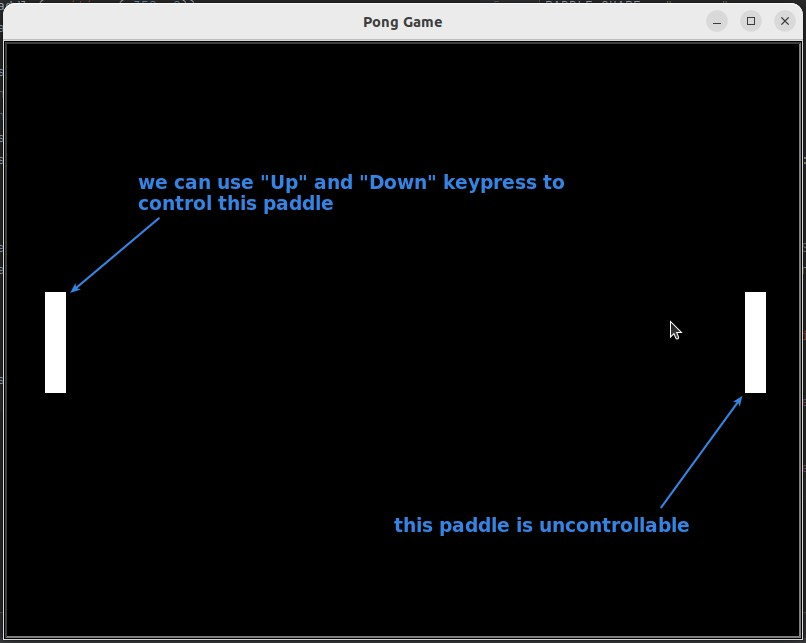

## **Challenge: Create Paddle class and Use it to create two paddles**

## **My solution**

> Because I had already done the Paddle class in the previous lecture, I only need to change the position part to an initializable parameter of the class in this lecture.

## **Result**

- The lector was made so that both paddles were human-operated, but I wanted to make it so that it could be played as a single player.
