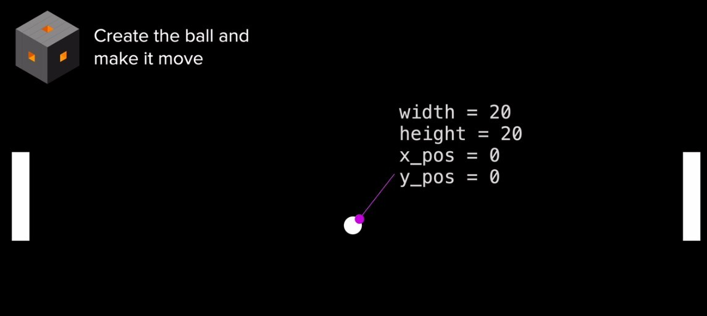
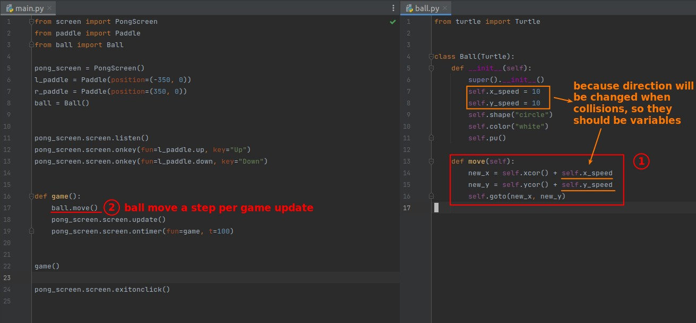

## **Challenge: Create the ball & let it moving**

## **Solution: part 1 - Ball class and create its object**

## **Solution: part 2 - Let the ball moving**

- Just get the ball moving, start with the simple.
