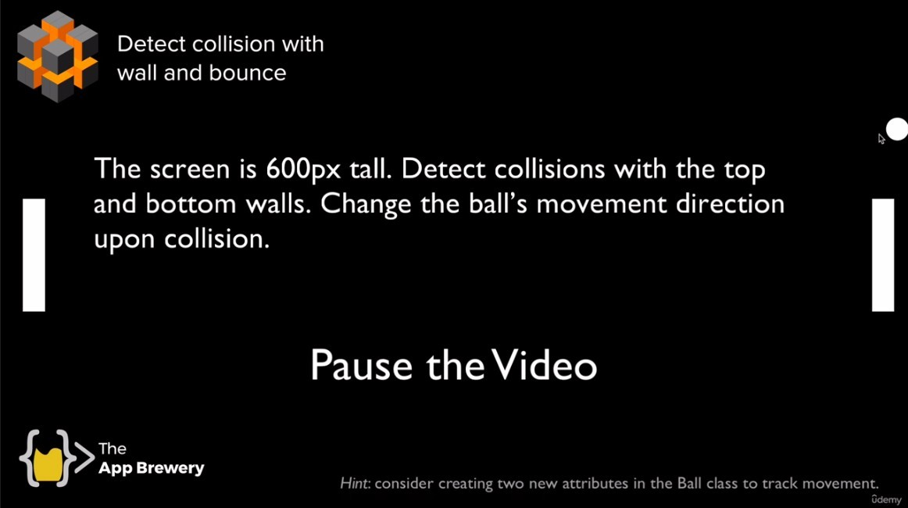
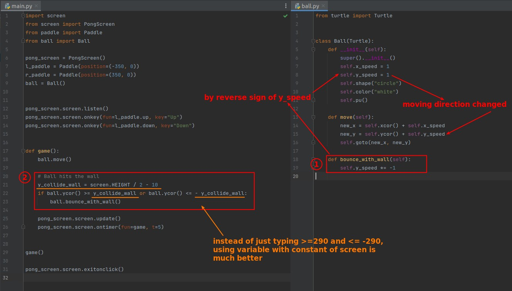
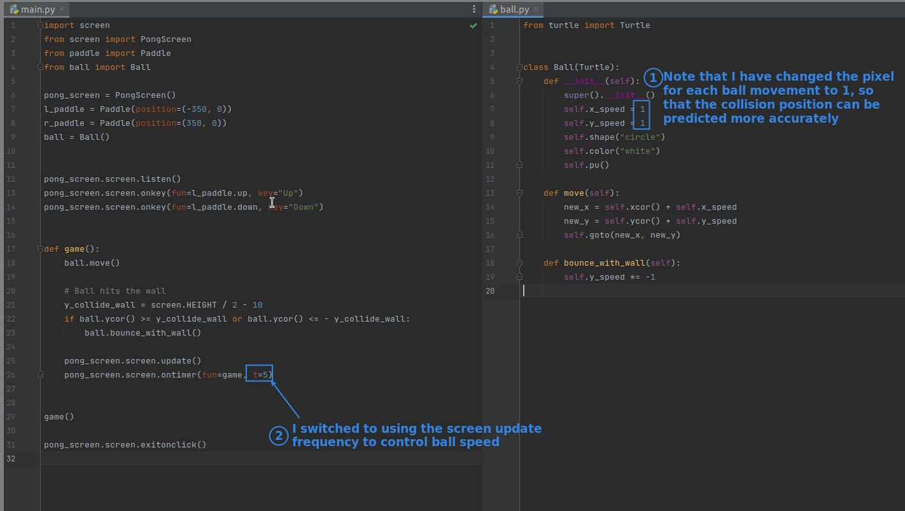

## **Challenge: Ball collision with the wall**

## **My solution**

- The variables that are often required are written in the attributes so that they can be easily extracted by different methods.
- A constant name can be more meaningful than a simple numerical value.

## **Some prerequisites to note...**

- The lector still uses the value of self.x_speed to control the speed of the ball, but I have the ball move a fixed 1 pixel each time the screen is updated, so the speed of the ball is affected by the speed of the screen update.
