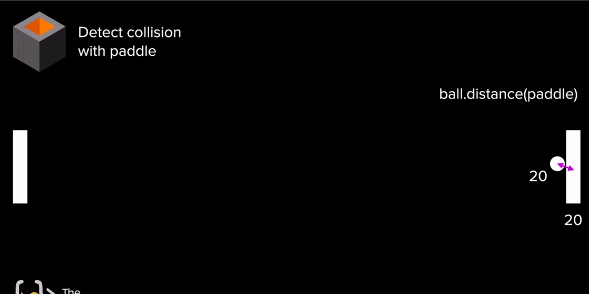
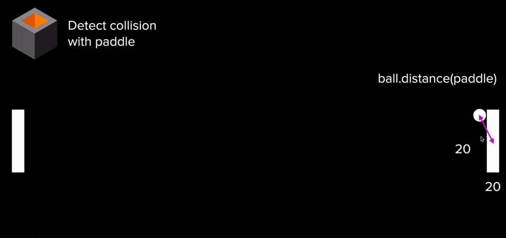
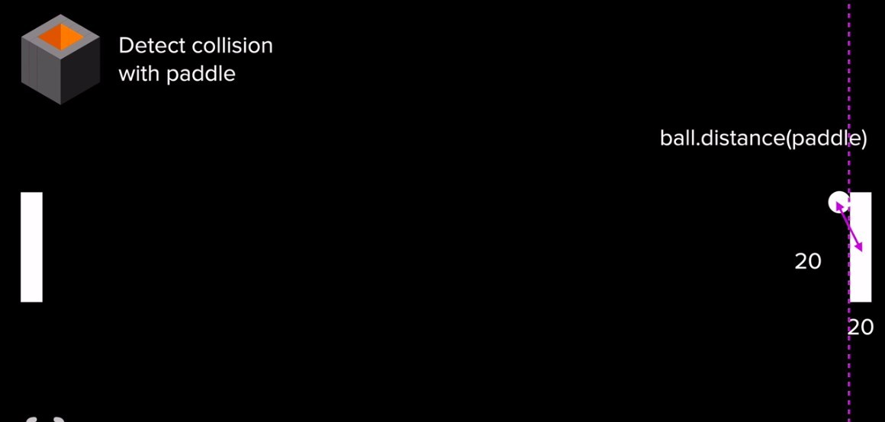
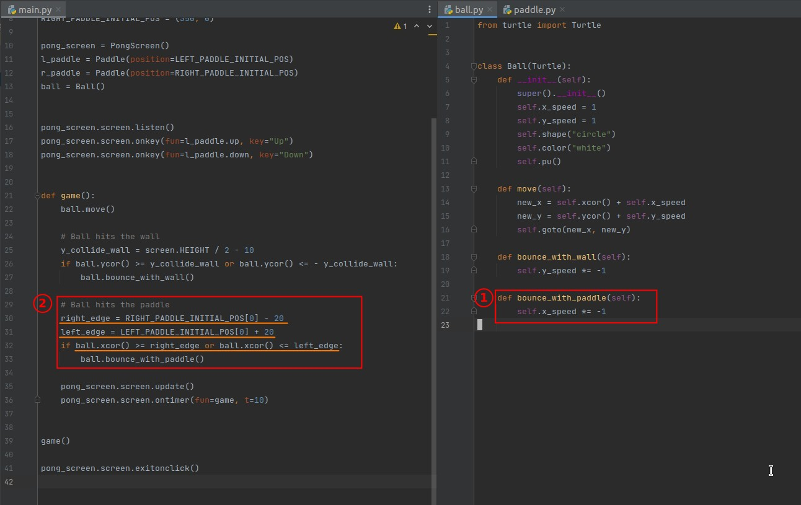
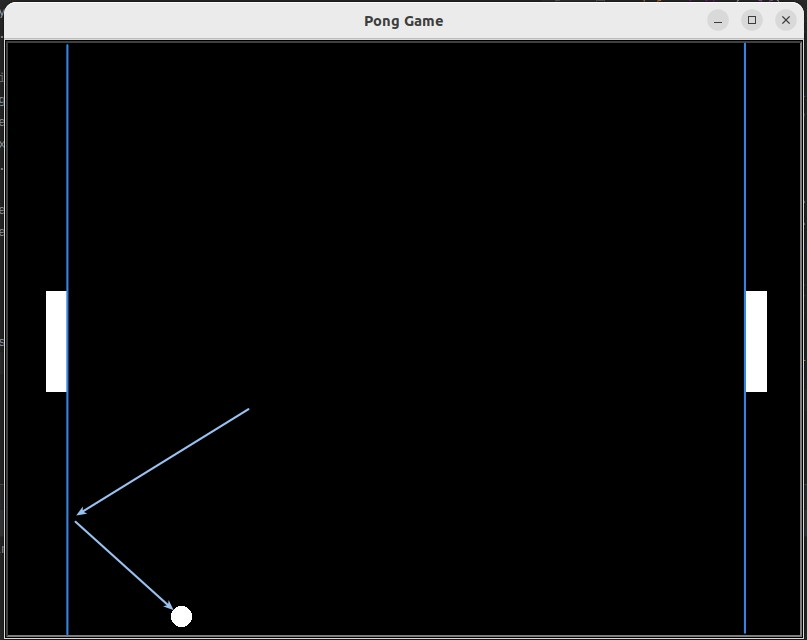
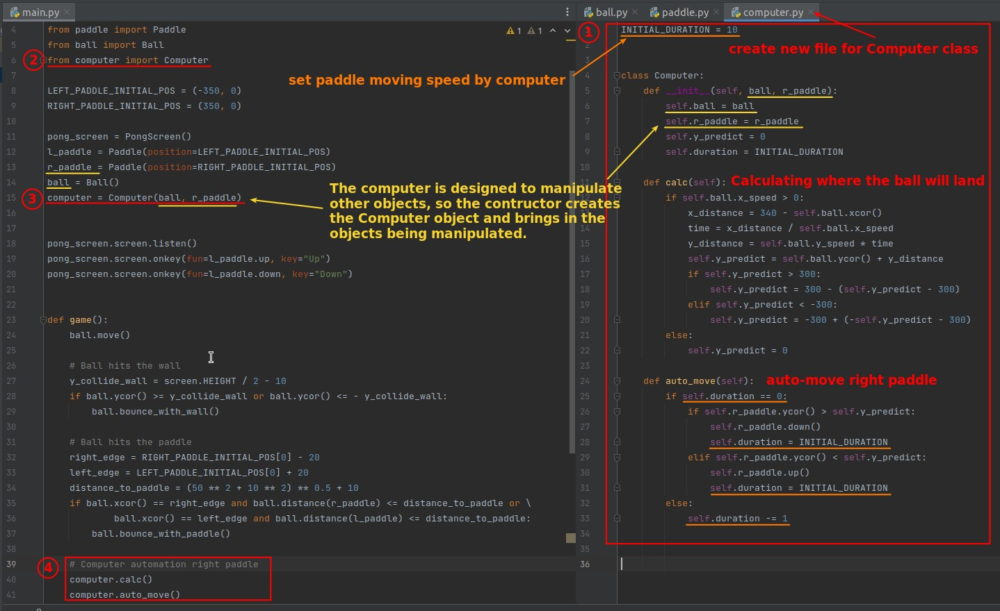

## **Challange: Collision with Paddle**

### _Simply by distance between ball and paddle_

### _Collision off center of the paddle_

- The .distance() method alone will not work when the collision is off-centre from the paddle, because .distance() is calculated using the centre of the ball and the paddle.

### _Combined x-margin_

> Therefore, it is necessary to combine the concept of left and right boundaries as a condition for collision.

## **My solution**

### _Start with only x-margin_

> Let's start with the simple left and right borders collision.

### _Add distance from paddle_

### _Plus: Computer class(Auto-control right paddle)_

> I added this part myself, lector is designed for two players to play against each other.

- Computer mainly calculates and operates on ball and paddle, so constructor directly introduces ball and paddle object as parameters when creating Computer object.
