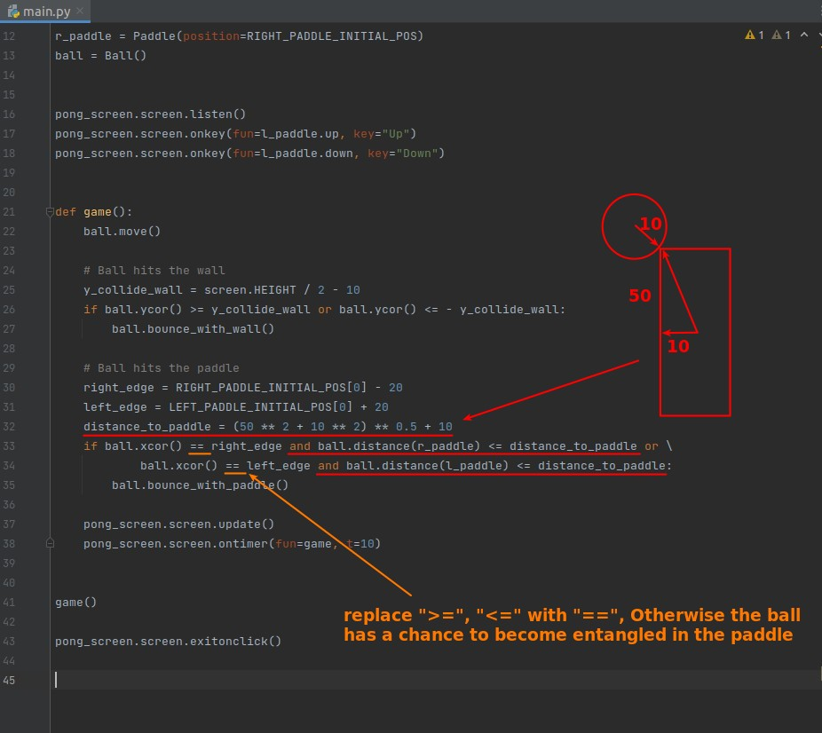

## **Challange: Collision with Paddle**

### _Simply by distance between ball and paddle_

### _Collision off center of the paddle_

### _Combined x-margin_

## **My solution**

### _Start with only x-margin_

### _Add distance from paddle_

### _Plus: Computer class(Auto-control right paddle)_

