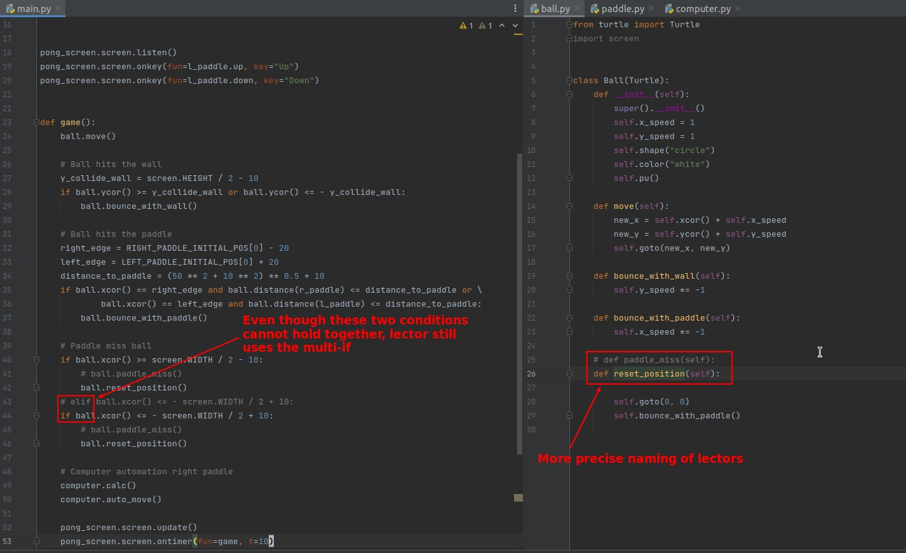

## **Challenge: Detect when paddle misses**

## **My solution**

- The part about changing the direction of the ball is straightforward using the existing method "bounce_with_paddle".
  - Perhaps "bounce_with_paddle" should be renamed to "reverse_x_direction" to be more accurate.

## **Compare to lector's**

- The lector is named more precisely so that it is easier to think of its true functionality in the future.
- lector prefers to use multiple-if.
