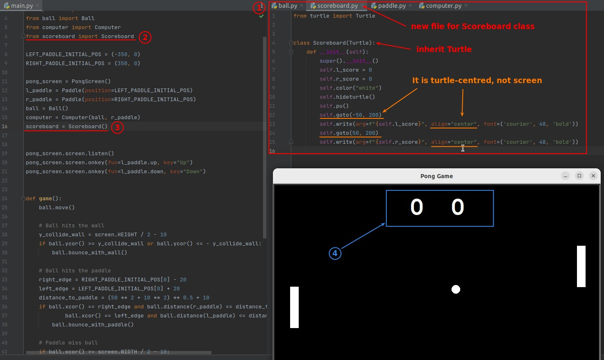
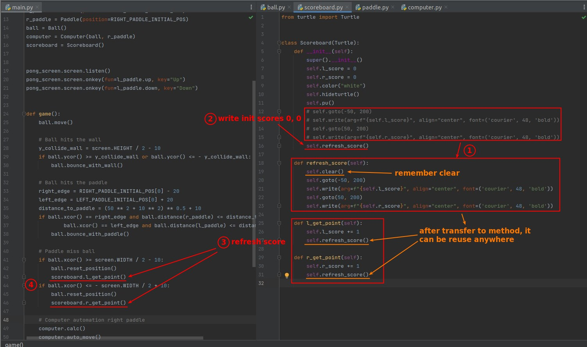
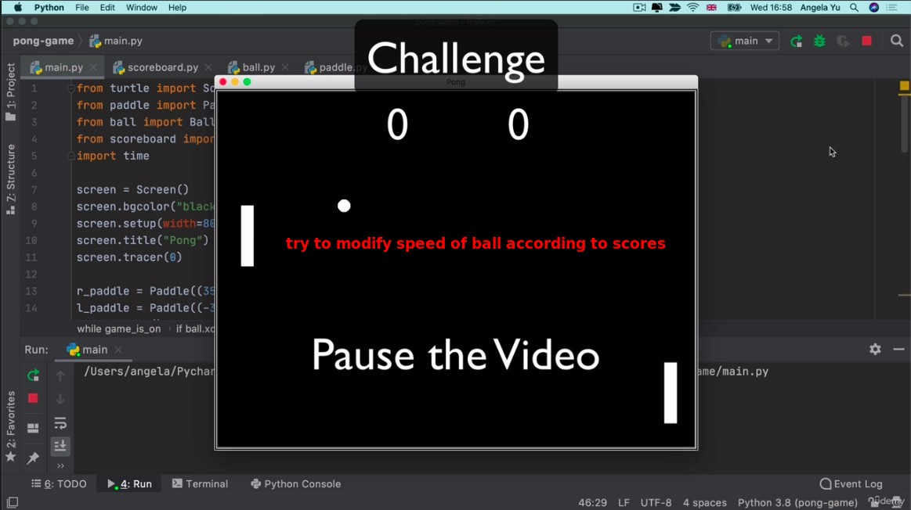
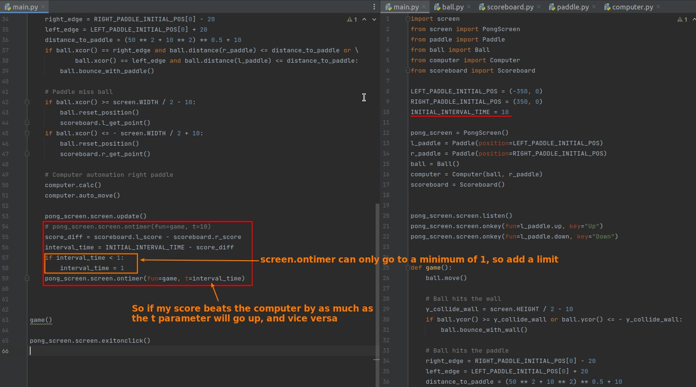

## **Create scoreboard**

### _Complete the initial look_

### _Add section for updating scores_

## **Challenge: Modify speed of ball according to scores**

### _instruction_

### _My solution_

