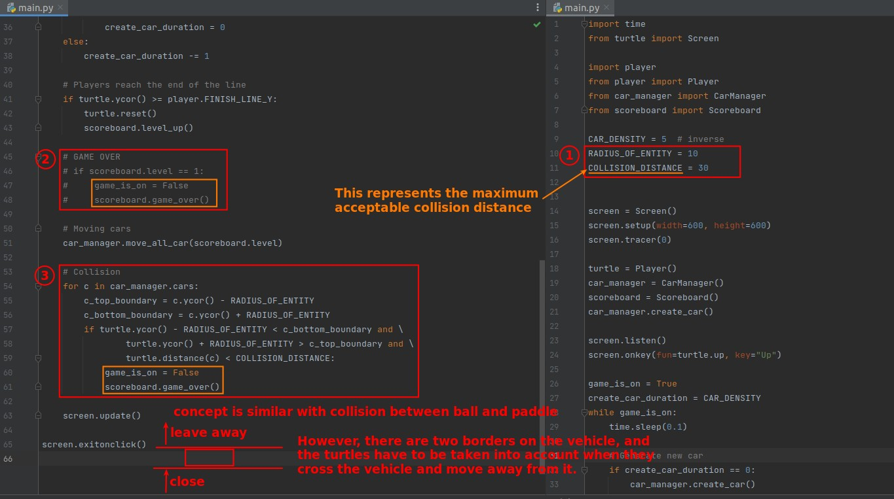
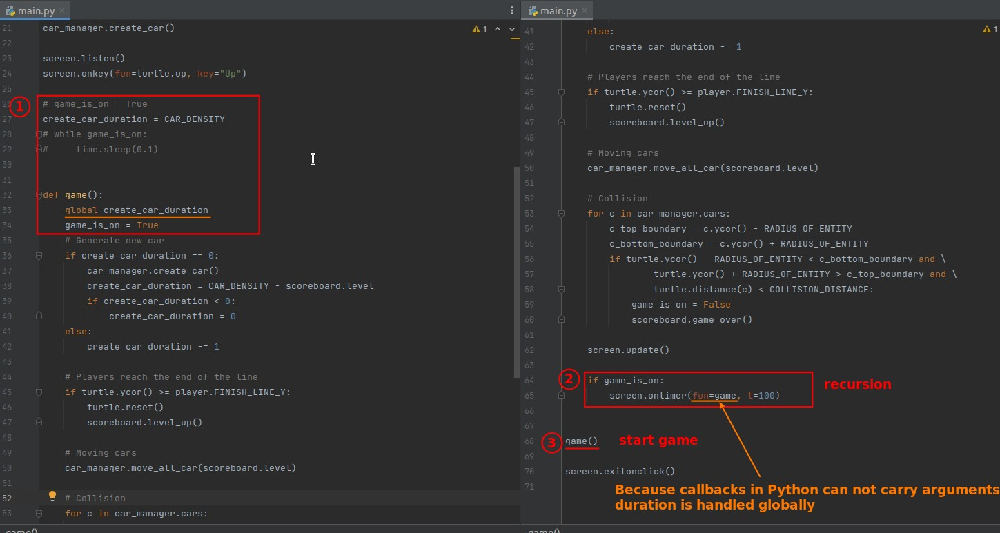

## **Challege: Collision**

- The maximum acceptable collision distance is actually a reasonable value obtained from direct testing results.

## **Plus: Optimize game by screen.ontimer (recursion)**

- Stopping the while loop is to make the result of the while condition False, stopping recursion is to find a way not to call function itself.
  - Don't try to jump out of the function with a return, when using recursion.
