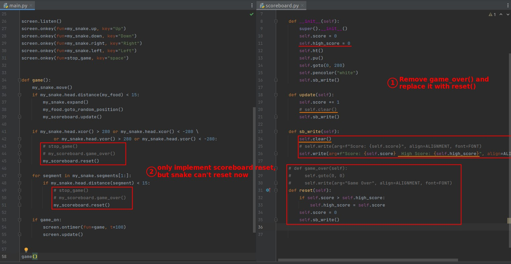
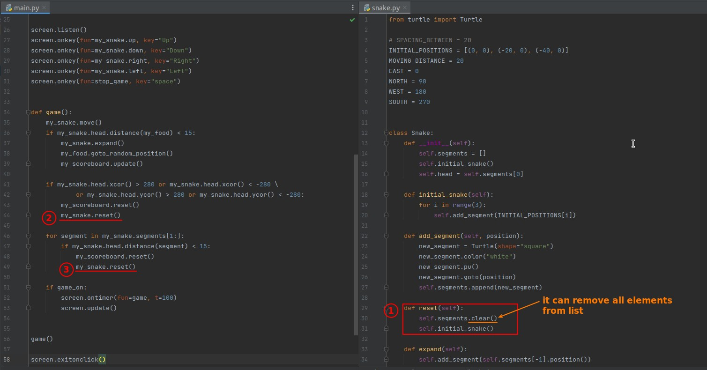
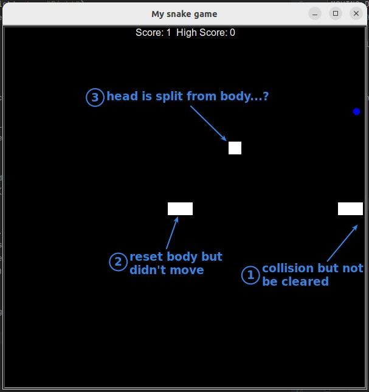
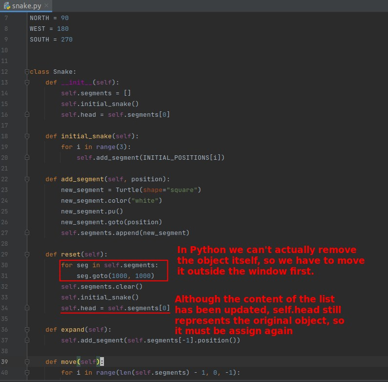
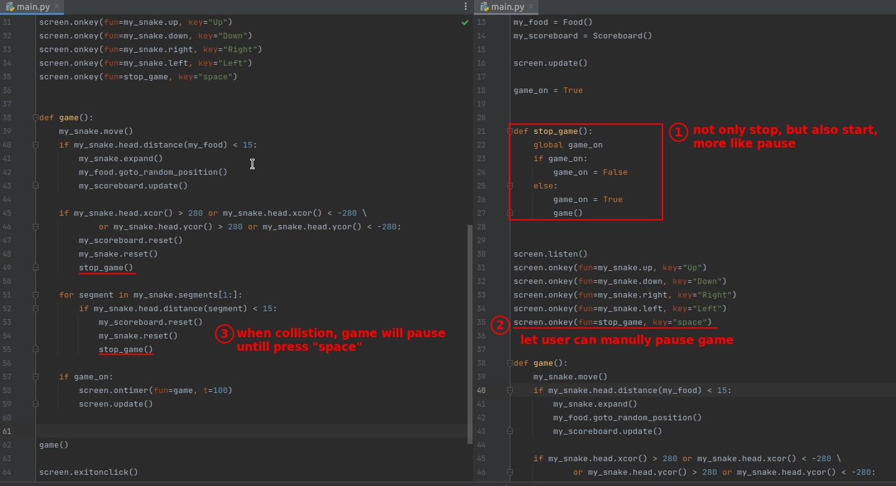
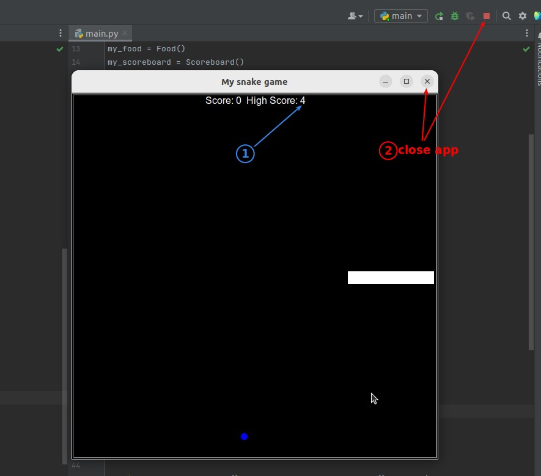
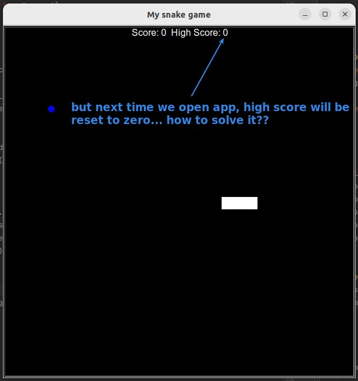

## **RESET of scoreboard**

## **RESET of snake**

### _First try_

### _Wierd result_

> Several important concepts were encountered here...

- A variable name in Python exists as a tag, it does not represent a specific block of memory.
- A tag cannot hold another tag, so when we assign an object in a list to a variable, it is like adding another tag to the object.
  - This is why our list has been cleared, the variable still points to the original object.
- No values or objects in Python can be cleared manually, but are automatically erased by Python when they don't have any tags on them.

## **PAUSE Game**

## **HIGH SCORE can't presist after closing app**

### _close and reopen app_

### _Use doc to record?_

> Shall we open another word app to record the highest score?

- Python does the same thing, only it can be written as a script to do it more automatically.
