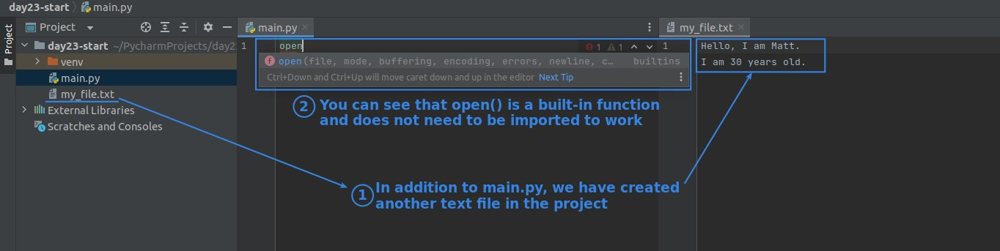
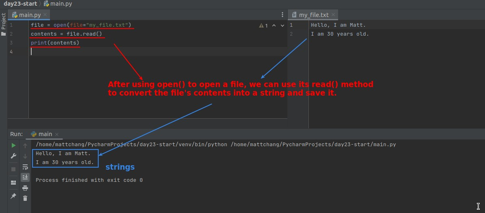
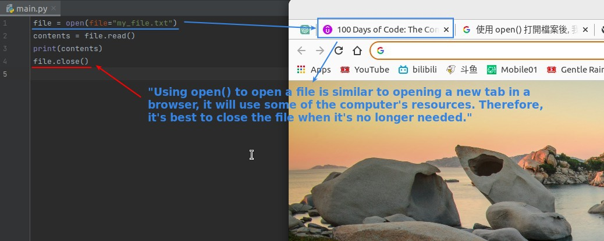
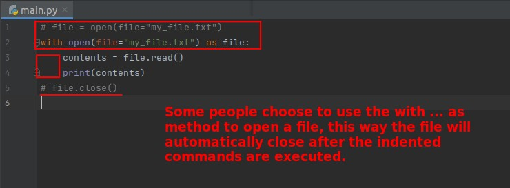
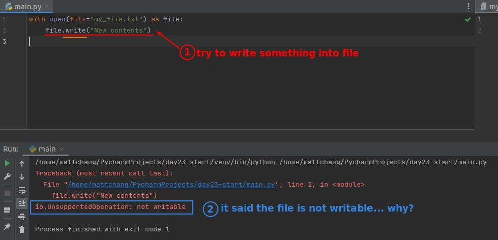
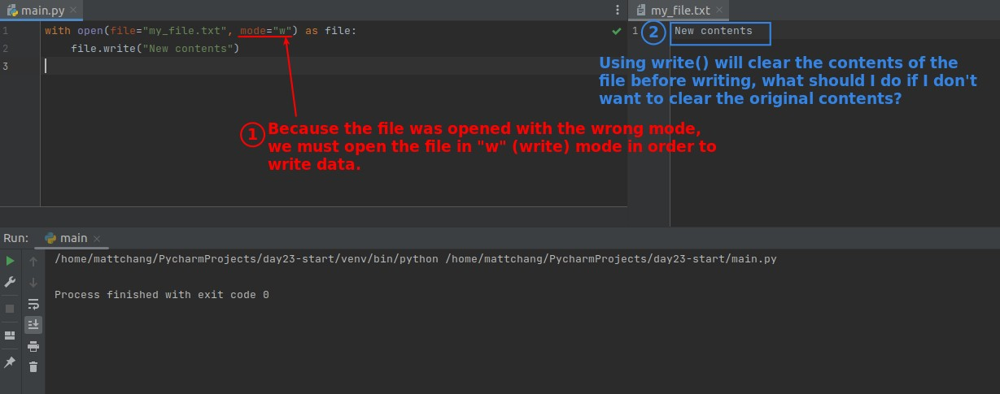
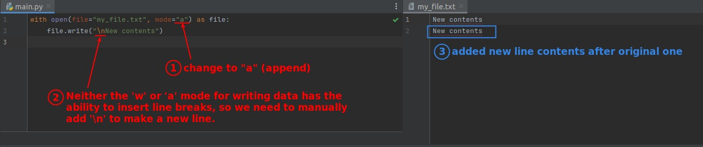
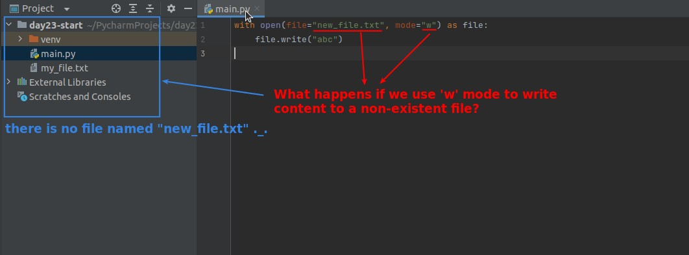
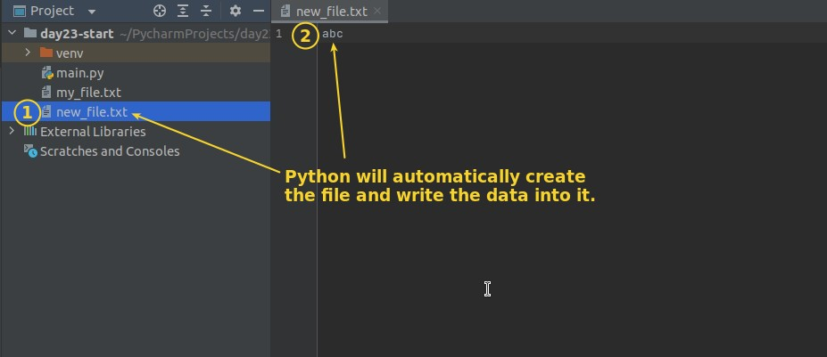

## **Open File**

## **Read File**

## **Close File**

## **Use with ... as to open file**

## **Write data into file**

## **Append data into file**

## **Write data to non-existed file**

