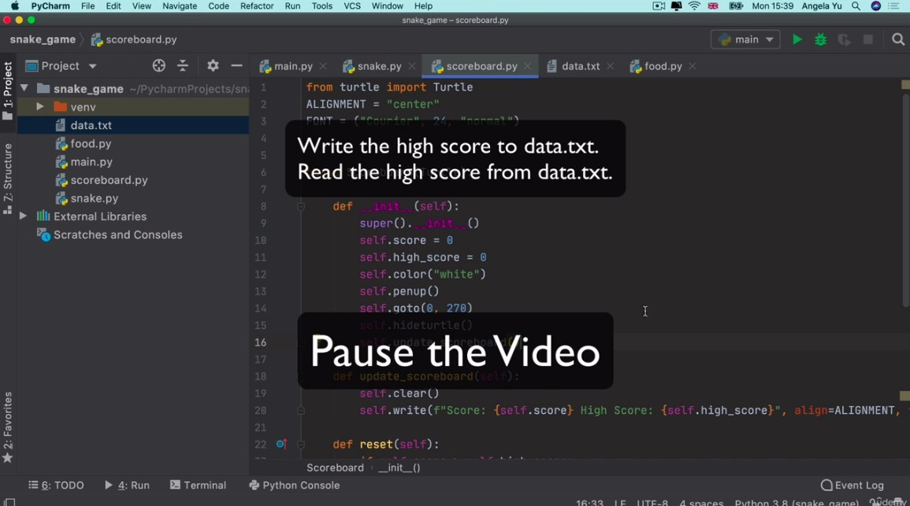
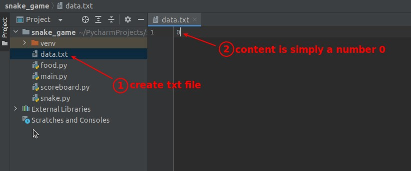
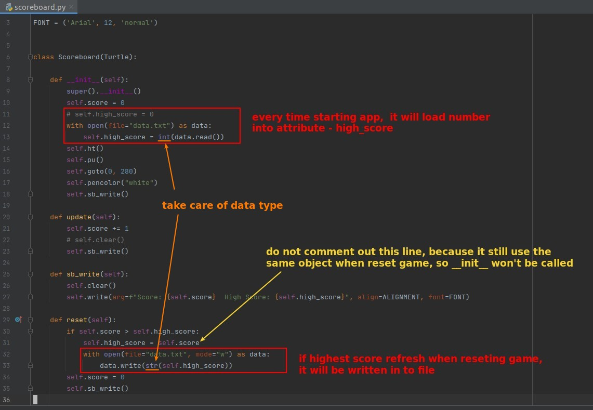

## **Challenge: Upgrade the scoreboard of Snake game**

> The purpose is to keep the highest score from being reset when the app is restarted.

## **Create a text file to store highest score**

## **Upgrade Scoreboard's codes to allow it to access text files**

- The data retrieved from the text file must be a string, and the data written to the text file must also be a string, both of which should be noted.
