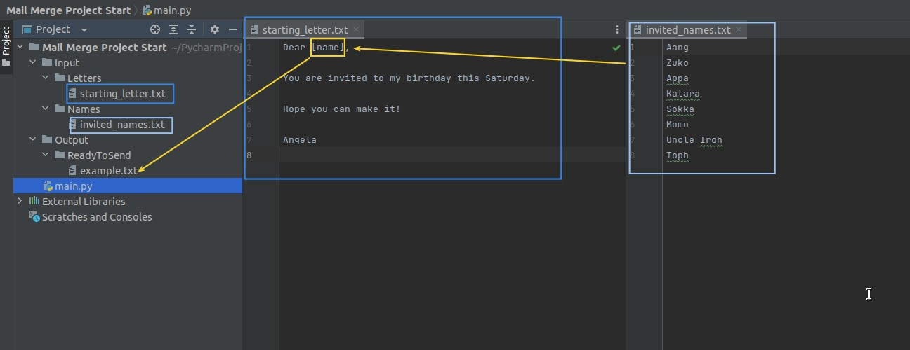
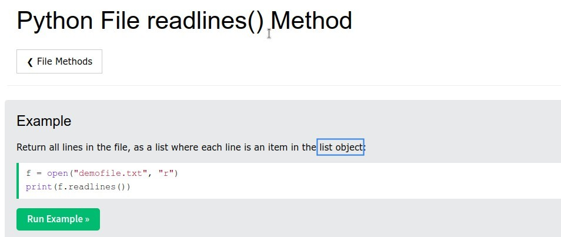
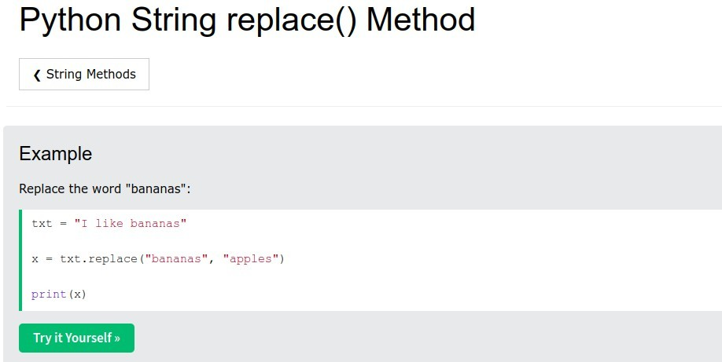
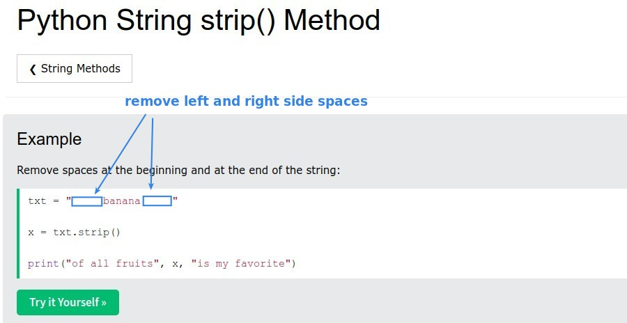
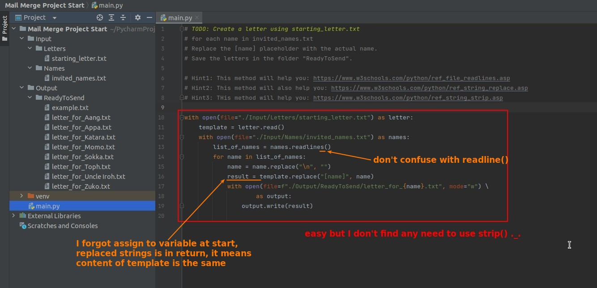

## **Challenge: Merge Mail**

### _Instruction_

### _Main.py & Comments_

### _Hints_

- In short, each row becomes an element in a list.

## **Solutions**

### _Mine_

- Some methods act directly on the attached object, others return the result of processing, the methods introduced by hints are in the latter category.

### _Compare to lector's_

- so "with ... as" does not form a scope, which is the same as if and while statements, so we don't need to make a nest structure.
- And don't forget that readability is important...
