## **Use build-in functions to retrieve data from CSV**

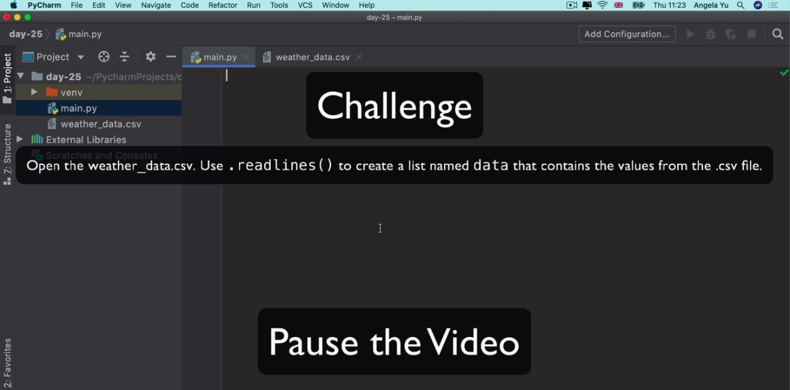

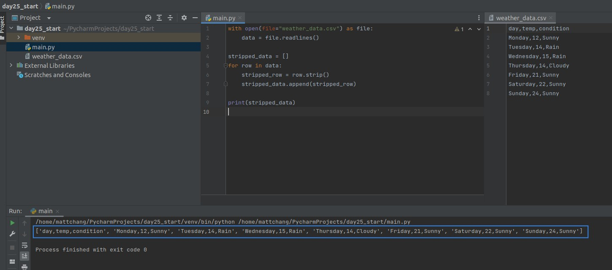

## **Use build-in library 'csv' to retrieve data from CSV**

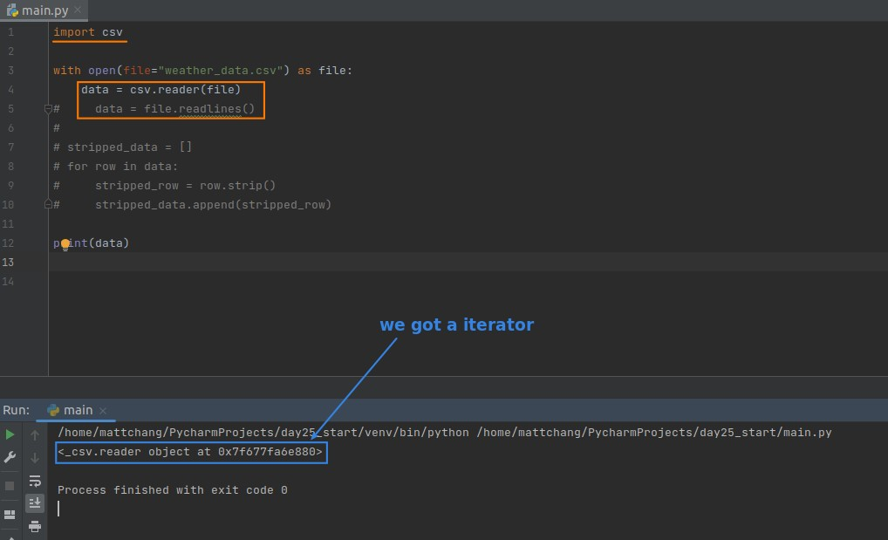

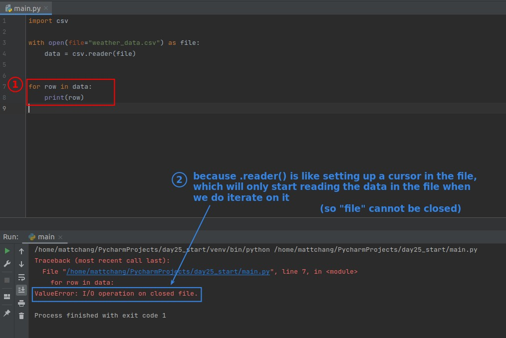

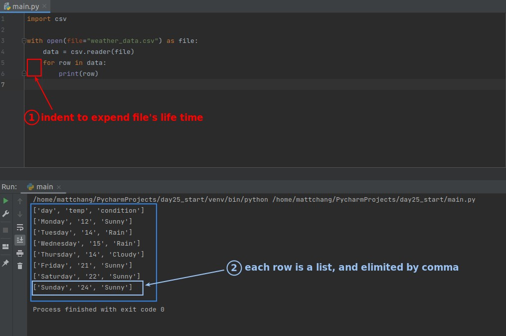

### _Challenge: Get all temperatures_

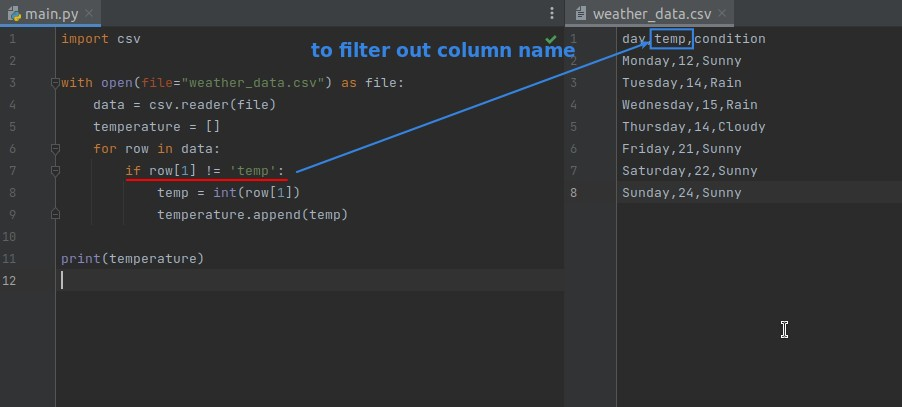

## **Use 3rd-party library 'pandas' to retrieve data from CSV**

### _Introduce PANDAS_

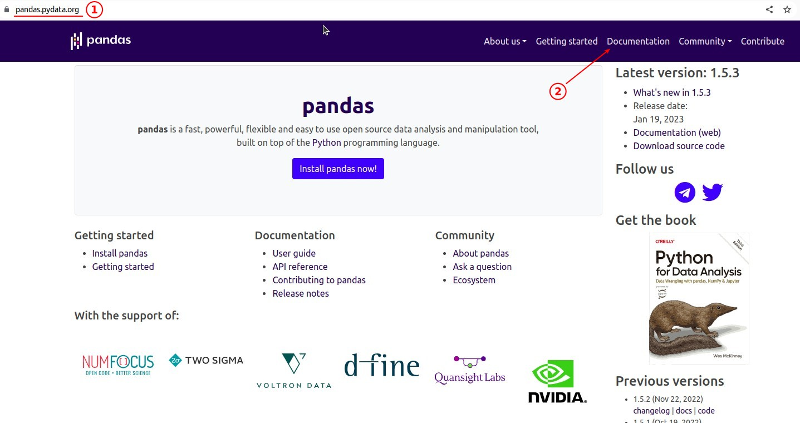

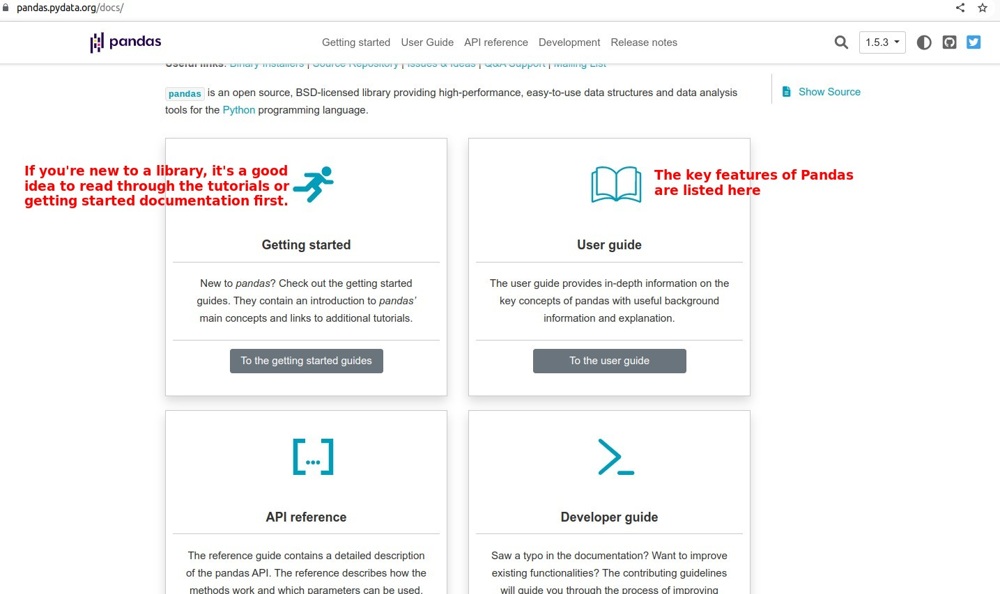

### _Use PANDAS_

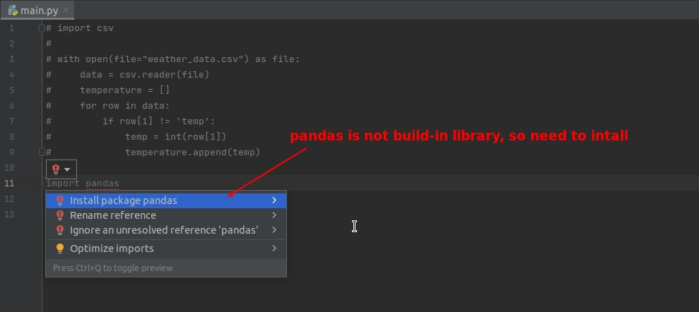

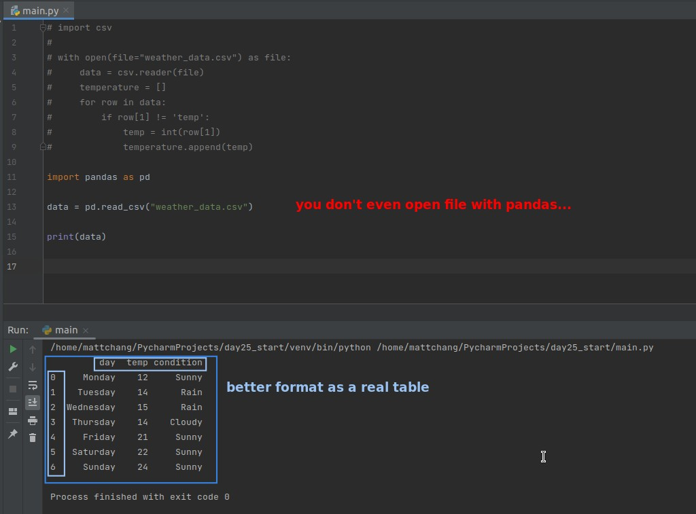

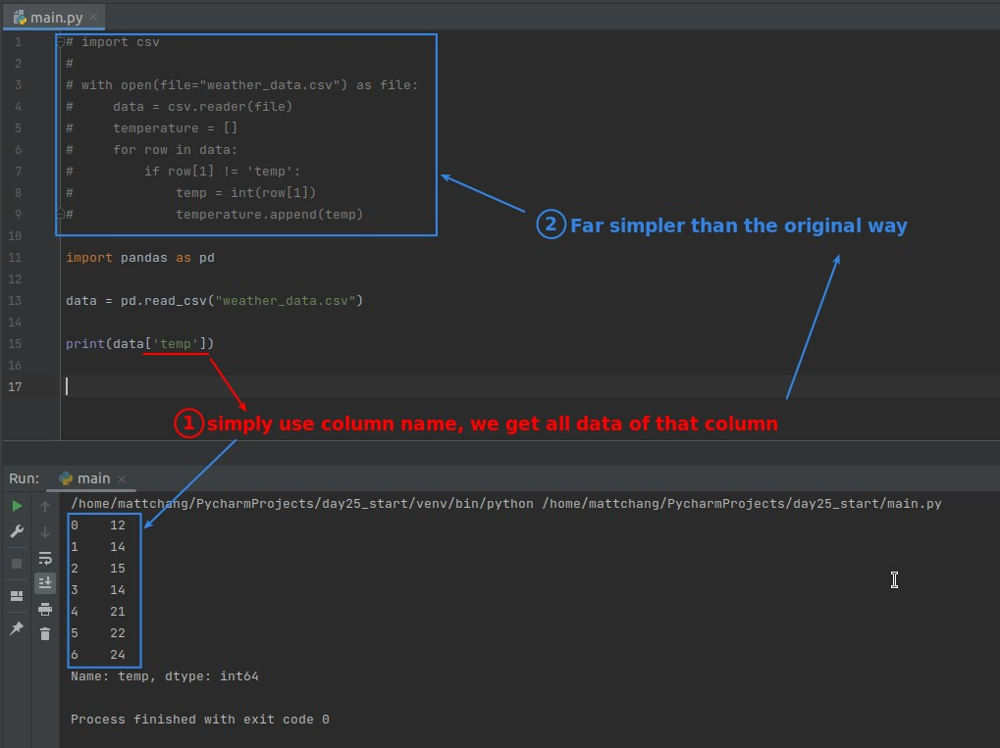
