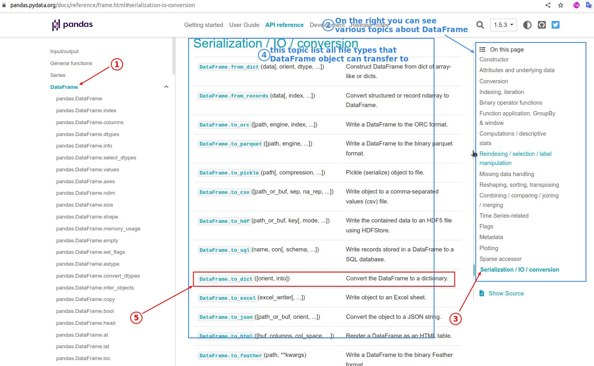
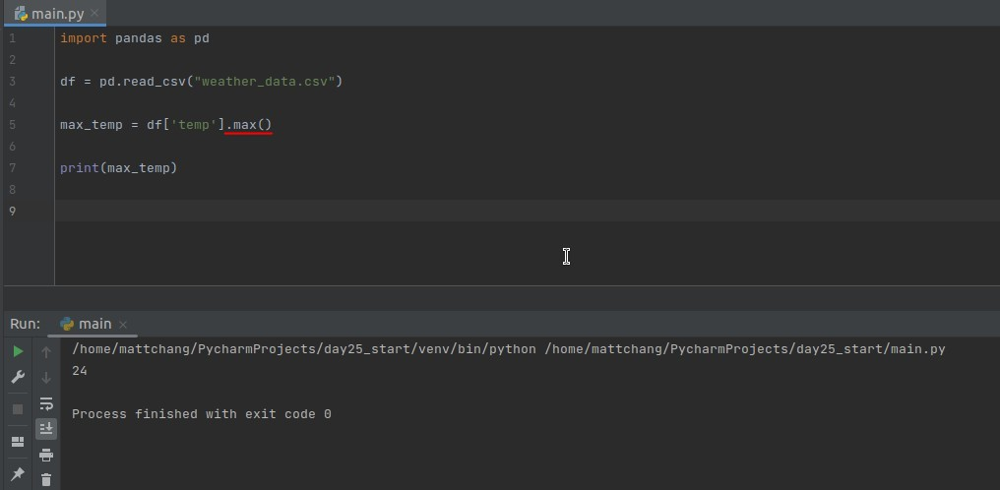

## **Types of Datas in Pandas**

> All the features of Pandas revolve around its two data structures - DataFrame and Series.

### _DataFrame object_

### _Series object_

### _Documents_

- DataFrame and Series are the most important of all topics.

## **Dive into documents of DataFrame**

- The Pandas documentation explains each method even more clearly and comprehensively than the Python documentation.

### _Practice_

## **Dive into documents of Series**

### _Practice_

- Until we are familiar with Pandas, we may be tempted to convert a series into a list, but then we find that Pandas itself provides much more powerful methods.

## **Challenge: calc the average temperature**

### _instruction_

### _My solution_

### _Compare to lector's_

> lector chooses to check the Pandas documents directly to see if there is a suitable method that can be used.

## **Challenge: Get maximum of temperature directly by Pandas method**

### _instruction_

### _diving documents_

### _Codes_

## **Get specific data**

### _values of specific column_

- result is Series object.
  - And each Series object is stored in the attribute of the DataFrame corresponding to the header name.

### _values of specific row_

- result is still DataFrame object.

## **Challenge: print a row of data had the highest temperature**

### _instruction_

### _My solution_

### _Compare to lector's_

- Be very clear about what type of data you are getting in each of the above processes.

## **Challenge: Convert Monday's temperature to fahrenheit**

### _instruction_

### _My solution_

### _Compare to lector's_

## **Create DataFrame object from scratch**

- Converting a dict to a DataFrame is a simple, but it is important to note the format of the dict.

## **Export CSV file from DataFrame object**

