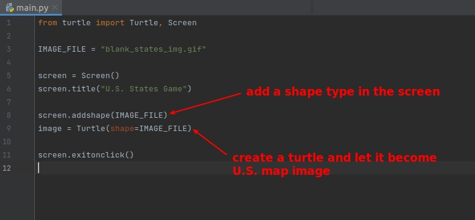

## **Files and Goal**

### _files provide by lector_

### _Our final goal_

## **Create screen with U.S. map background image**

- Here you can perhaps set the length and width of the screen according to the size of the image. (725x491)

## **How to get x, y of each states on map**

> Although the CSV provided by lector already has the x, y information for all states, we tried to get it ourselves here for practice.

- It is important to check the documentation, as there may be problems with out-of-date information from google or even textbooks, but the documentation is usually updated with newer versions.
