## **Our final goal**

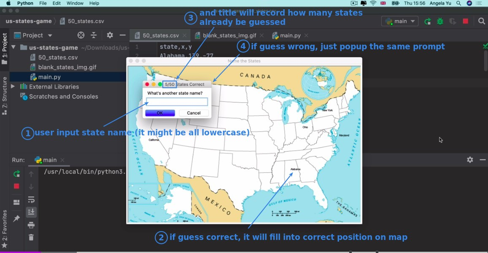

## **Start the challenge**

### _compare if answer in csv data_

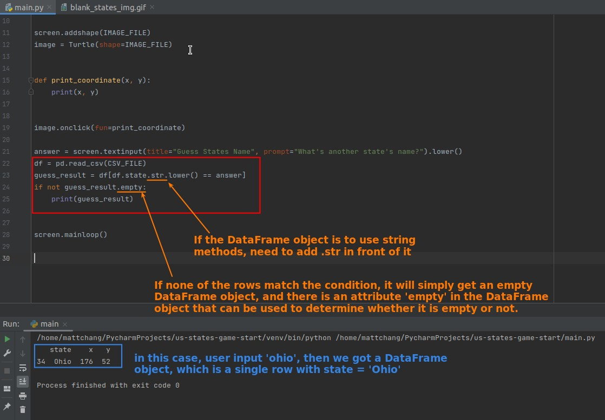

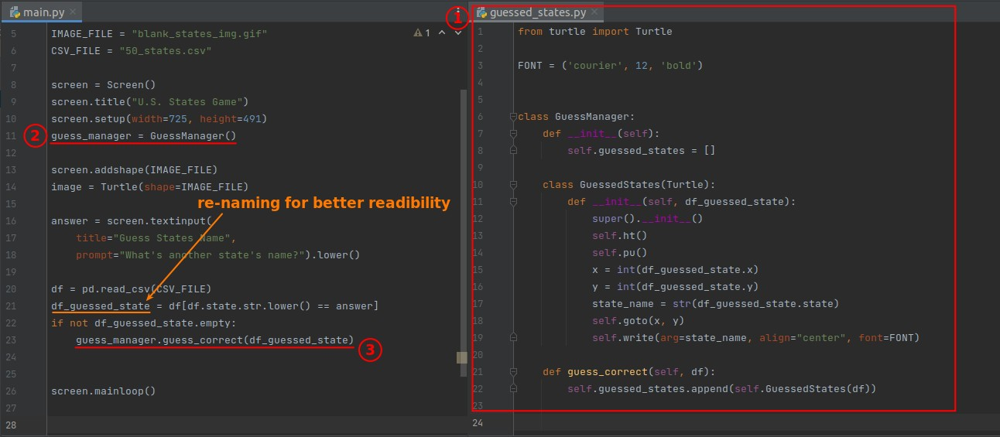

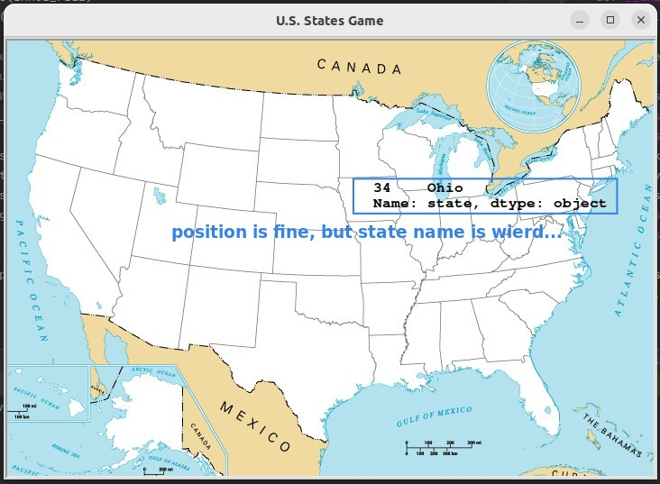

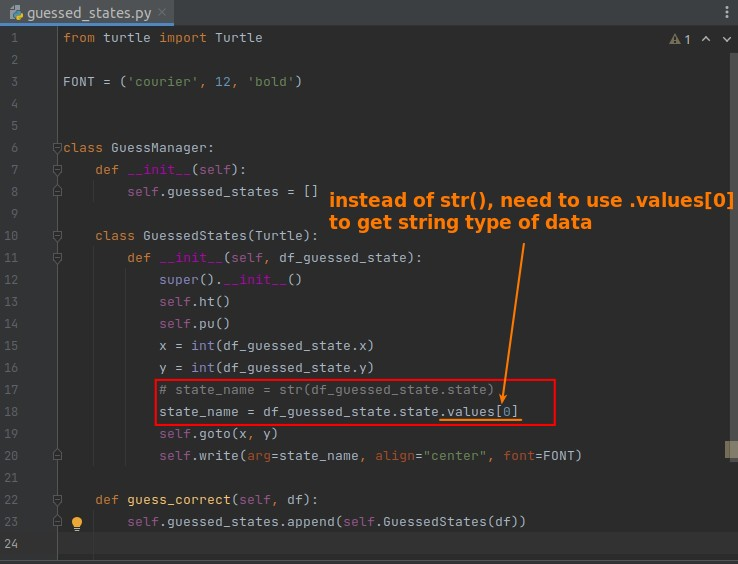

- Compared to getting an integer from a Series object, getting a string seems to be much more difficult.

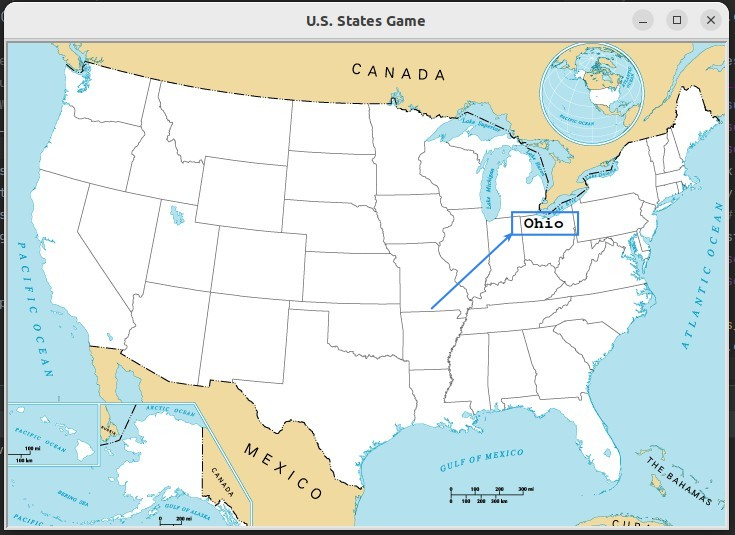

### _build input window class_

> Because of the complexity of the prompt window, it is recommended to make it a separate class.

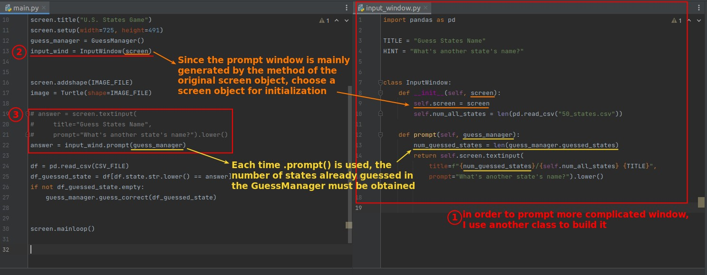

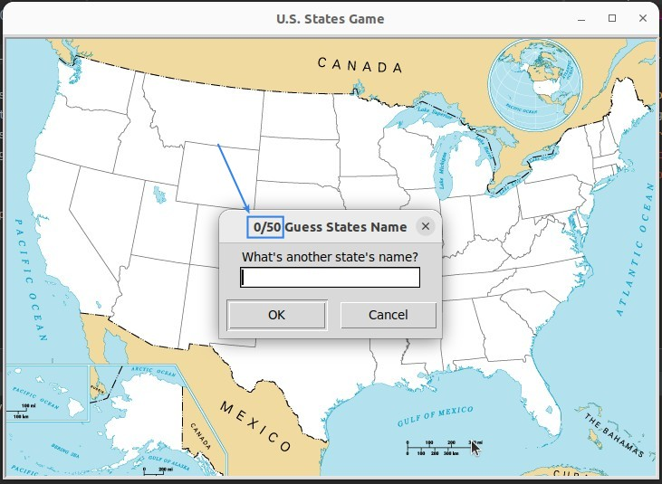

### _while loop_

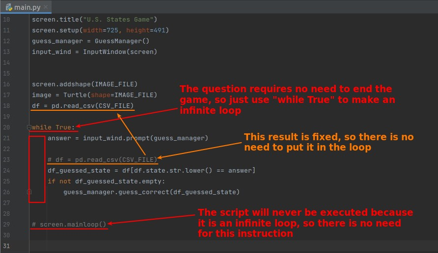

### _further optimize: compare logic should be included by GuessManager_

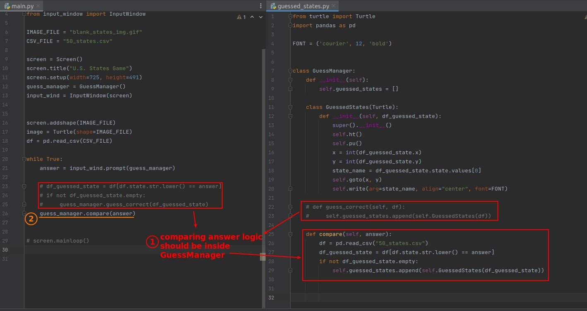

- In fact I think class GuessedStates should also be separated into a separate file, perhaps called names_drawer or something like that, so that the GuessManager can concentrate on the logic.

## **Compare to lector's**

### _String.title()_

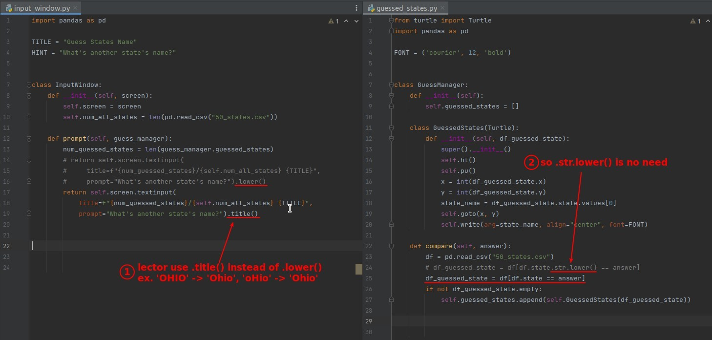

### _Series.to_list() and operator 'in'_

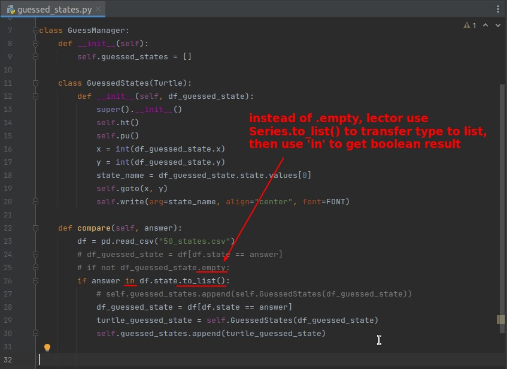

### _Series.item()_

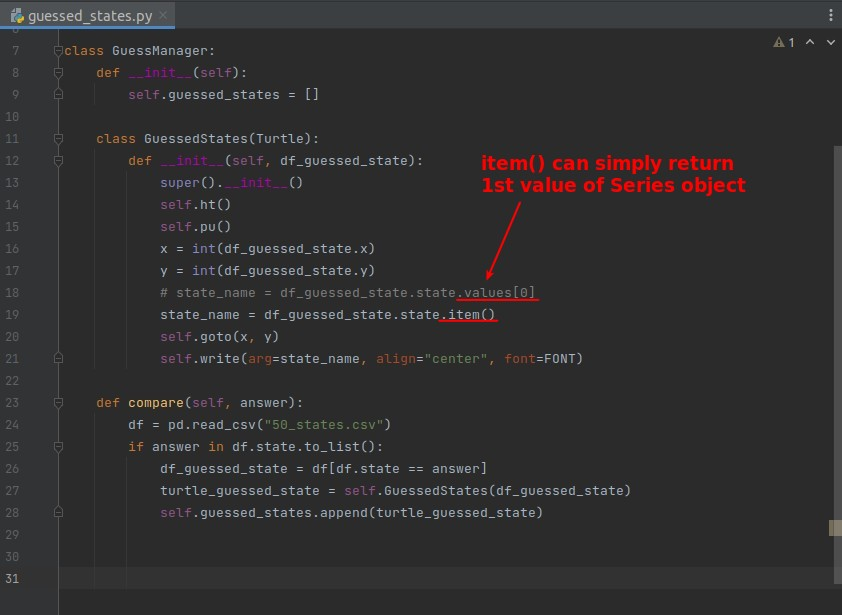

### _While condition (Not infinit loop...)_

