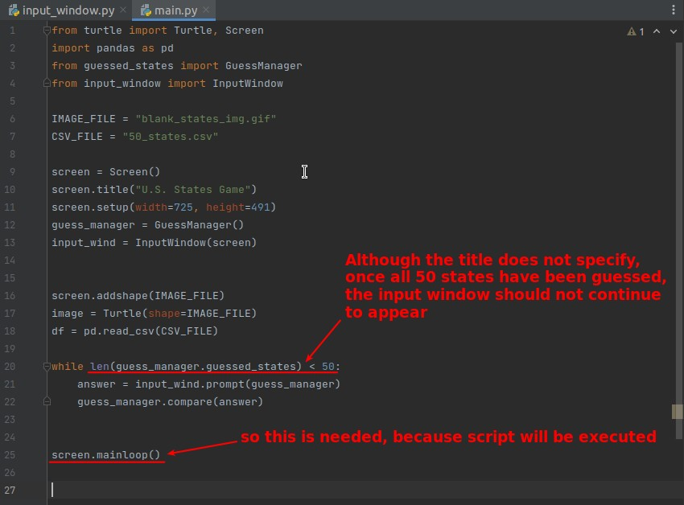

## **Our final goal**

## **Start the challenge**

### _compare if answer in csv data_

### _build input window class_

### _while loop_

### _further optimize: compare logic should be included by GuessManager_

## **Compare to lector's**

### _String.title()_

### _Series.to_list() and operator 'in'_

### _Series.item()_

### _While condition (Not infinit loop...)_

