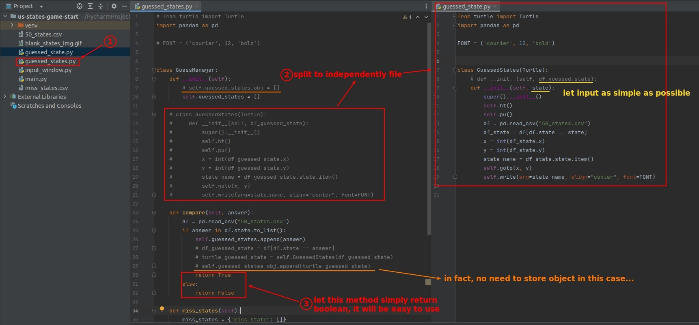

## **Let user actively exit the app**

- "break" means exit the loop.

## **Challenge: export new csv file when exit**

## **My solution**

### _GuessManager_

- In fact there is no need to save the object for this challenge.
  - so "self.guessed_states_obj" is useless, can be removed.

### _main.py_

### _CSV file_

## **Further Optimize**

- Let the GuessManager only concentrate on the logic of handling guesses.

