## **How to Create New List from Existed One?**

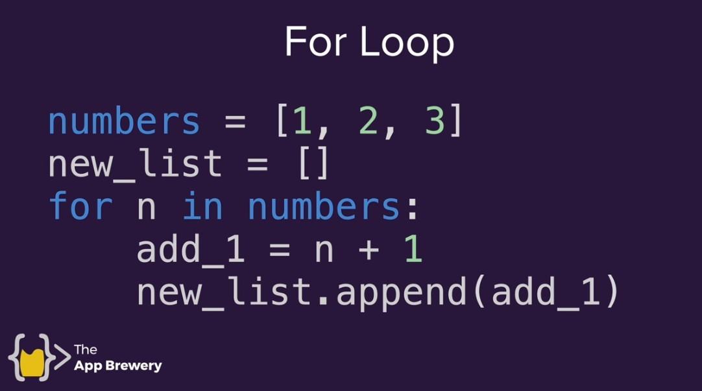

## **List Comprehension**

### _Formula_

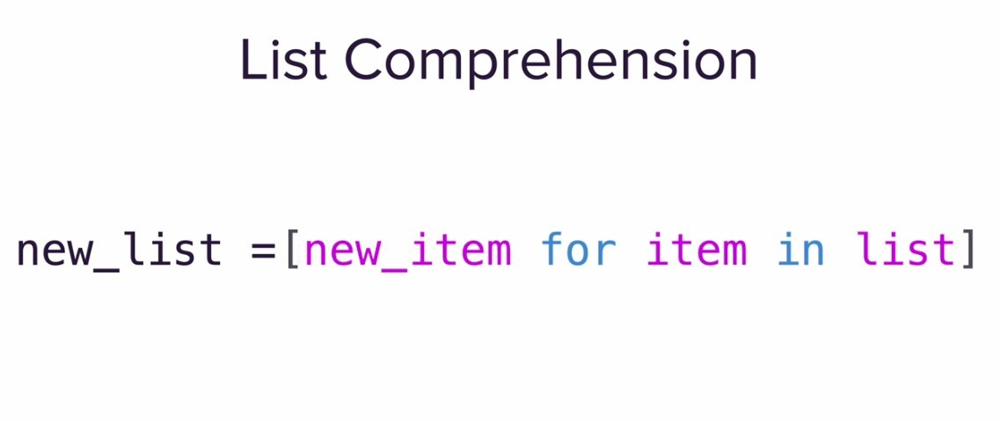

### _Use it in question at start_

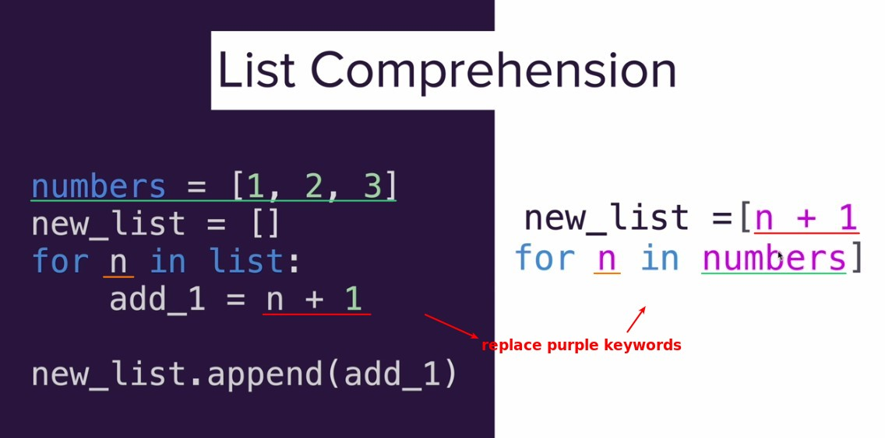

### _Simple practice in Python console of pyCharm_

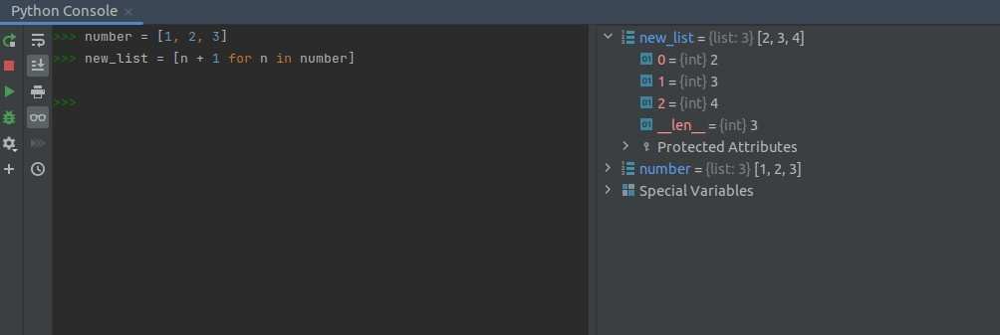

## **Not only for list, but also all ITERATOR**

### _String_

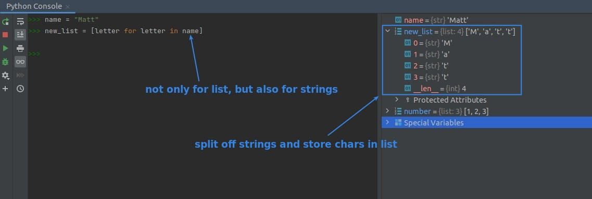

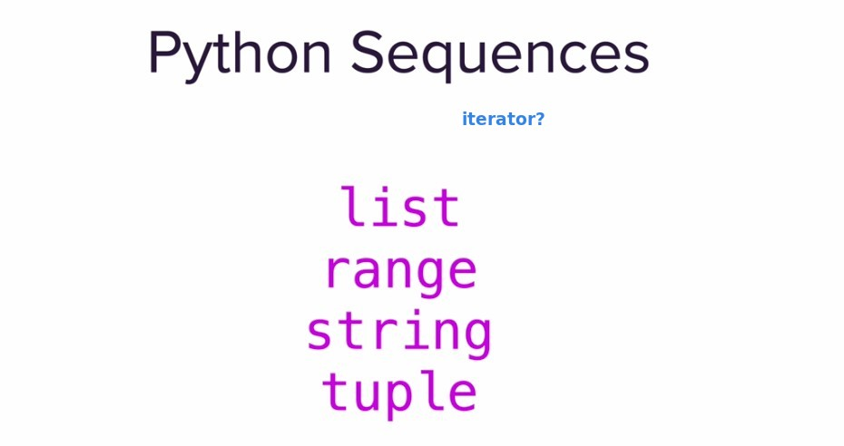

### _Dictionary_

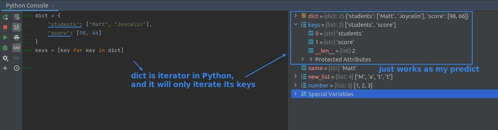

### _DataFrame_

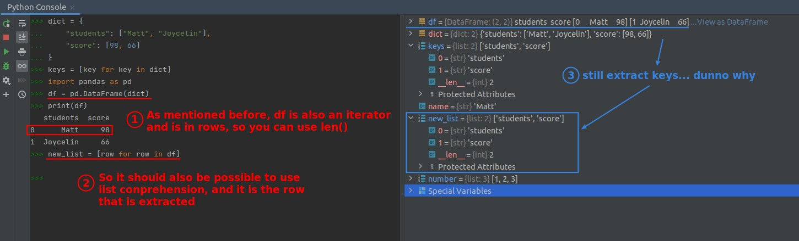

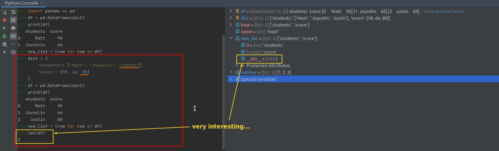

## **Challenge: Double [1, 2, 3, 4]**

### _Instruction_

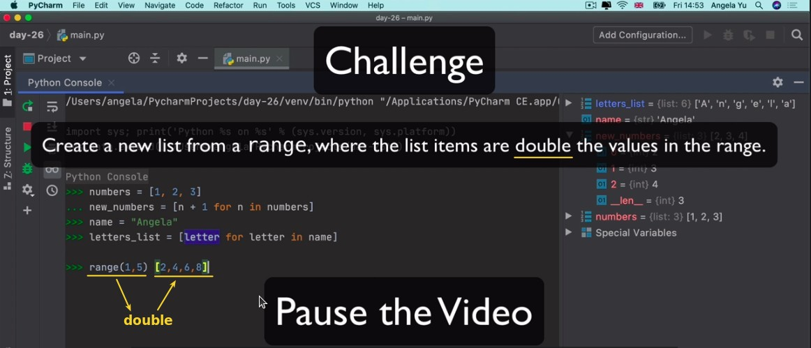

### _My solution_

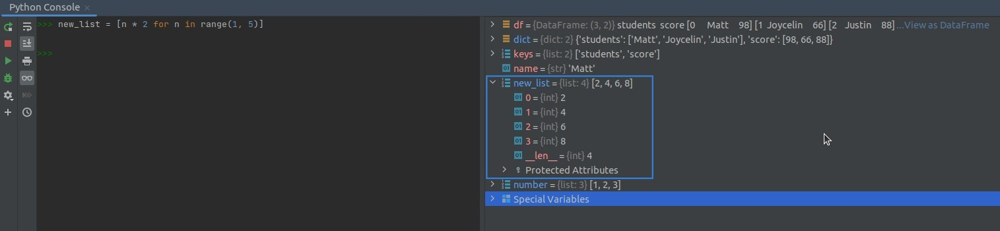

## **Conditional List Comprehension**

### _Formula_

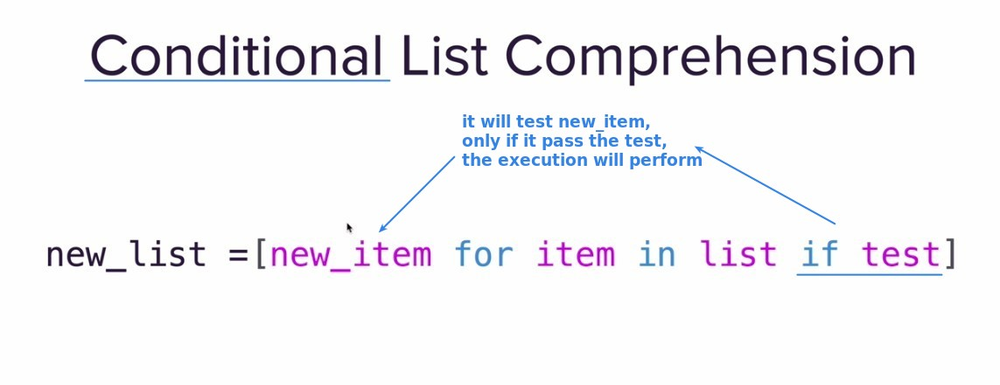

### _Plus: Set value in Python console_

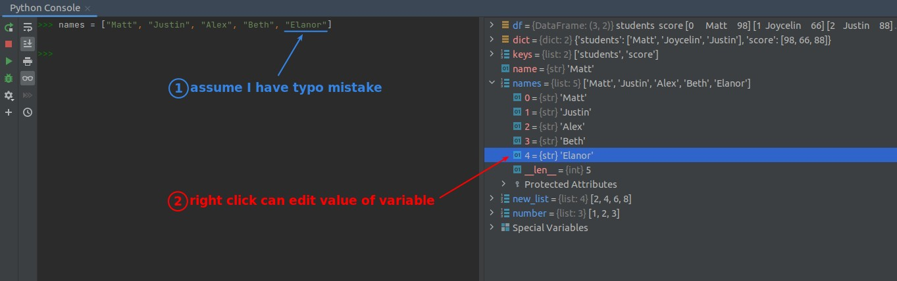

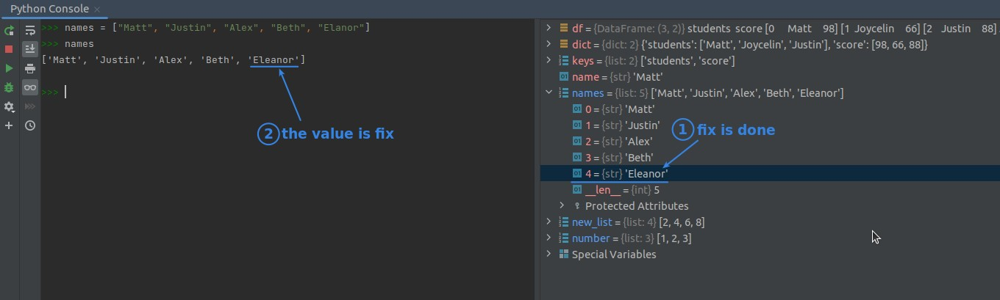

### _Practice: Get only short names less then 5 chars_

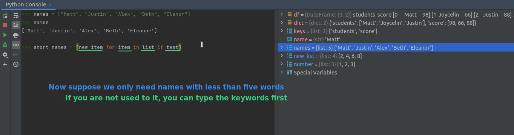

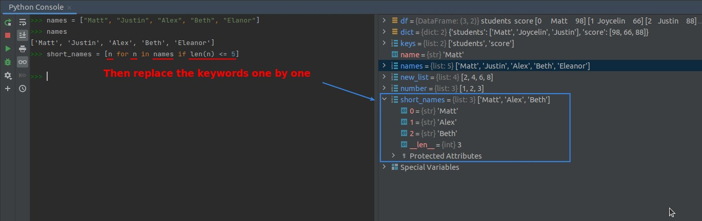

## **Challenge: Get Long names over then 5 chars and ALL CAPS**

### _Instruction_

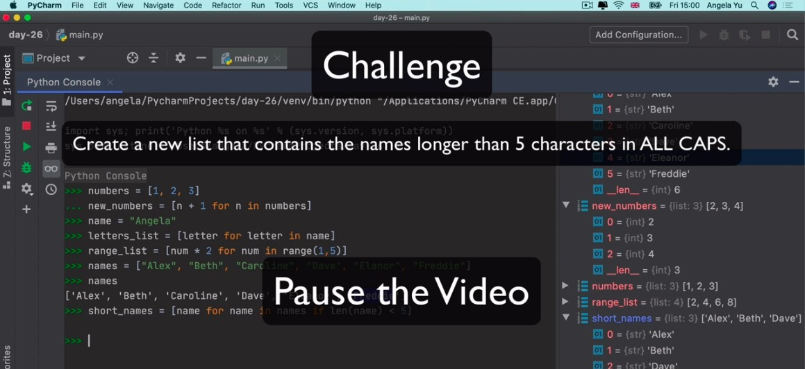

### _My solution_

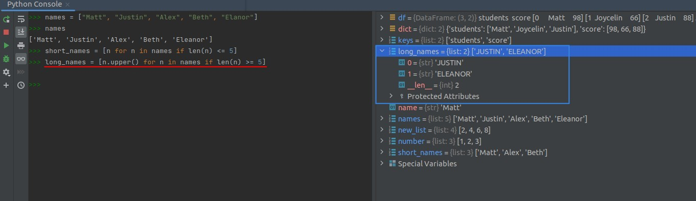
