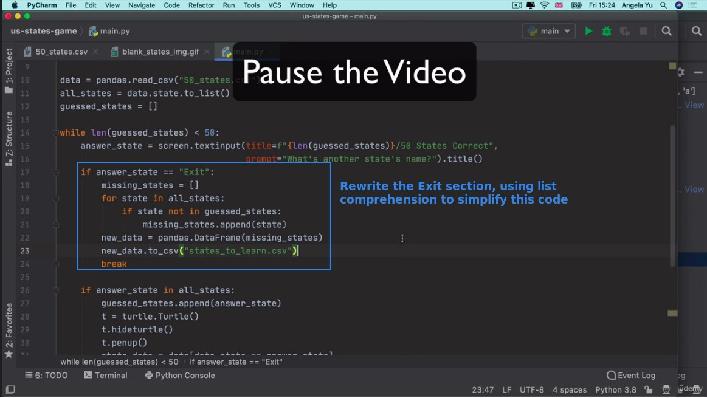

## **Challenge: Update Exit part of U.S. states guess game with list comprehension**

## **My solution**

> My codes look a lot different from lector's because I have done OOP, but I can still find places to use list comprehension.

- So the point is to find the starting point - the iterator, and then make sure the end point is a list, and that no other resources are needed in the middle process.
