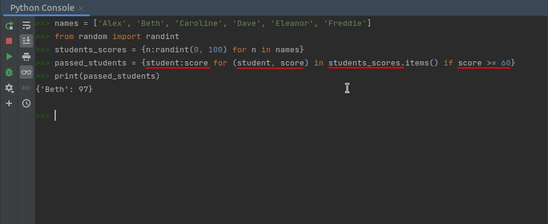

## **Formula: Dict Comprehension**

### _From normal iterator_

### _From dict_

### _Add condition_

## **Practice: List to Dict**

### _Question_

### _Solution_

## **Practice: Dict to Dict**

### _Question_

### _Solution_

### _Diving in ..._

- So you actually convert the dict into a list of tuples in order to do the comprehension.
  - If this conversion is not done, only the keys are obtained.
