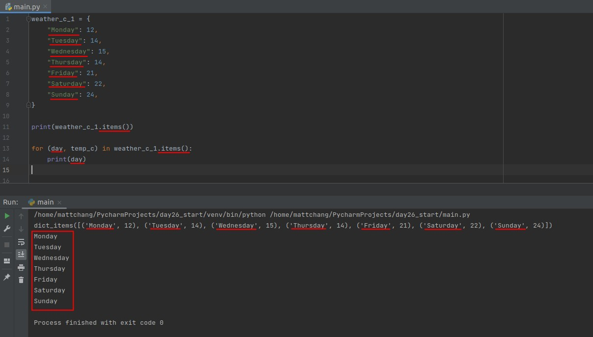
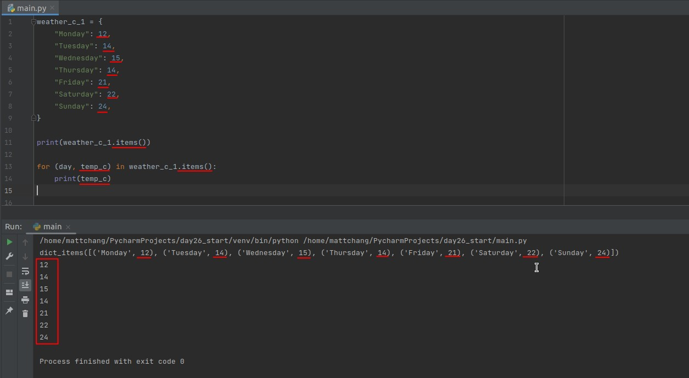
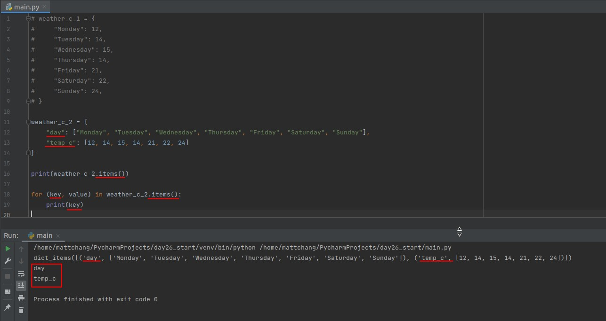
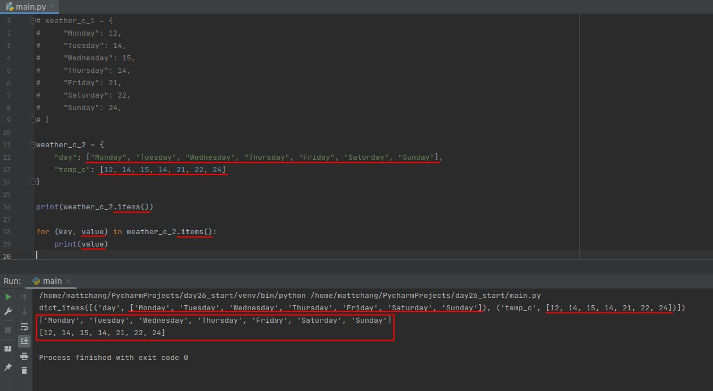
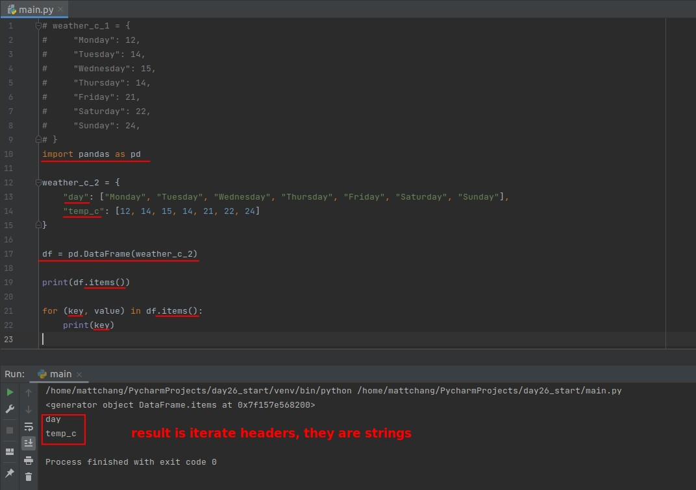
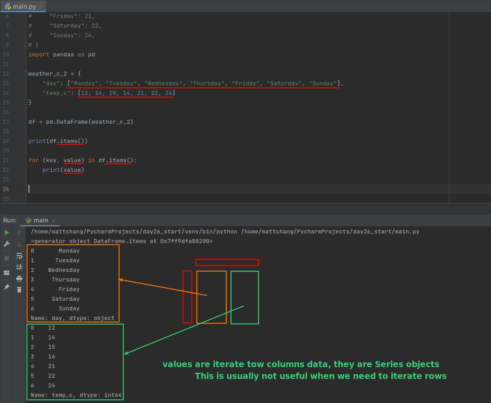
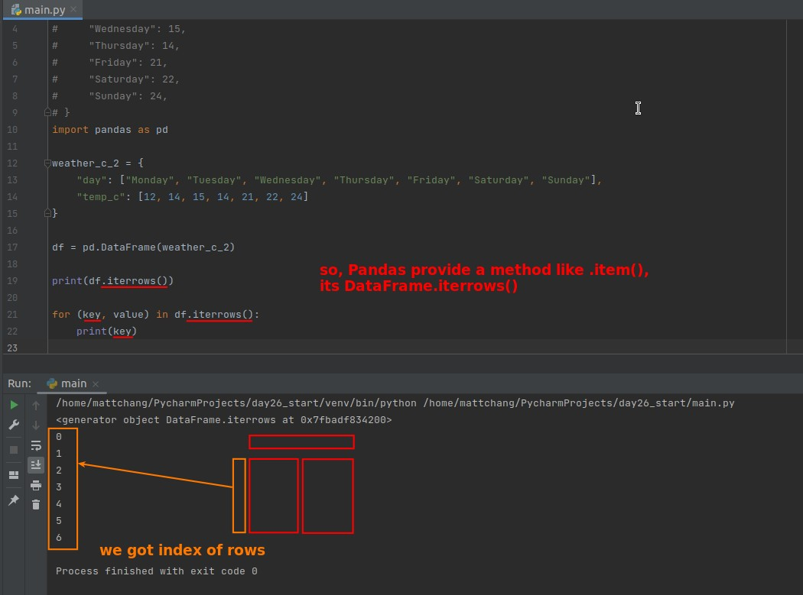
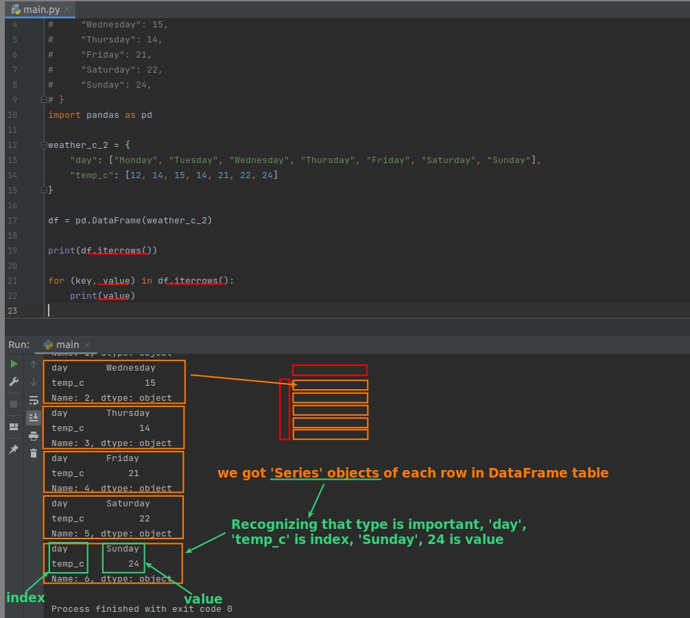
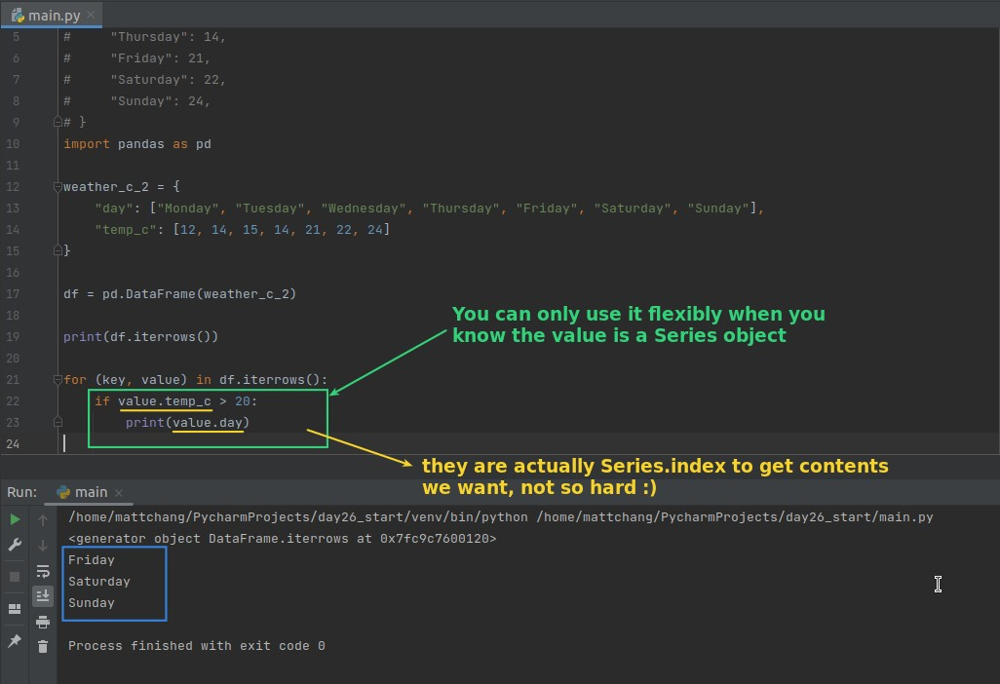

## **Dict_normal.item()**

### _key: content of keys_

### _value: content of values_

## **Dict_for_df.item()**

### _key: String of headers_

### _value: List of columns_

## **DataFrame.item()**

### _key: String of headers_

### _value: Series object of columns_

## **DataFrame.iterrows()**

### _key: index of rows_

### _value: Series object of rows_

### _Practice_

