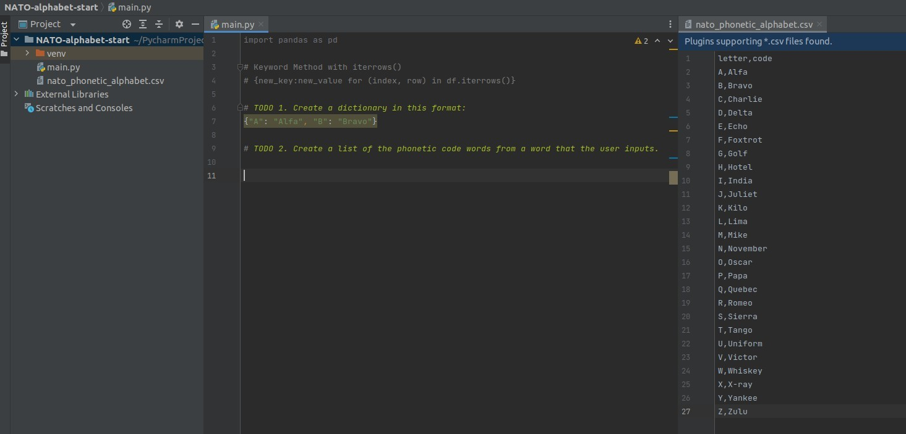
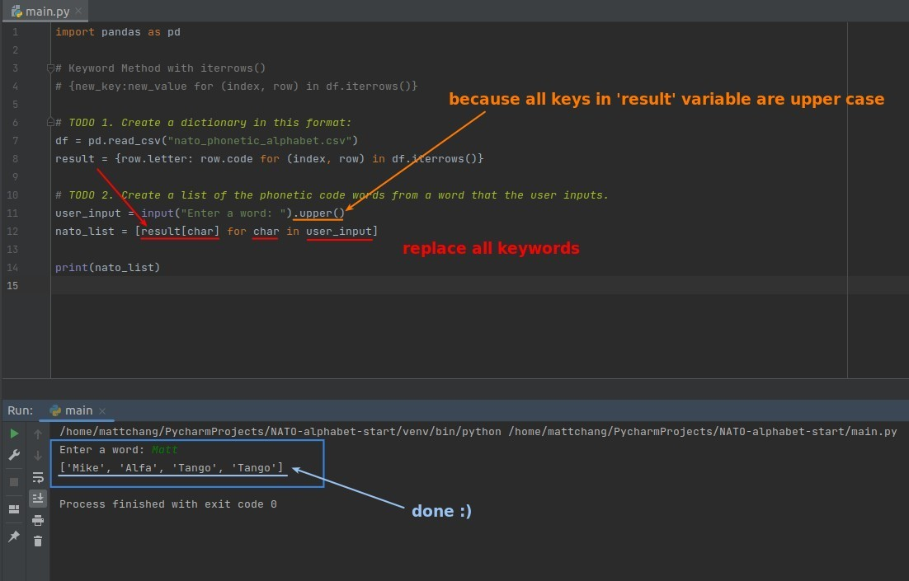

## **Challenge: NATO alphabet project**

## **TODO 1: Get dictionary with letter:NATO word pair from CSV file**

- Because the source is a CSV file, it is easiest to convert to a DataFrame object using Pandas.
  - In the previous lecture we explained the way to iterate through a DataFrame object, which can be used in dict comprehension.

## **TODO 2: Get list of NATO words from user input**

## **Conclusion**

- Whenever the source is an iterator and you want to get a dict or a list, you can use comprehension.
- Write out the keywords in the comprehension first and then replace them one by one, this way the idea is clearer.
