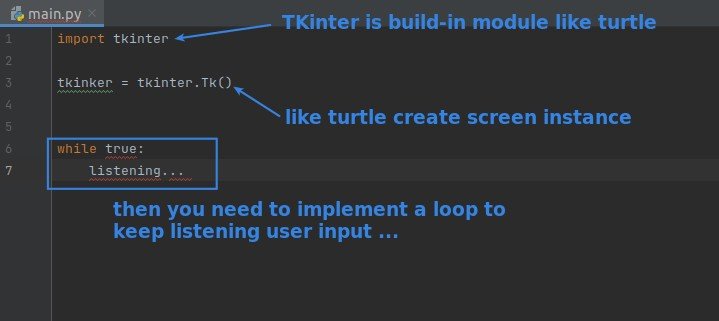
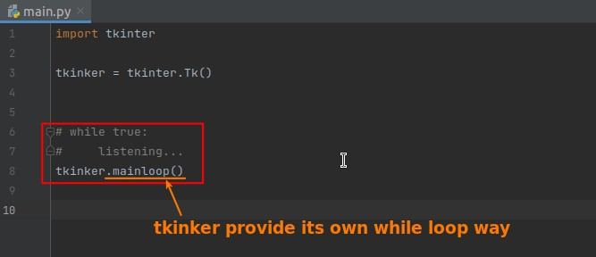
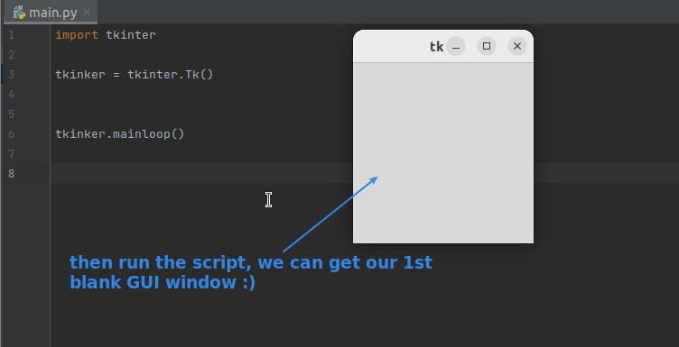
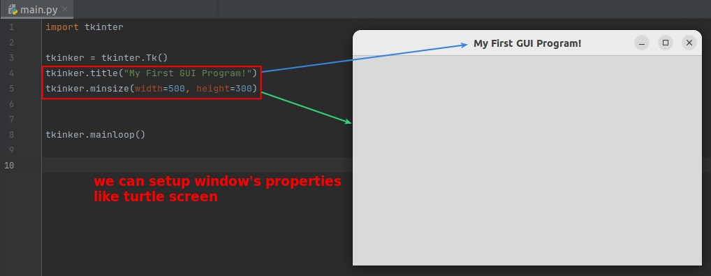
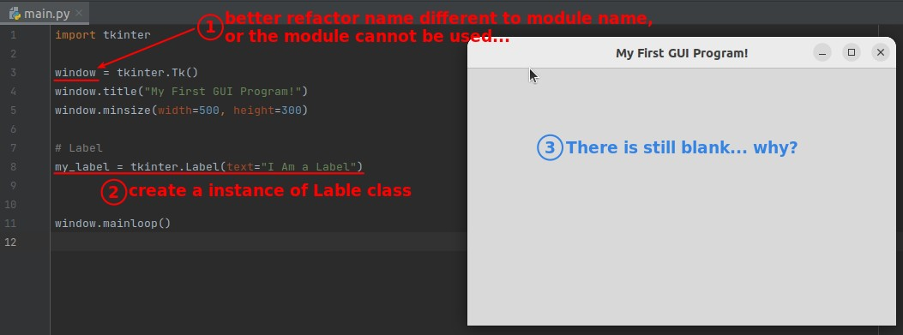
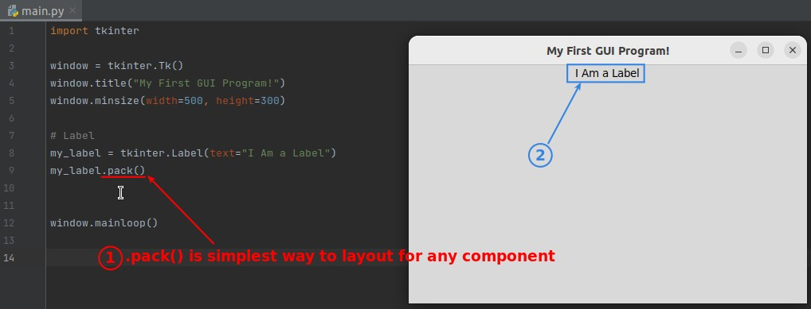
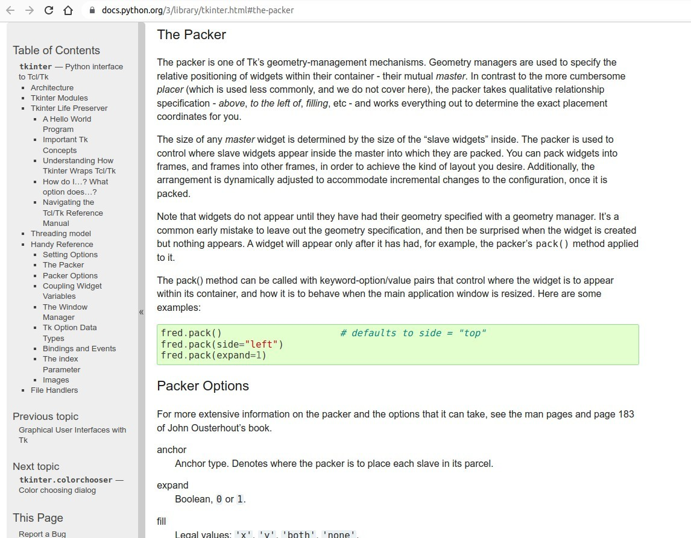
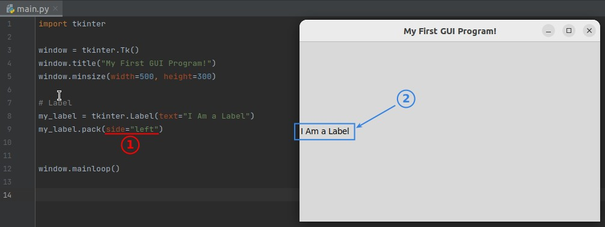
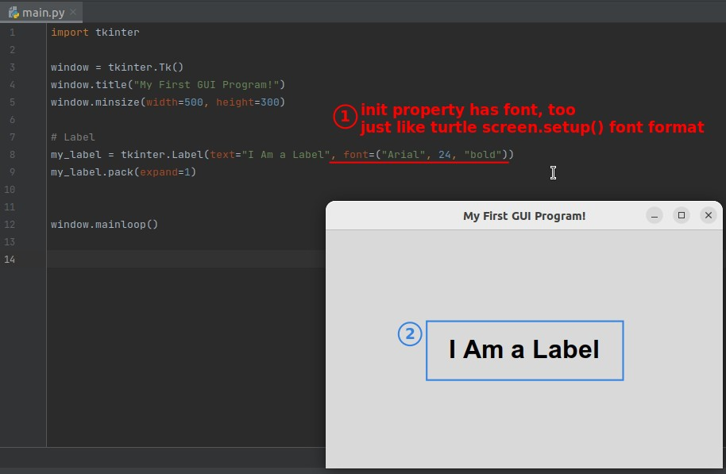

## **TK window**

### _Create instance of TK window_

### _.mainloop()_

### _setup_

## **Lable**

### _Create instance of Label class_

### _Simplest way to layout TK component: .pack()_

### _Parameters_

