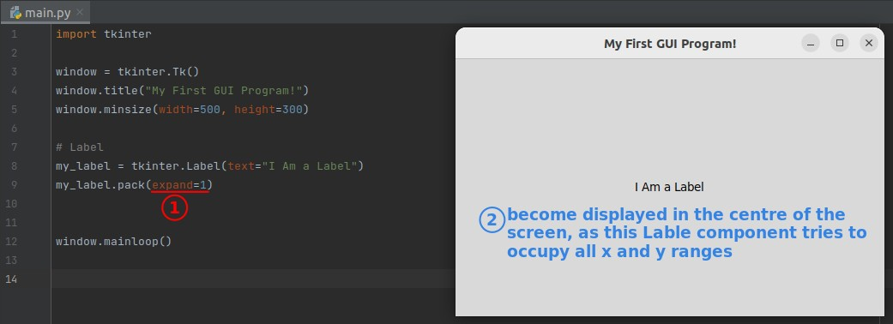

## **TK window**

### _Create instance of TK window_

### _.mainloop()_

### _setup_

- If .minsize() is used alone without any parameters, the window size will be automatically scaled according to the contents.

## **Lable**

### _Create instance of Label class_

- Because any component in a TK window needs to be laid out before it can be displayed in the window.

### _Simplest way to layout TK component: .pack()_

- In fact there are a number of parameters that can be used in .pack(), which can be found in the following two linked documents:
  - https://docs.python.org/3/library/tkinter.html#the-packer
  - http://tcl.tk/man/tcl8.6/TkCmd/pack.htm

### _Parameters_

