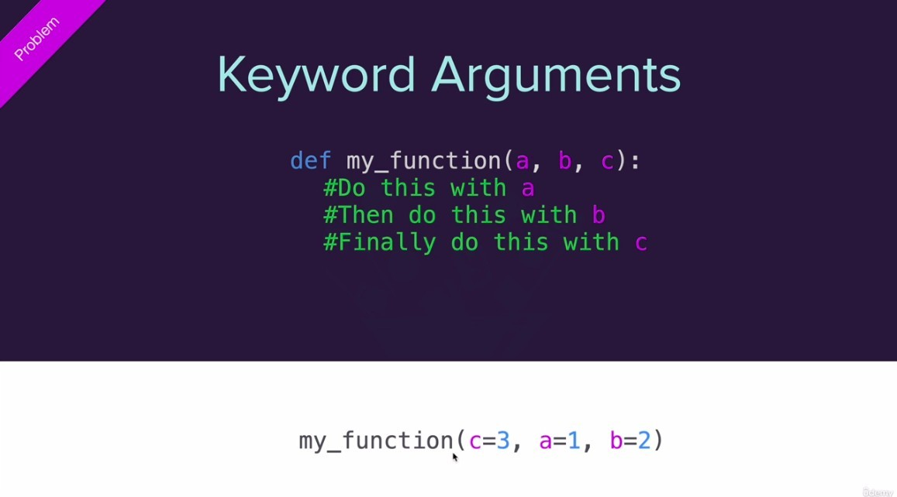
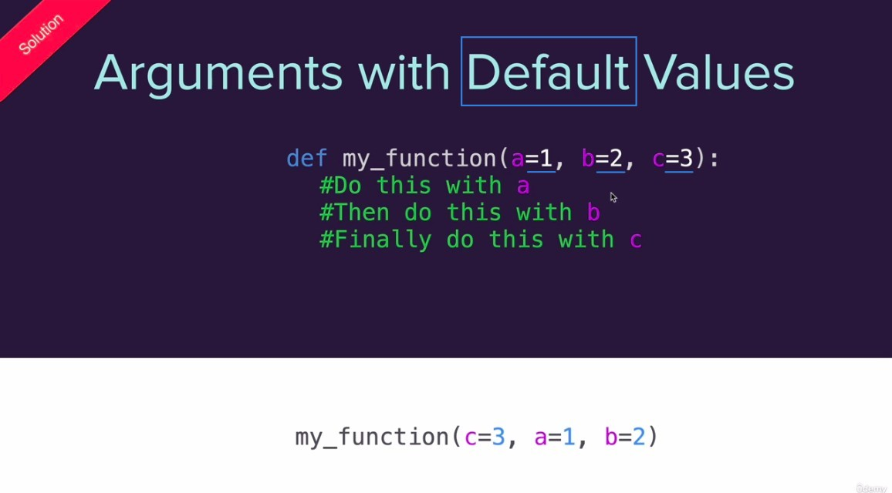
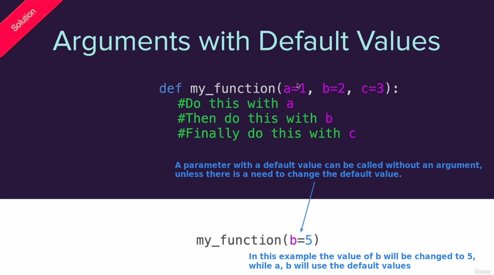
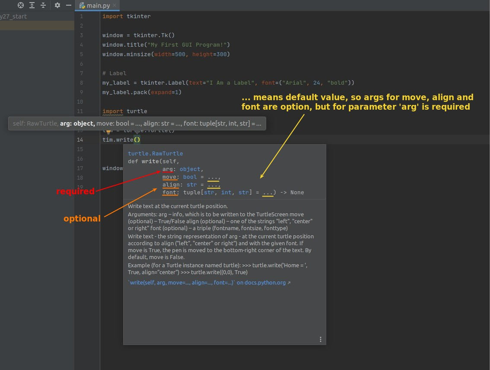

## **Concept of Arguments with Default Values**

## **Popup documents in pyCharm**

> When the mouse cursor hovers over a function/method/class for a period of time, the document will appear as bellow.

