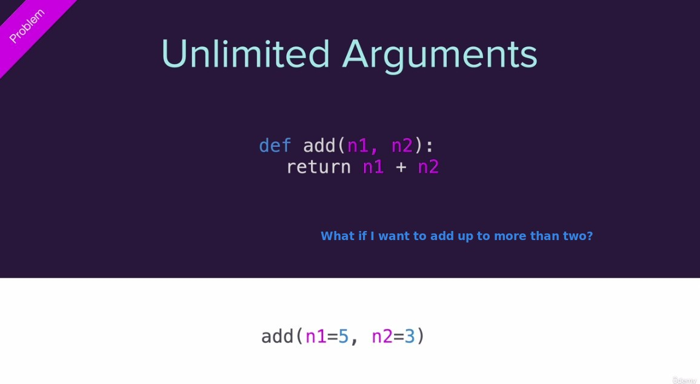
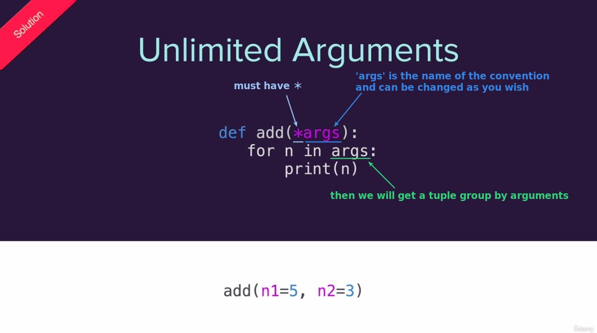
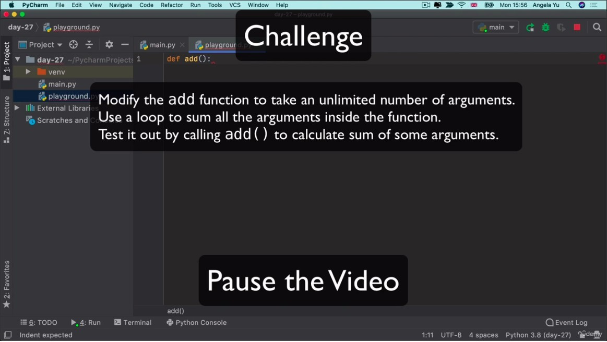
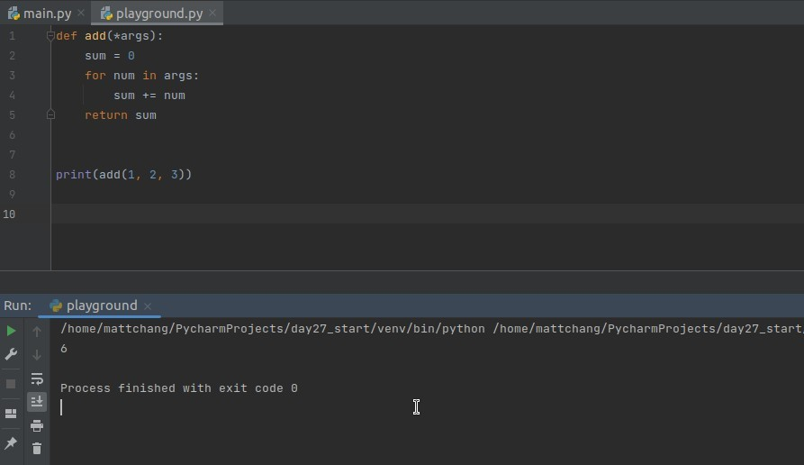
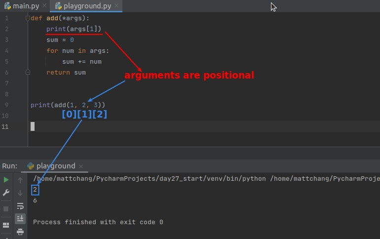

## **Problem: If number of arguments is an arbitrary?**

### _Review: normal positional arguments_

### _Solved by Unlimited Arguments_

## **Challenge: define add() which can accept an arbitrary number of args**

### _Instruction_

### _Solution_

- Now no matter how many arguments we pass into add(), it can always calculate the sum.

## **Unlimited Arguments are Positional**

### _Practice to prove that arguments are positional_

### _Formula: Unlimited **Positional** Arguments_

![Alt formula: unlimited [positional] arguments](pic/06.jpg)
