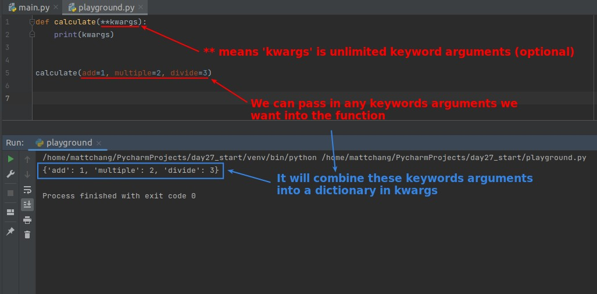
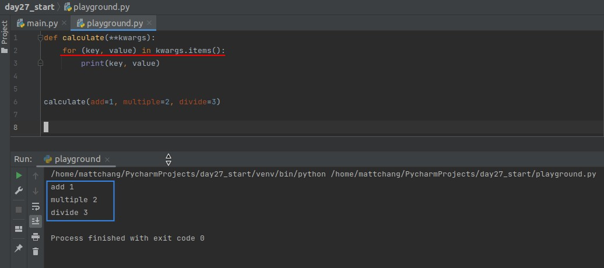
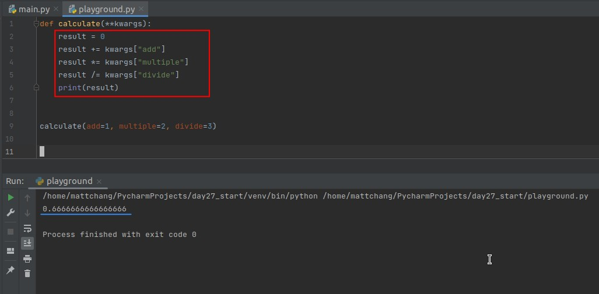
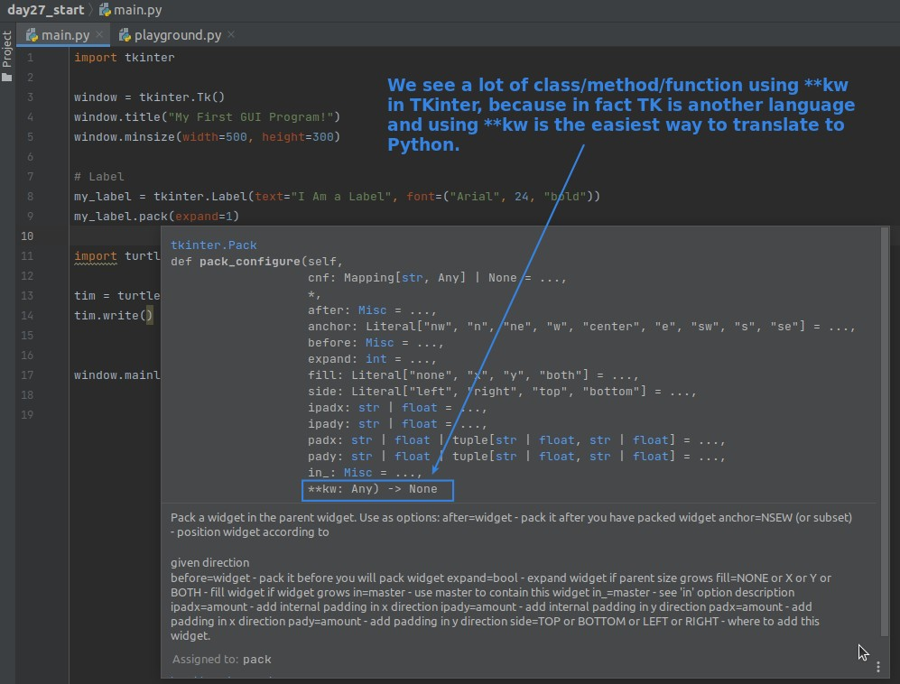
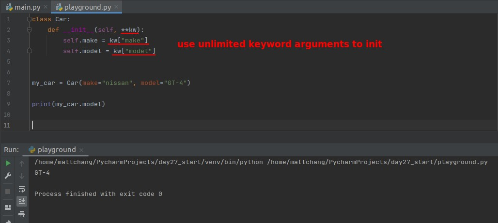
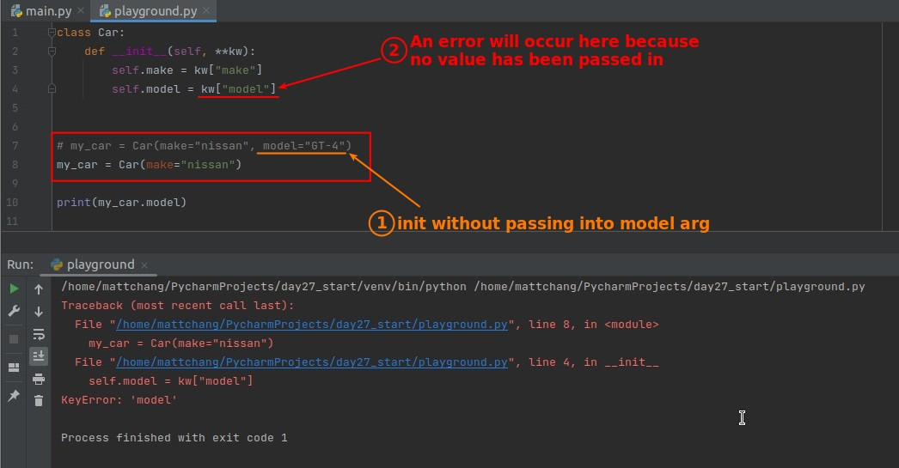
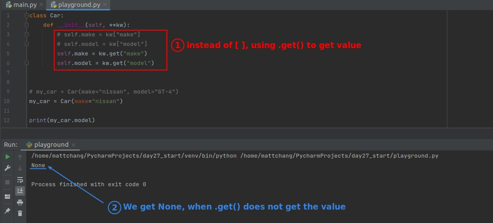

## **Intro of Unlimited Keywords Arguments (Optional)**

## **Usage of Kwargs**

### _for in loop_

### _get specific value from kwargs_

## **Reason Tkinter use lots of \*\*kew**

## **Init Class with \*\*kw**

### _init(\*\*kw)_

### _lack of value_

