## **Set Option**

### _Checking documents_

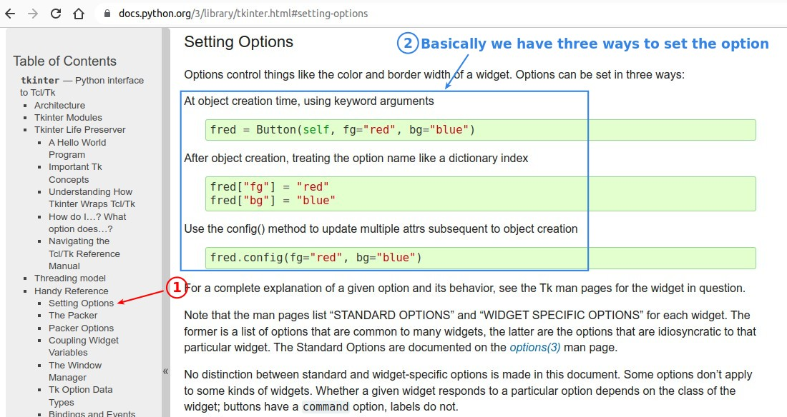

### _Practice_

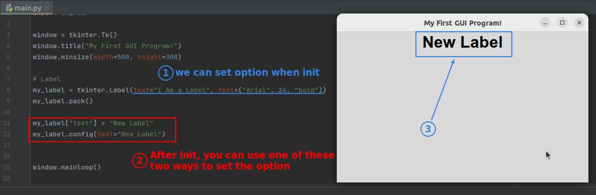

## **Button component**

### _Checking documents for options_

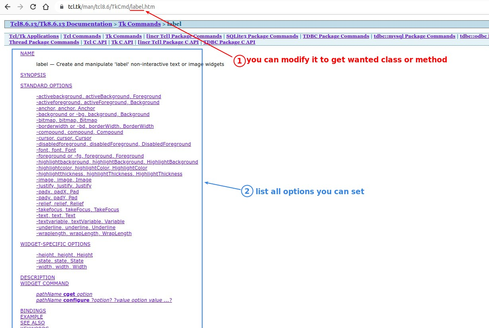

### _Create Button component_

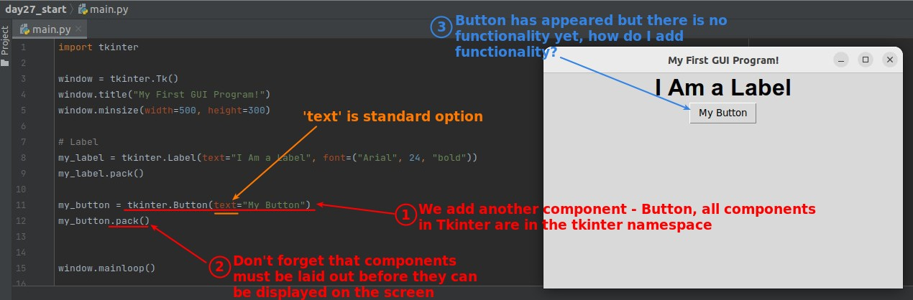

### _Create function of button_

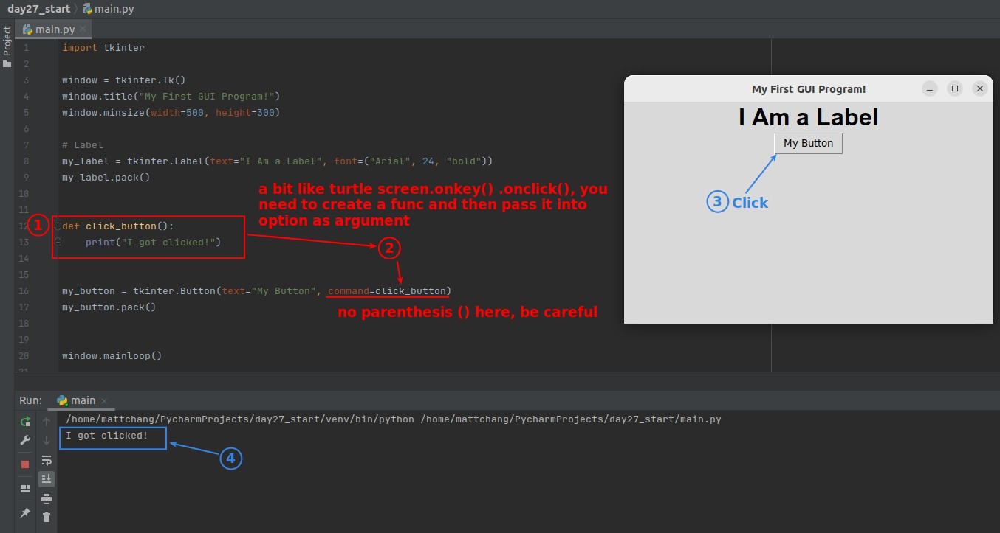

### _Challenge: Change Label text when clicking button_

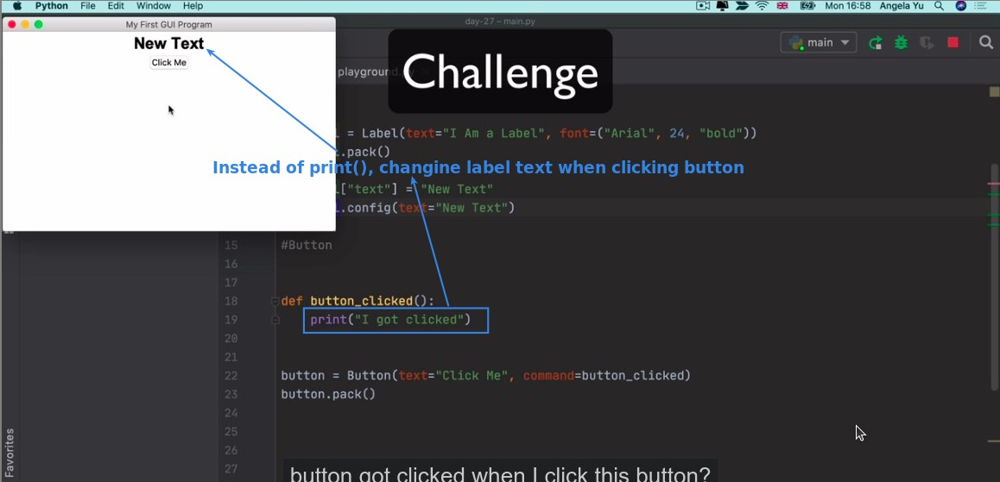

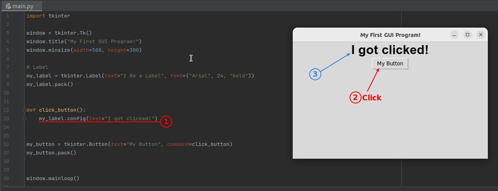

## **Entry component**

### _Create Entry component_

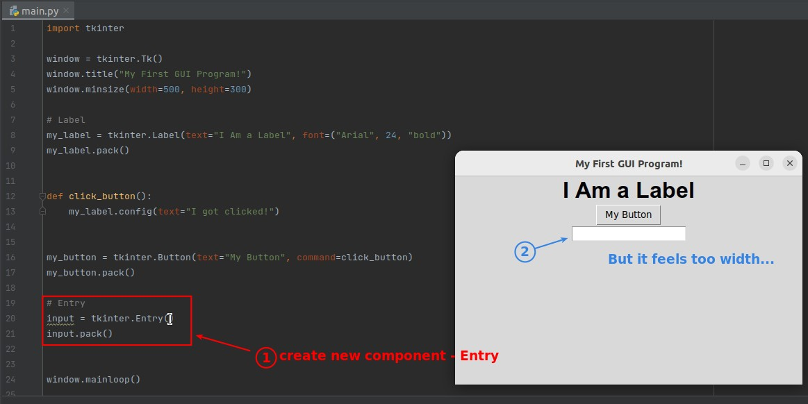

### _Narrowing Entry_

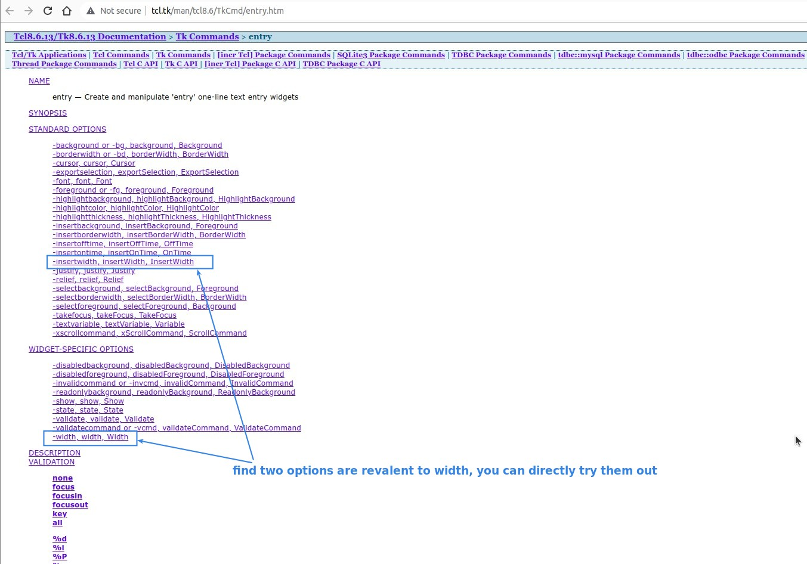

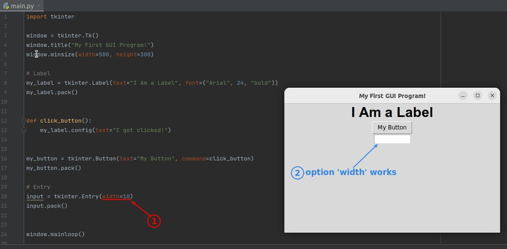

### _Get value from Entry_

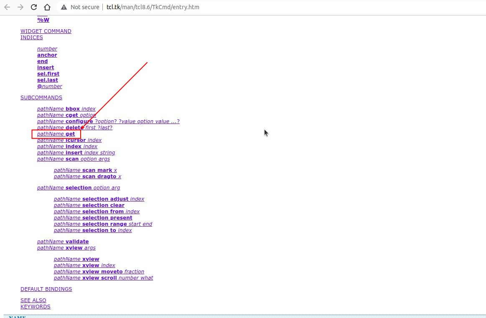

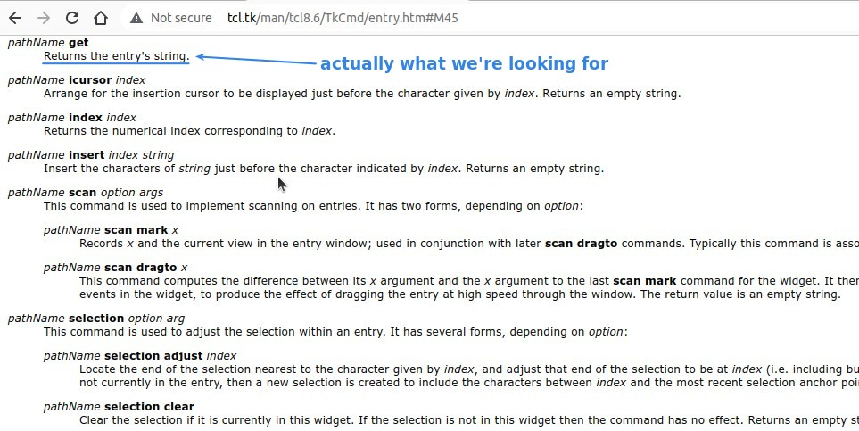

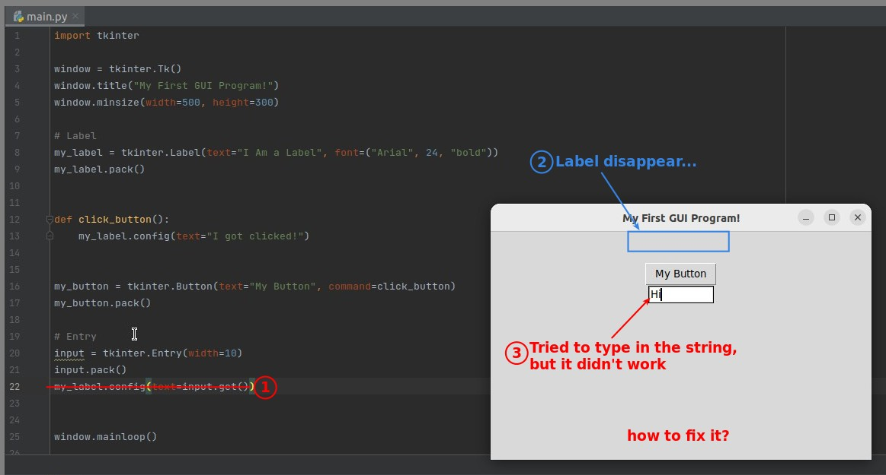

### _Fix the problem_

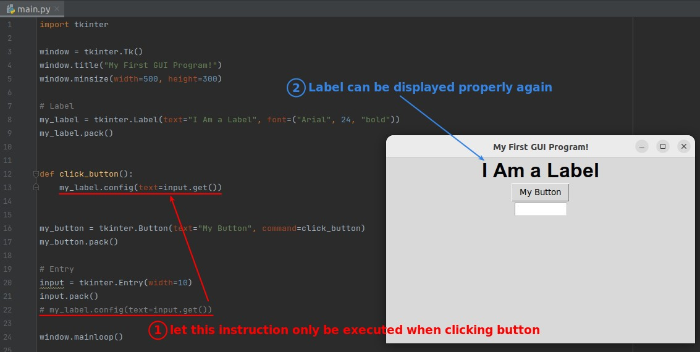

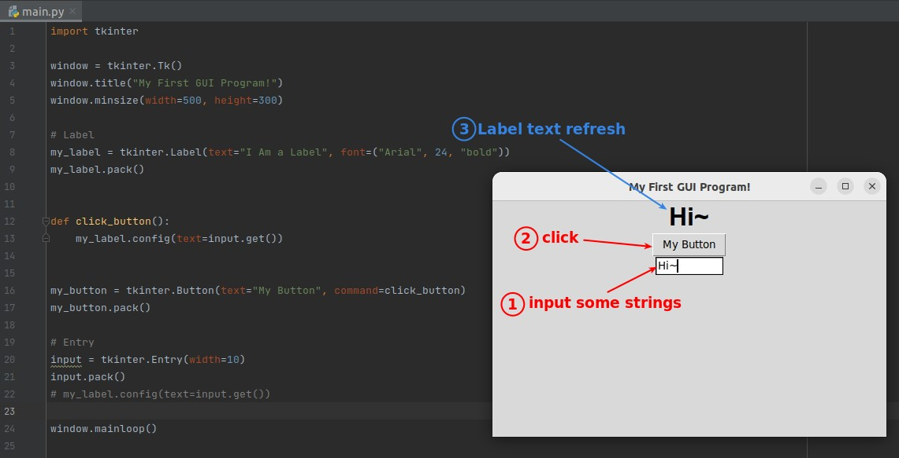
