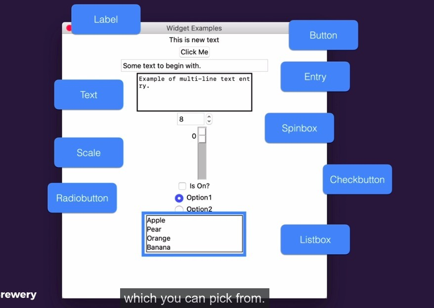

## **More widgets**

- These are the widgets that we often use in the Tkinter GUI.

## **Example codes by lector**

> Lector provides sample code for all the above widgets as follows.

- When we want to use a widget, we just use the lector sample to modify it.

  - Basically any points that need to be changed are clearly explained by comments.
  - There are some oddities that we don't need to worry about, and we don't usually change them.

- Some widgets use IntVar objects to obtain values, with particular attention to their usage.
