## **Re-arrange the previous Script**

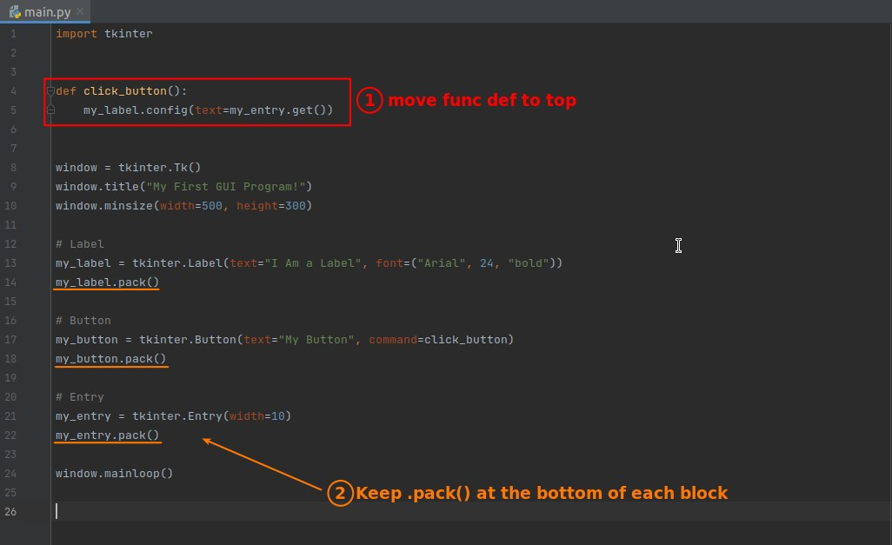

## **.pack()**

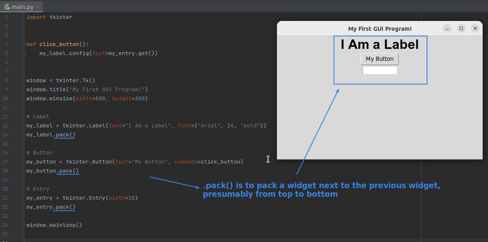

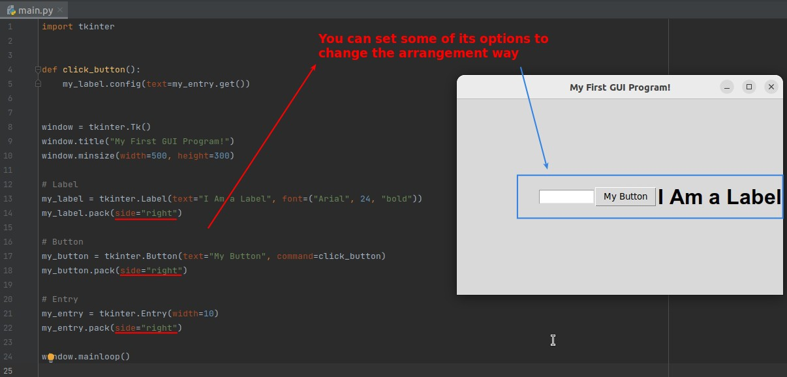

## **.place()**

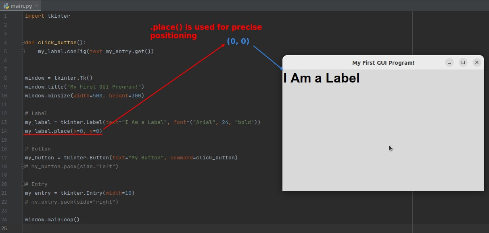

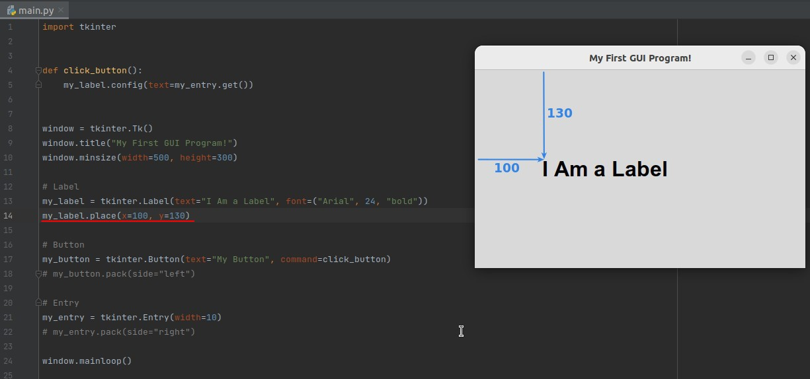

### _mix use with pack()_

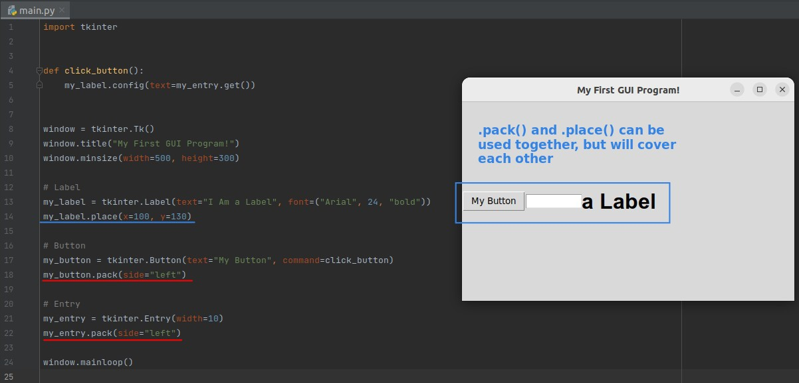

## **.grid()**

### _concept of grid_

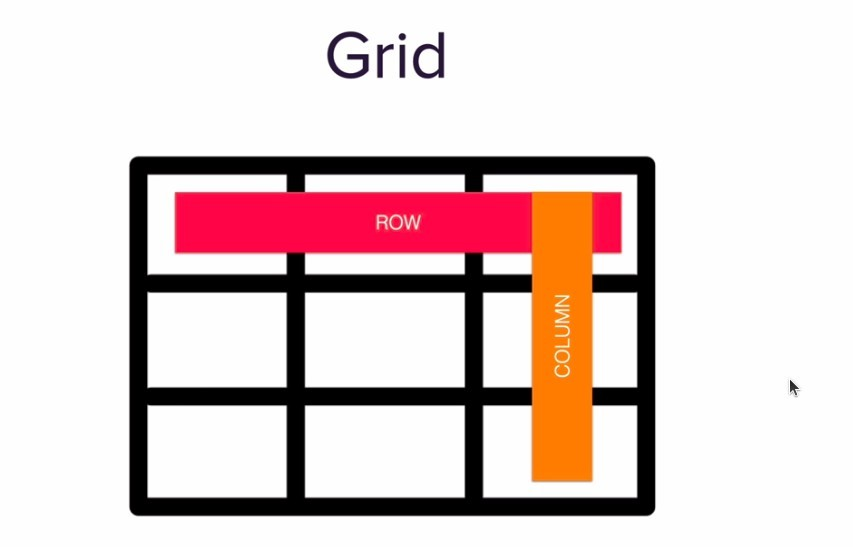

### _.grid() is relative position_

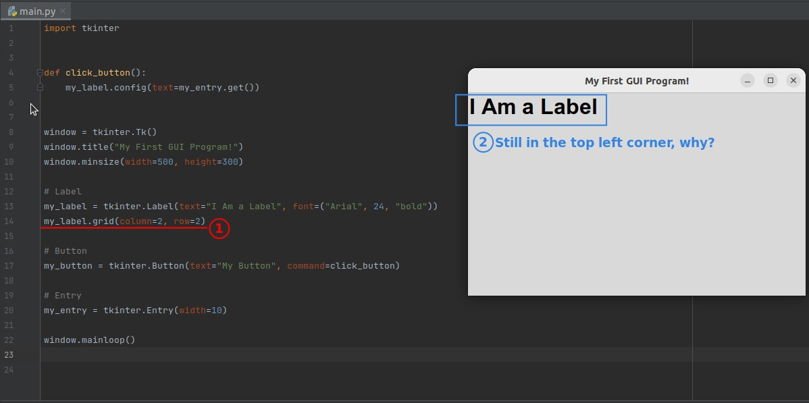

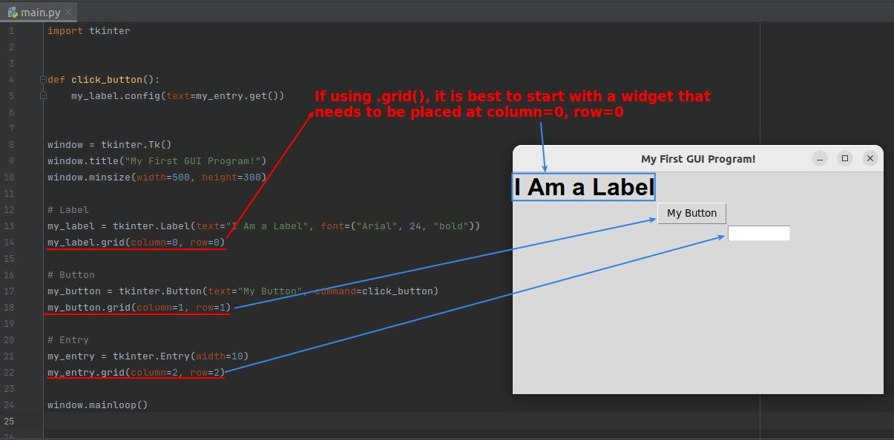

### _grid() cannot mix use with pack()_

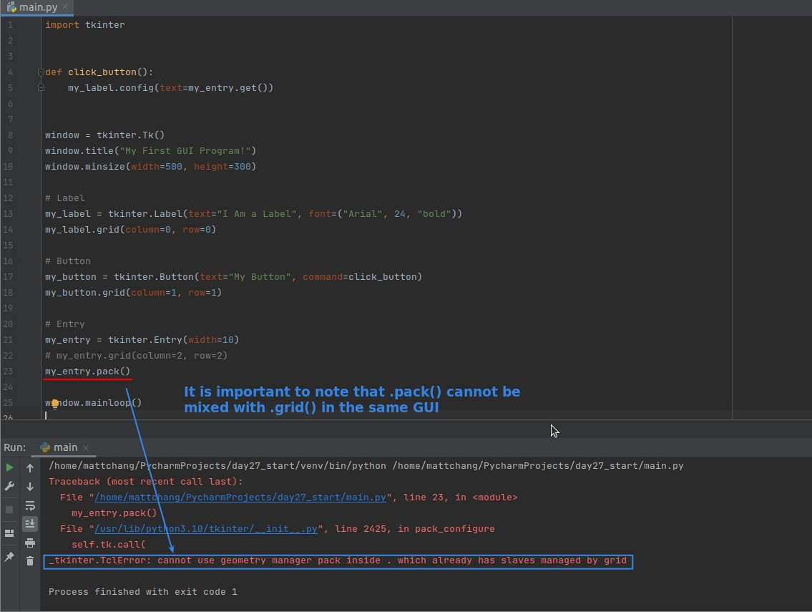

## **Challenge: Create New Button & Specific Grid Arrangement**

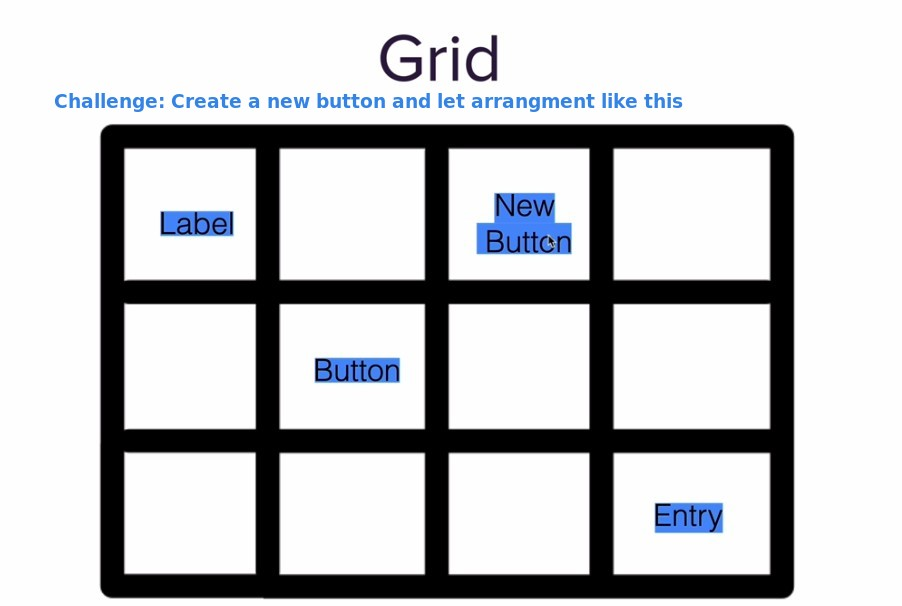

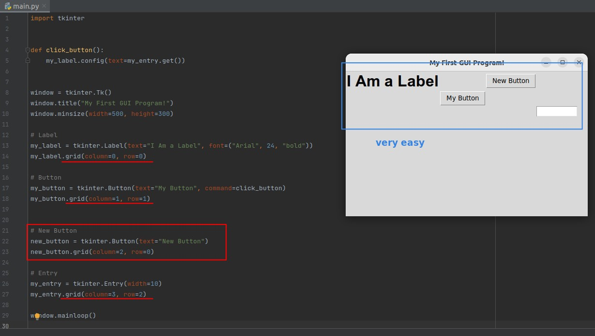

## **Padding**

### _whole window_

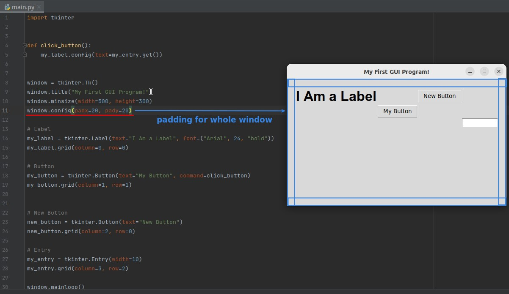

### _widget_

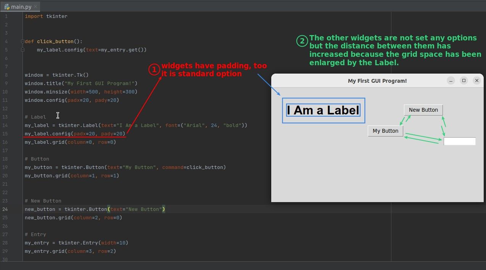
