## **Prepare files of Pomodoro project**

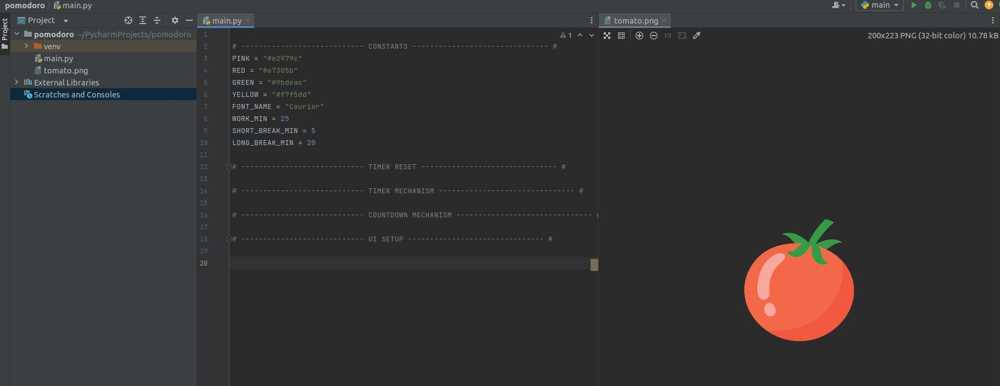

## **Class Pomodoro & Hold the simple window**

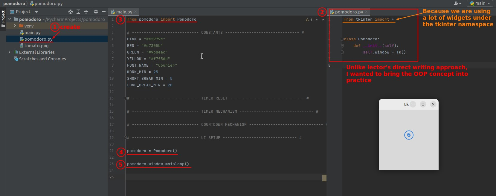

## **"Overlap" & Canvas widget**

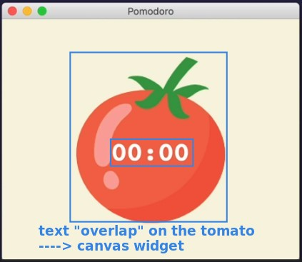

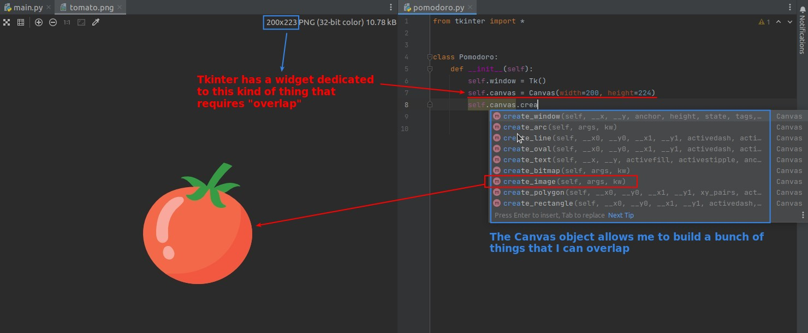

## **Canvas.create_image()**

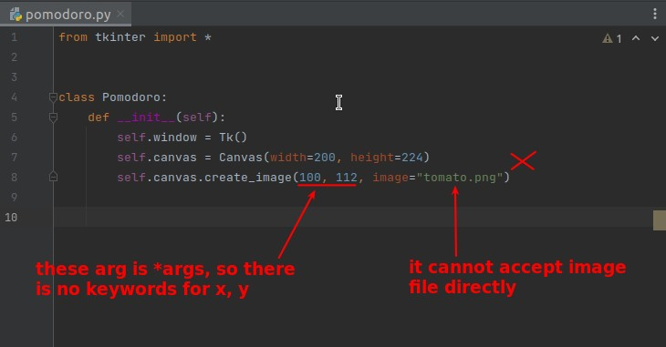

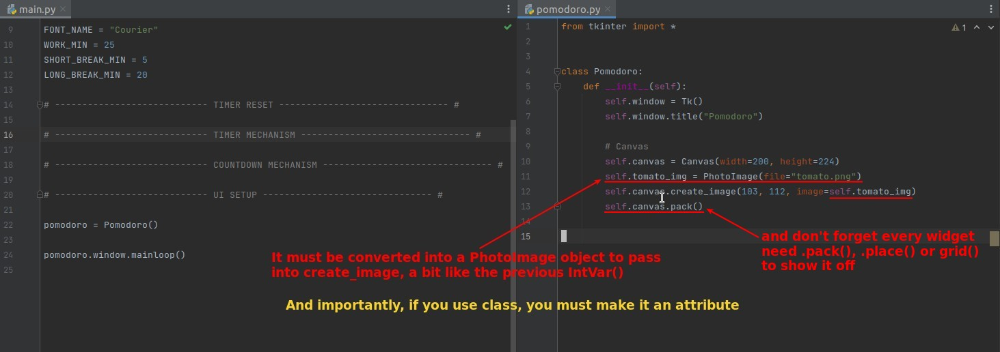

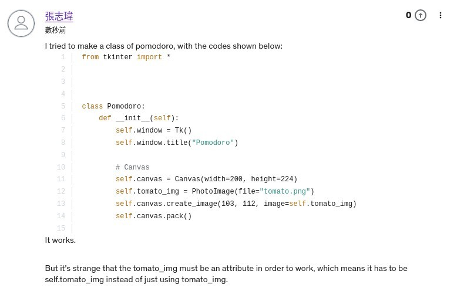

## **Padding**

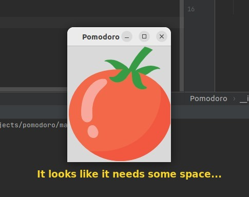

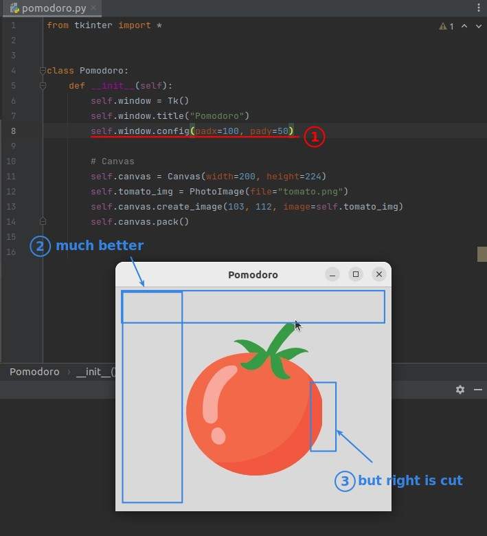

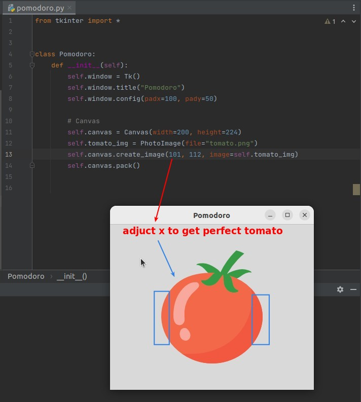

## **Canvas.create_text()**

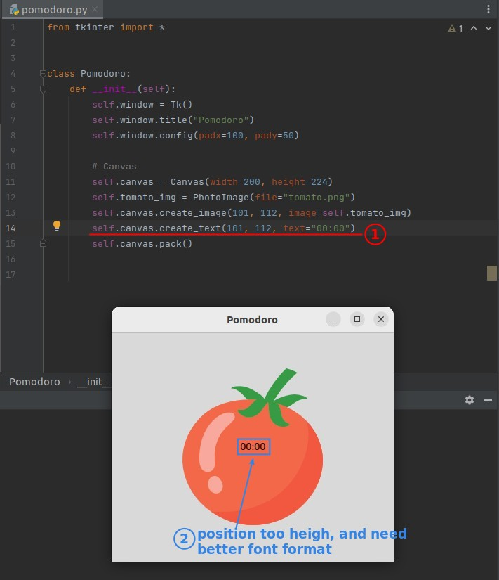

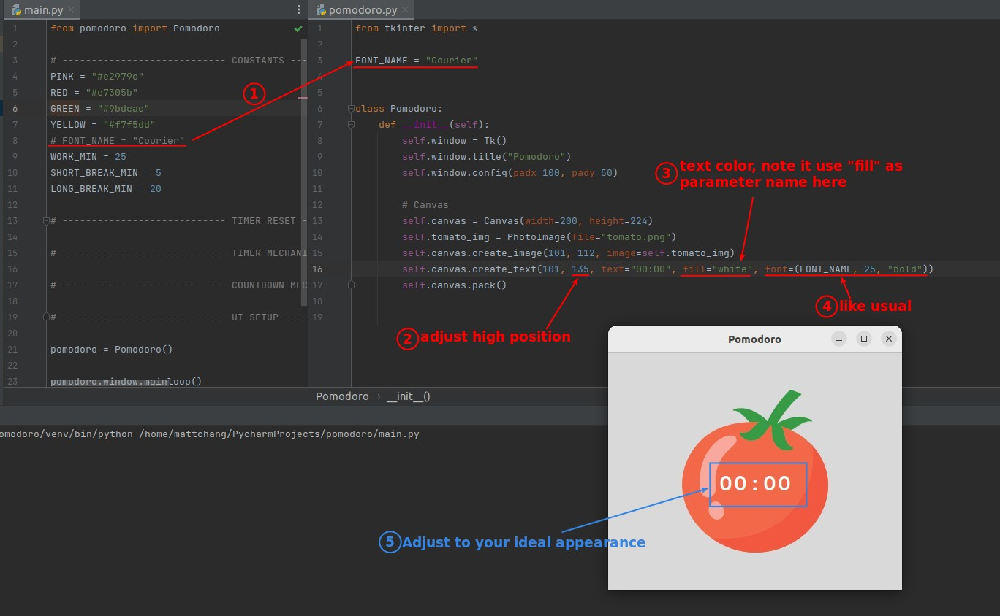

## **Background color**

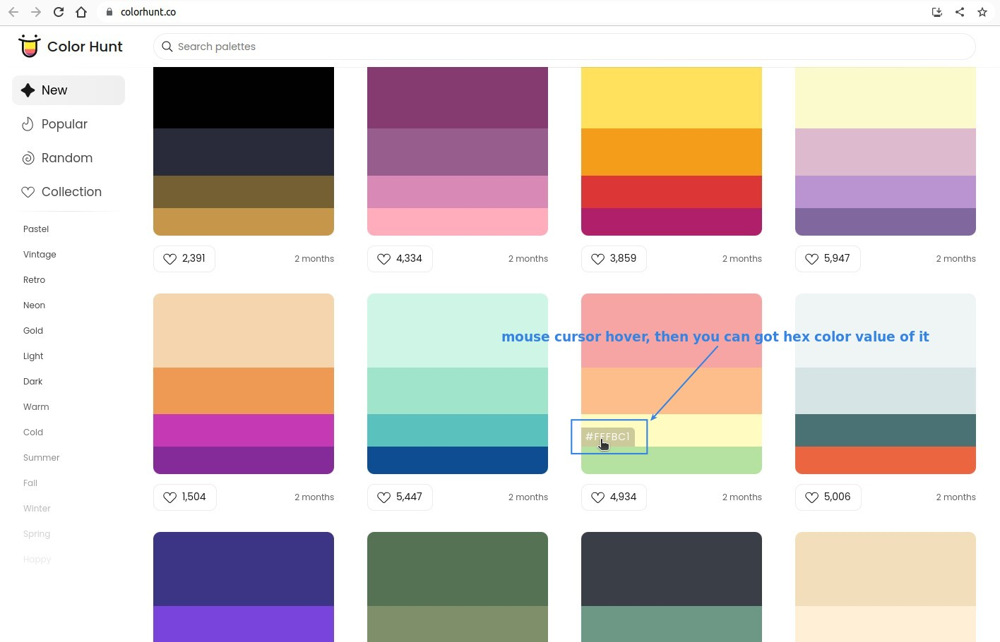

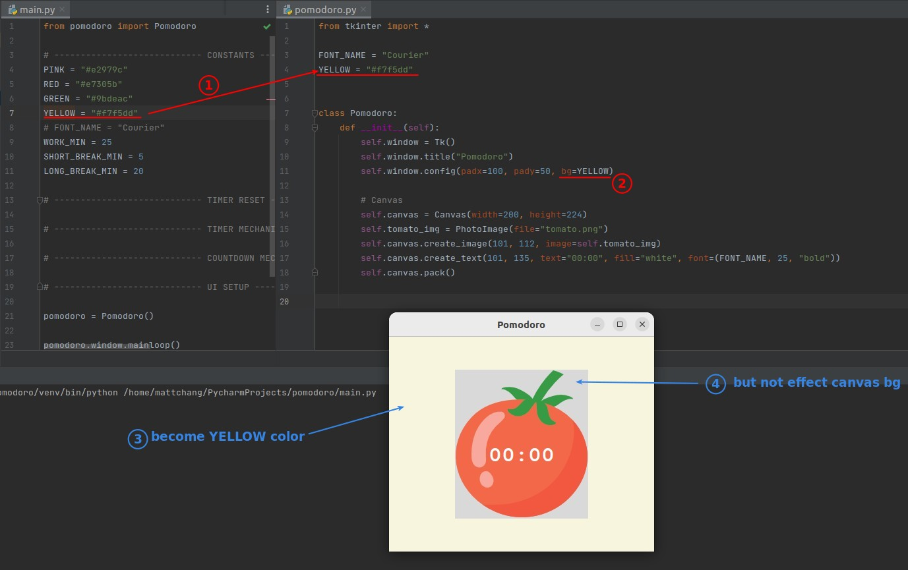

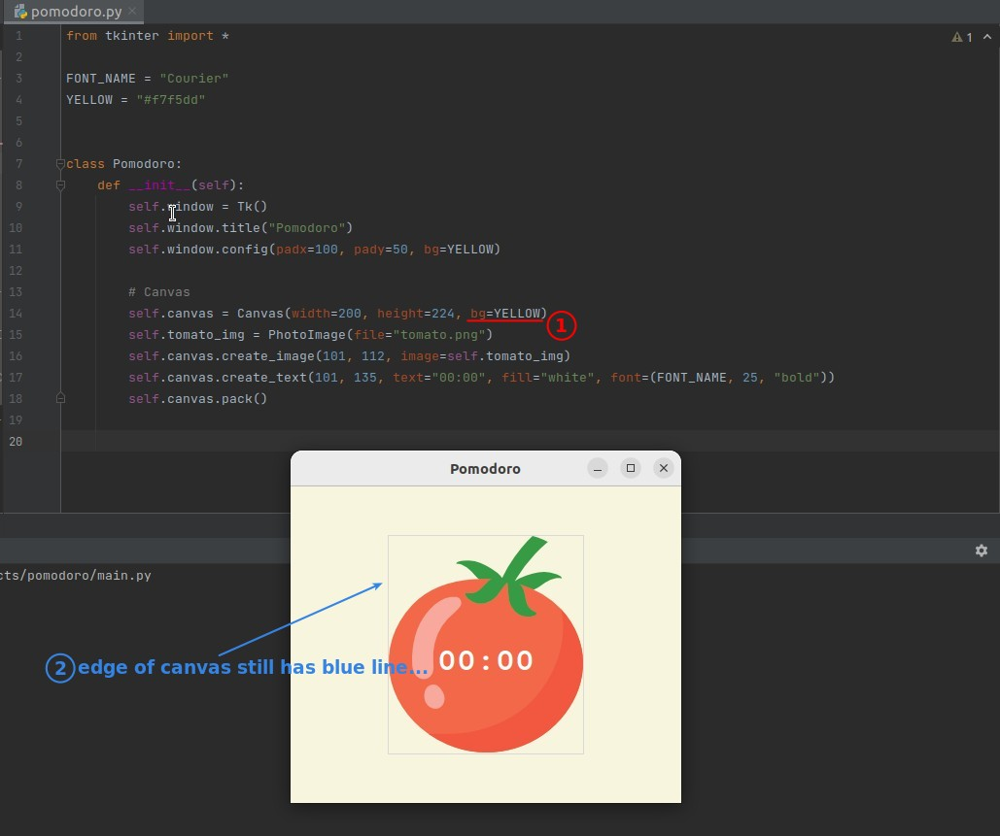

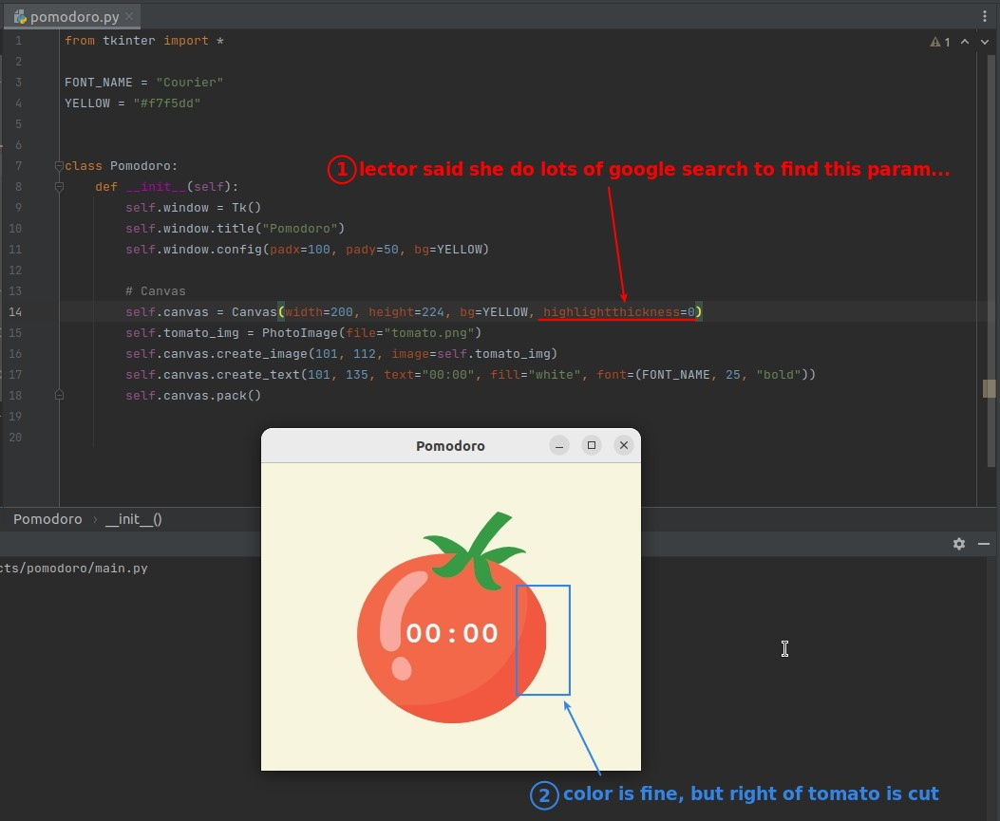

## **Final ajustment**

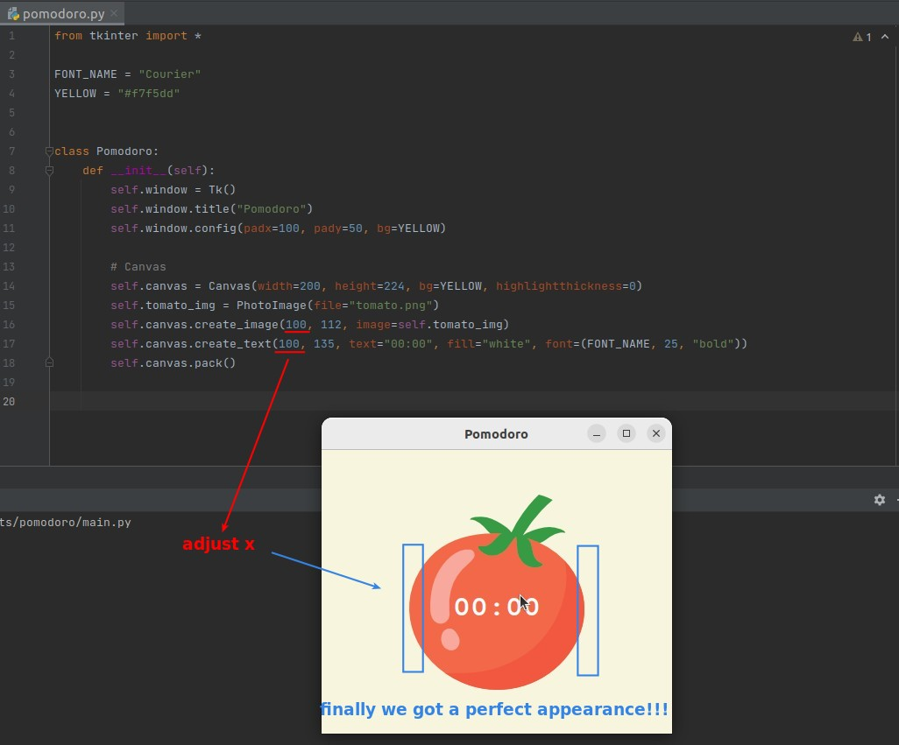
