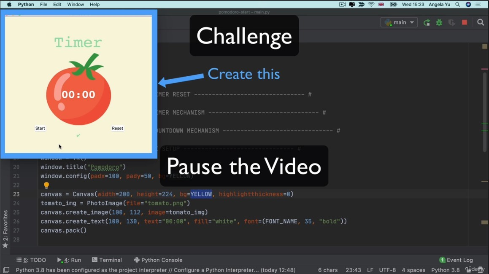
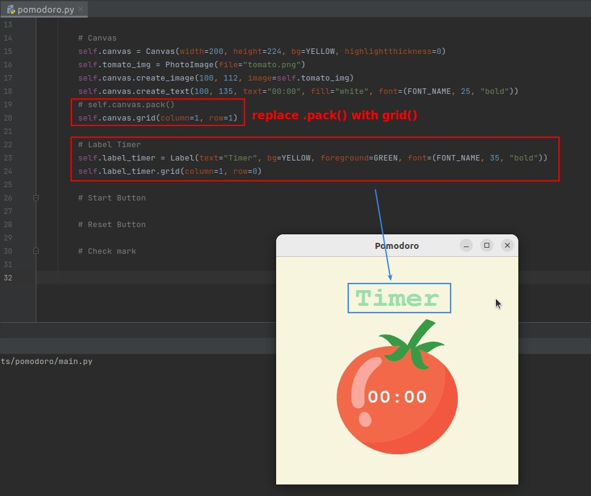
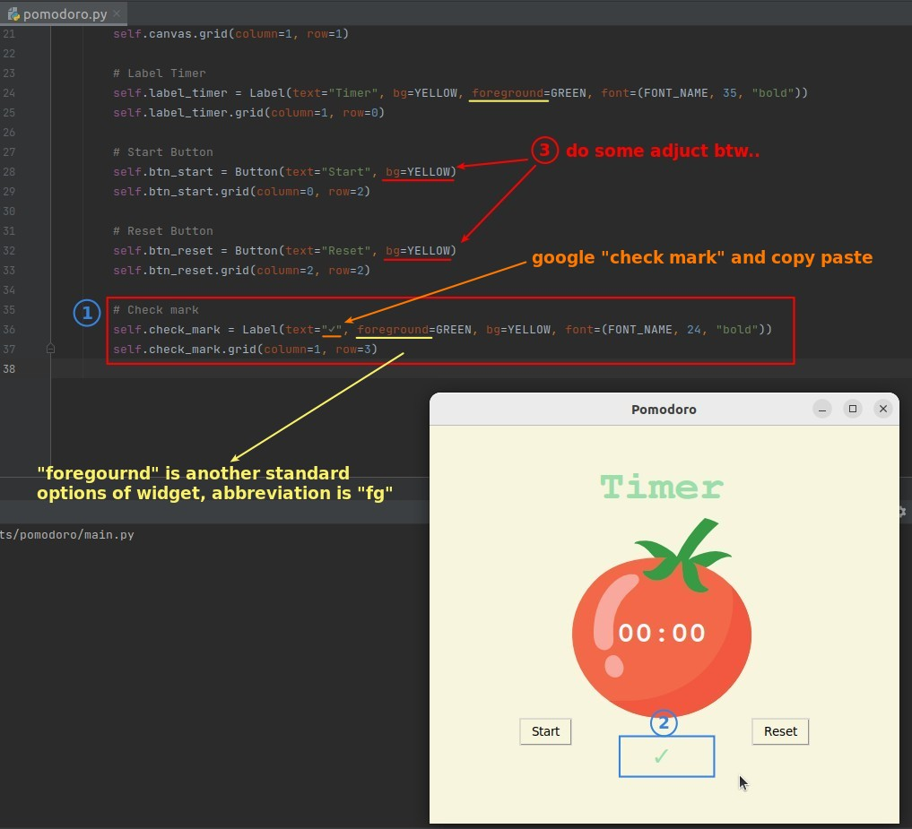
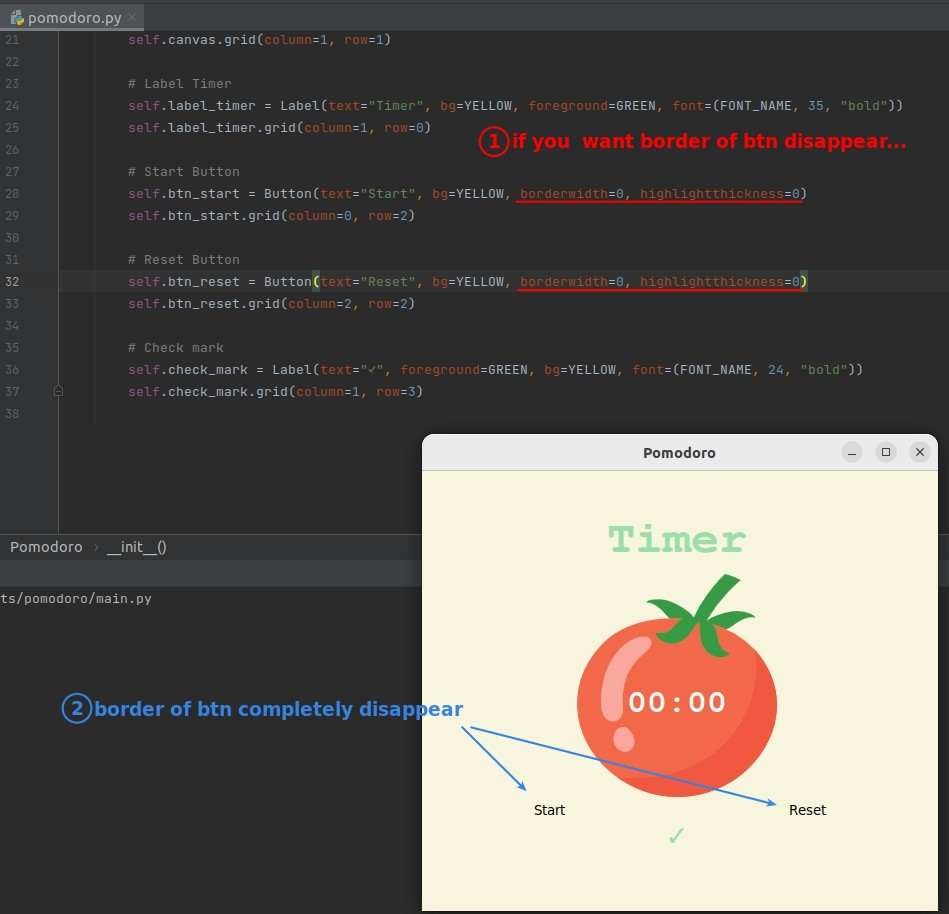

## **Challenge: Complete All Wedgets of Pomotoro app(Not including logic yet)**

## **Solutions**

### _Timer label_

- So the param used to change the color of the Label is "foreground".

### _Buttons_

- It seems to gather itself next to other widgets, rather than in the center of the grid space.
  - so I don't need to do more work :)

### _Check mark_

> Because the check mark is also a string, the Label widget is also used to present it.

## **If you want to remove border of buttons**

