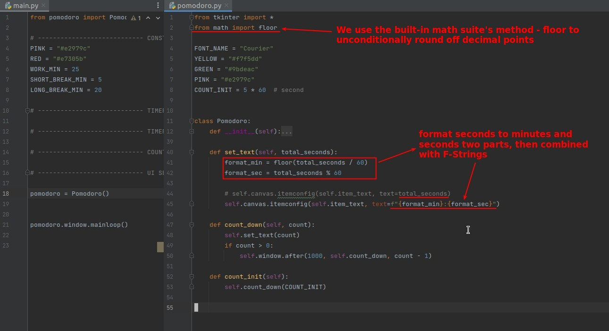

## **Countdown mechanism: simplest of idea**

### _simplest idea_

- This type of GUI program, which constantly checks for events, is called Event-driven.

### _method provide by Tkingter to include custom function_

- Note that Unlimited positional arguments are not allowed to be written after keywords arguments, so the preceding arguments must be passed in as positional arguemtns.

- The above example is a good example of why it is important to use Unlimited positional arguments, because then the function we define can have any number of parameters.

### _Upgrade .after() to loop_

> .after() just calls our function after a certain amount of time, it's not a loop itself, so we need to do some more tricks to make the whole process a loop.

## **Set options of Canvas item**

## **Bind countdown mechanism to Start button**

### _Move all countdown mechanism funcs into class Pomodoro_

- Since the Start button is one of the attributes in class Pomodoro, it's much easier to bind a method in the same class than to bind an external function, so I decided to move all the functions of the countdown mechanism to class Pomodoro.

### _Bind func to Start button_

- Because the method to be bound is already in the same class, so it's very simple.

## **Format countdown text**

