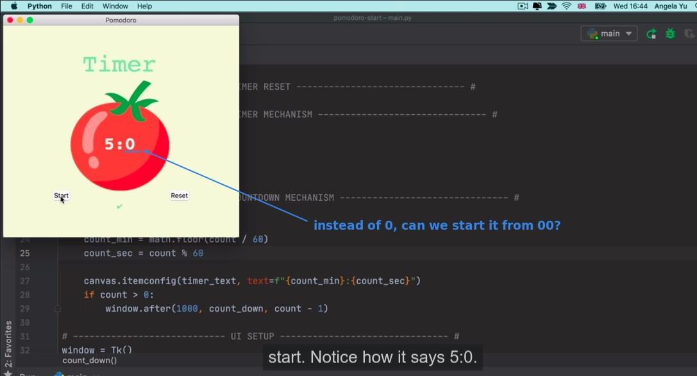
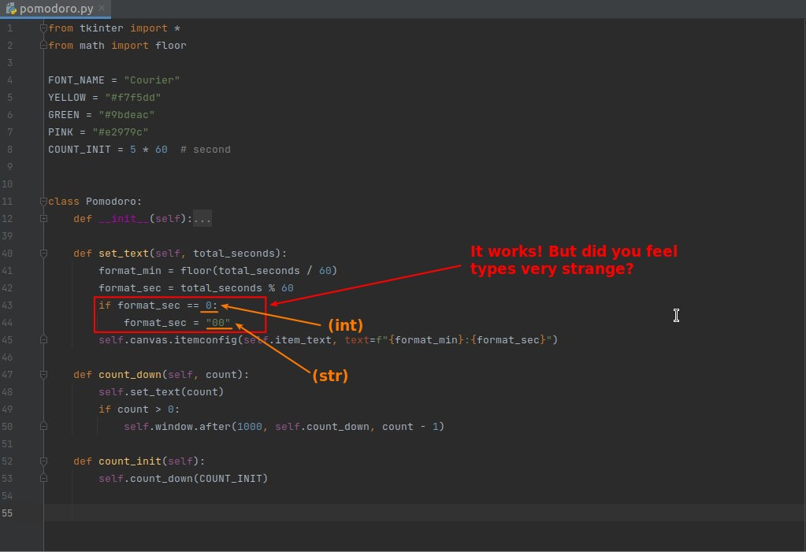
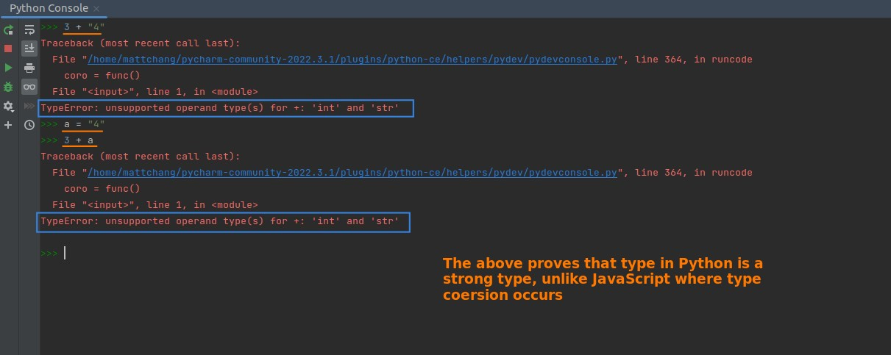
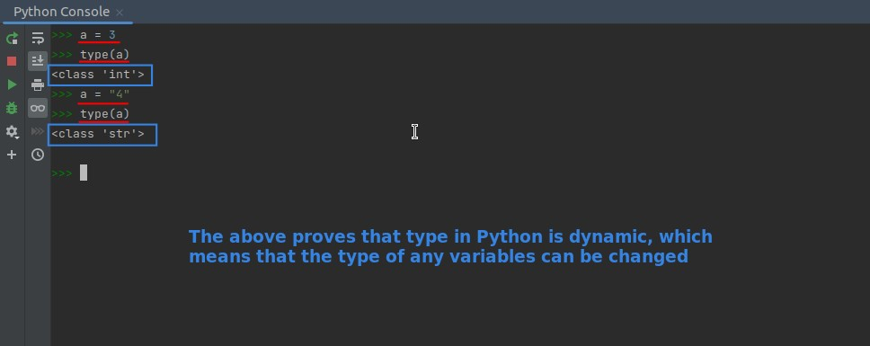
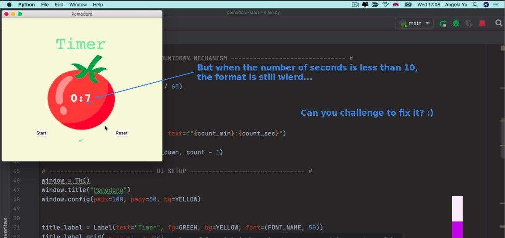
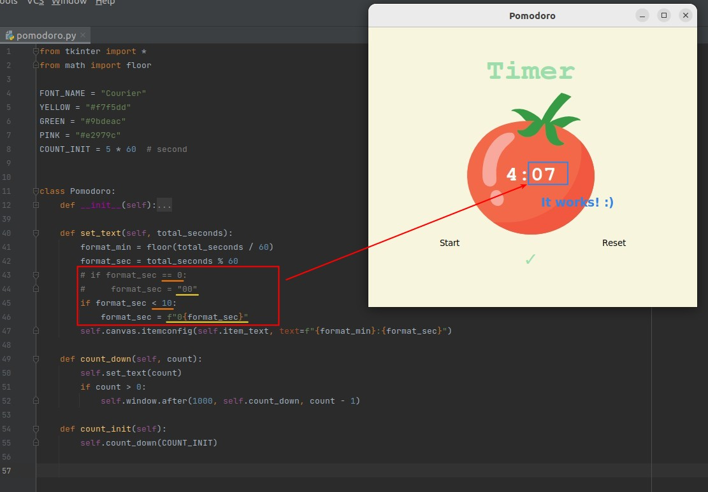

## **Description the problem**

> Continuing the results of the previous lecture, we found some issues that must be solved.

## **Try to fix it & Strange feature of Python type**

### _Try to fix the problem_

### _Console prove: Strong type of Python_

### _Console prove" Dynamic type of Python_

## **Still not perfect about the solution...**

> Although the above approach seems to work at first glance, after getting the app running for a while, problems are found again.

### _Description of the lackiness_

### _Fix it with F-String and take advantages of Dynamic type_

- We use F-String to merge strings and convert different types of data into str at the same time, and write very concise codes to achieve our goal.
- The variable that needs to be converted to a type is the same variable as the one that will be assigned, because Python is Dynamic type, which is not possible in C or Java.
