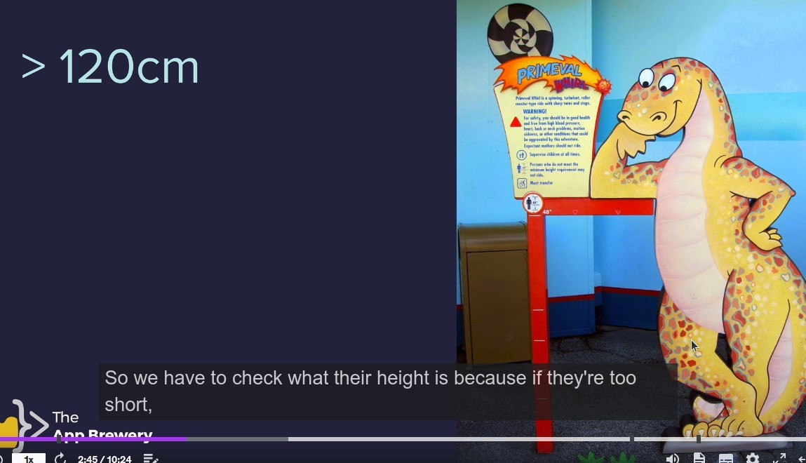

## **Purpose of your program**

- If you want to help an amusement park conductor write a program that can determine whether tickets can be sold to customers based on their height.

## **Tool for drawing flowchart**

## **replit**

- There are some codes that lecturer already help us written in the file.

## **if-else condition statement**

## **indentation in python**

- Defining code block space using indentation in python.
- The above is a indentation error example, and the indentation error will also have a dedicated error message like above.

## **Comparison Operators**

### _= and ==_

- The equal to == in comparison operators can easily be confused with the assignment operator =, so be very careful about it.

- If you mistakenly use = in the condition of an if-else statement, an error will occur as above.
  - because condition must be boolean value in the end.
